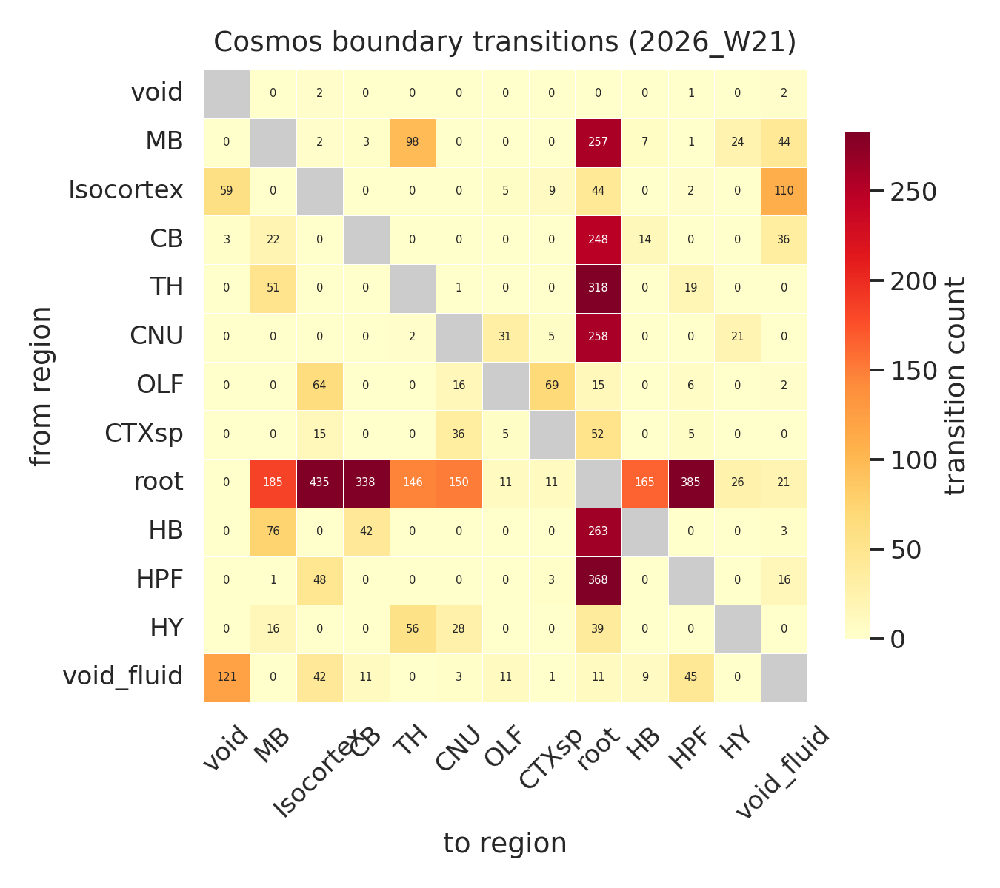
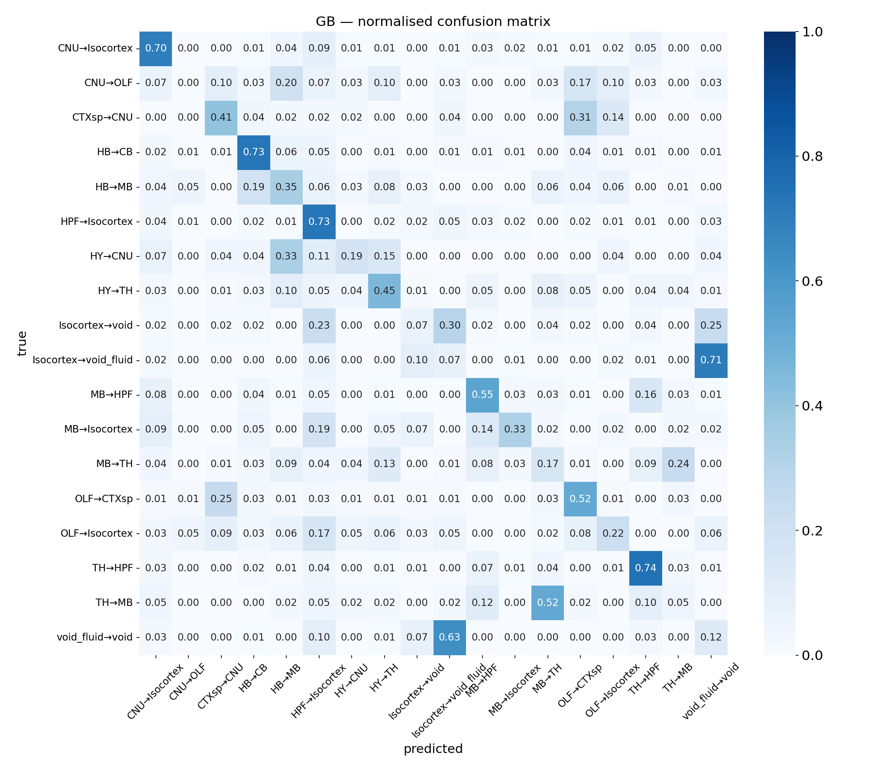
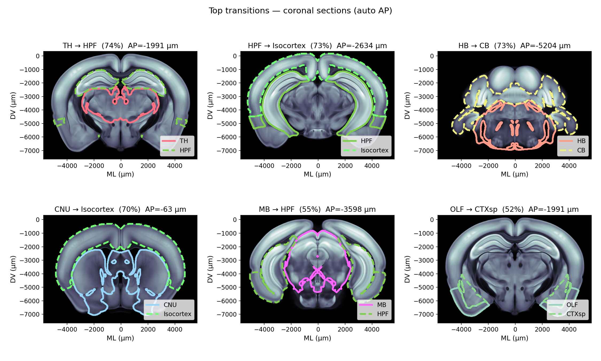
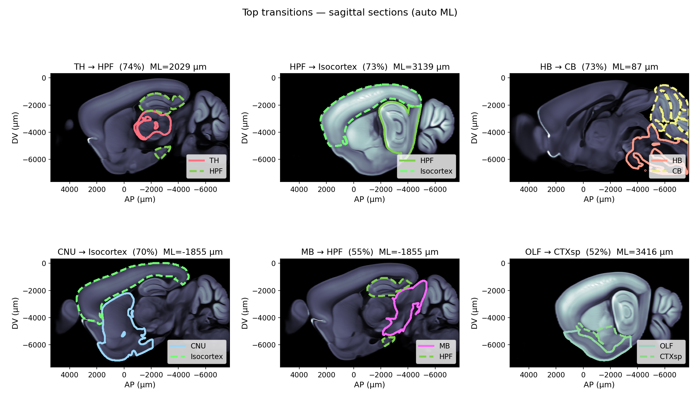
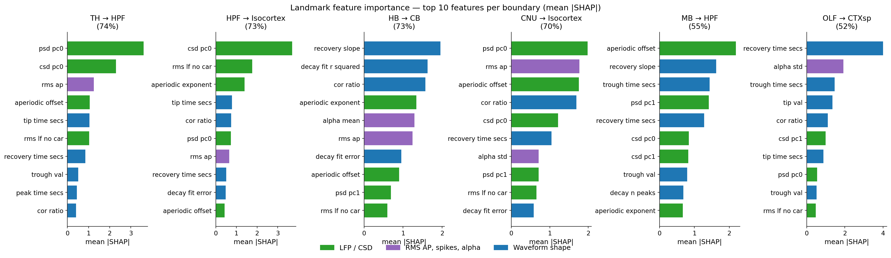
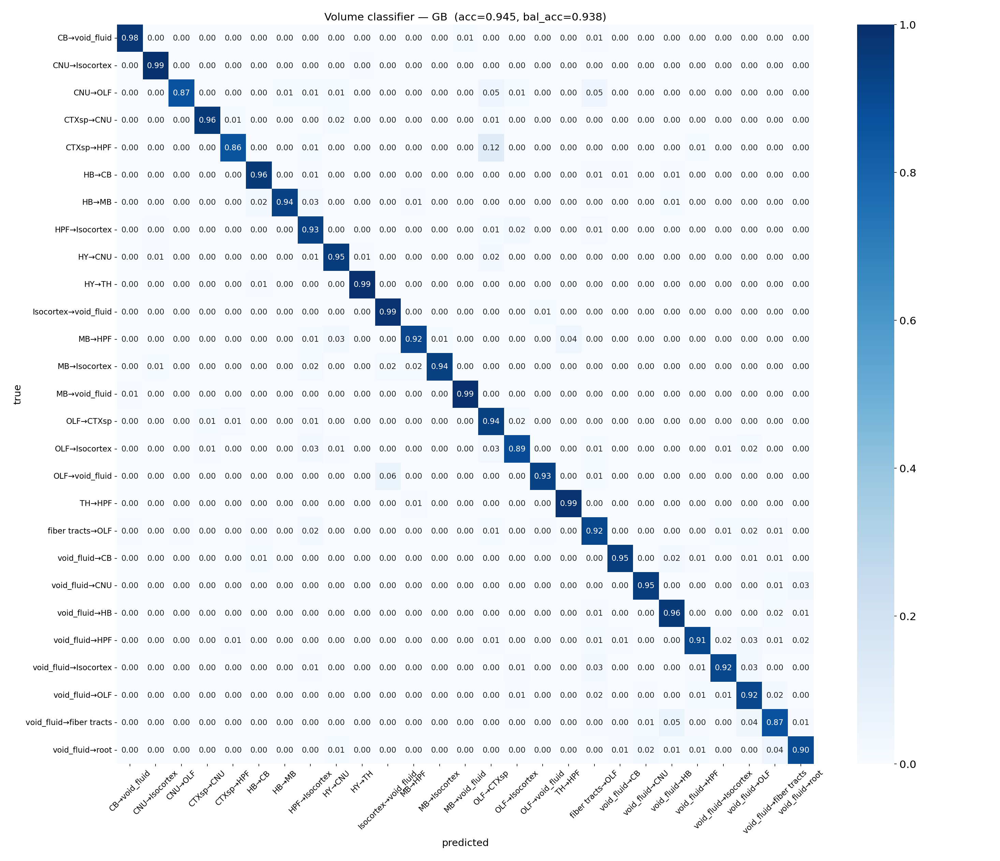
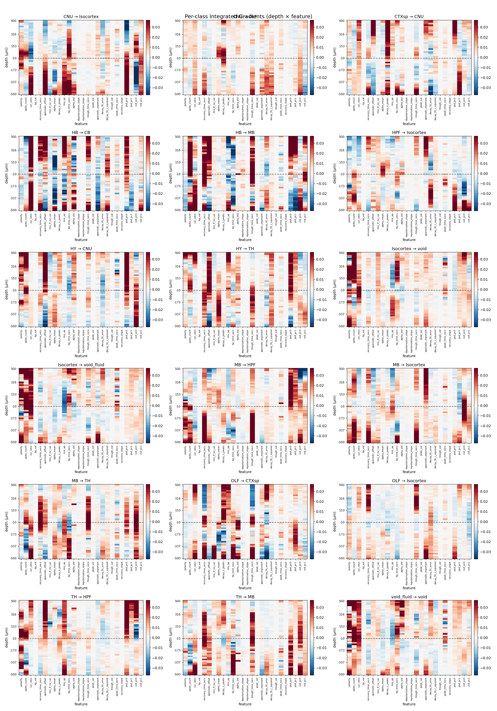

## Introduction

Sharp transitions in electrophysiological features at brain-region boundaries can serve as anatomical landmarks for Neuropixels probe localisation — a well-known example is the **hippocampus–thalamus boundary** ([Benson et al. eLife 2024](https://elifesciences.org/articles/100840#fig3), Fig. 3b).

This analysis mines the IBL Ephys Atlas to discover which Cosmos-level boundaries carry the strongest, most consistent feature jumps across animals.
To do so we identify which transitions we observe on our dataset by computing a transition matrix. Then we build a dataset of the features at the transitions, for each couple
of transitions that has more than 32 data points.
To identify which transitions are the most salient, we train a classifier to predict the transition couple from the features around the transition. We then select the 6 most
salient transitions and run a feature importance SHAP analysis to understand each feature contribution.


---

## Step 1 — Cosmos boundary transition matrix


For each probe, channels are depth-aggregated (modal Cosmos region), adjacent-depth transitions are counted directionally, and interior unlabelled positions are replaced by nearest-neighbour interpolation along the probe (**21,435 positions replaced** in vintage 2026_W24).

{.lightbox}

Boundaries with **≥ 32 probe crossings** in either direction are retained for downstream analyses — **18 transitions** in total.

---

## Step 2 — Depth-profile exploration

For each qualifying transition the ±1000 µm window around each crossing depth was extracted, channels were aligned to zero, and features were plotted as heatmaps (probes × depth).

### Example: TH → HPF

{.lightbox}

::: {layout-ncol=2}
{.lightbox}

{.lightbox}
:::

### Other representative boundaries

::: {layout-ncol=2}
{.lightbox}

{.lightbox}

{.lightbox}

{.lightbox}
:::

---

## Step 3 — Dimensionality reduction (PCA)

Raw LFP features include 21 PSD-related columns (7 raw-PSD + 14 CSD-PSD) that are highly correlated due to the 1/f spectral background.
Two independent PCAs compress these into 4 components:

* **PSD group** (7 features) → `psd_pc0`, `psd_pc1`
* **CSD group** (14 features) → `csd_pc0`, `csd_pc1`

The original PSD/CSD columns are dropped. After also removing `distance_to_tip_um` and the aperiodic-residual PSD features, **26 features** remain for downstream analysis:

| Group | Features |
|-------|----------|
| PCA (LFP) | `psd_pc0`, `psd_pc1`, `csd_pc0`, `csd_pc1` |
| Waveform shape | `tip_val`, `trough_val`, `peak_val`, `recovery_time_secs`, `tip_time_secs`, `trough_time_secs`, `peak_time_secs`, `depolarisation_slope`, `repolarisation_slope`, `recovery_slope` |
| Unit quality | `rms_ap`, `spike_count`, `polarity`, `cor_ratio`, `alpha_mean`, `alpha_std`, `decay_n_peaks`, `decay_fit_error`, `decay_fit_r_squared` |
| LFP aperiodic | `rms_lf_no_car`, `aperiodic_offset`, `aperiodic_exponent` |

After PCA, Cosmos-level regions are already partially separable in the 2D PC space:

{.lightbox}

---

## Step 4 — Boundary classifier

### Feature vector construction

For each (probe, boundary) crossing, a **difference vector** is computed:

$$\mathbf{x} = \bar{\mathbf{f}}_{\text{below}} - \bar{\mathbf{f}}_{\text{above}}$$

where "below" is the from-region side (deeper) and "above" is the to-region side (shallower), each averaged over the ±1000 µm window around the crossing depth.
This yields a 26-dimensional vector per sample encoding the *direction and magnitude* of the feature change.
1c
### Model

A **Gradient Boosted classifier** (`HistGradientBoostingClassifier`, 300 iterations) is trained on the 18-class problem using **4-fold stratified cross-validation** (1,714 samples total).

### Accuracy

```{python}
#| echo: false
#| label: tbl-accuracy
#| tbl-cap: "Per-class CV accuracy (gradient boosting)."

import pandas as pd
df_acc = pd.read_csv('figures/classifier_accuracy.csv')
df_gb = df_acc[df_acc['model'] == 'gb'].copy()
df_gb = df_gb[df_gb['class'] != 'overall'].set_index('class')['accuracy']
df_gb = df_gb.sort_values(ascending=False)
df_gb.index = df_gb.index.str.replace('_to_', ' → ')
df_gb.name = 'GB accuracy'
df_gb.map(lambda x: f"{x:.1%}")
```

```{python}
#| echo: false
import pandas as pd
df_acc = pd.read_csv('figures/classifier_accuracy.csv')
overall = df_acc[(df_acc['model'] == 'gb') & (df_acc['class'] == 'overall')]['accuracy'].values[0]
print(f"Overall GB CV accuracy: {overall:.1%}")
```

Overall CV accuracy: **GB ≈ 47%** against a null of ~9.3% (permutation test, p = 0.0099) — roughly **5× chance level**, confirming that LFP features carry strong boundary-specific information.

### Confusion matrix

{.lightbox}

---

## Step 5 — Top 6 transitions: brain-section visualisation

The six most consistently classified transitions (by GB per-class accuracy) are identified automatically.

### Coronal sections

{.lightbox}

### Sagittal sections

{.lightbox}

### Depth-profile heatmaps

```{python}
#| echo: false
import pandas as pd
df_acc = pd.read_csv('figures/classifier_accuracy.csv')
df_gb = df_acc[(df_acc['model'] == 'gb') & (df_acc['class'] != 'overall')]
top6 = df_gb.nlargest(6, 'accuracy')[['class', 'accuracy']].values.tolist()
```

::: {layout-ncol=2}
```{python}
#| echo: false
#| output: asis
import pandas as pd
df_acc = pd.read_csv('figures/classifier_accuracy.csv')
df_gb = df_acc[(df_acc['model'] == 'gb') & (df_acc['class'] != 'overall')]
top6 = df_gb.nlargest(6, 'accuracy')[['class', 'accuracy']].values.tolist()
for cls, acc in top6:
    slug = cls.replace('_to_', '_to_')
    label = cls.replace('_to_', ' → ')
    print(f'{{.lightbox}}\n')
```
:::

---

## Step 6 — Per-landmark feature importance

For each of the top-6 transitions, SHAP values (TreeExplainer on the full training set) identify which features the model relies on specifically for **that boundary**.
Only the samples belonging to each class are used, so the result is a per-landmark fingerprint rather than a global importance ranking.

{.lightbox}

The per-landmark fingerprints reveal two distinct boundary types:

**LFP-power boundaries** — driven by `psd_pc0` / `csd_pc0` (broadband LFP and CSD):
- **TH → HPF** (`psd_pc0`, `csd_pc0`, `rms_ap`) — broadband LFP power drop, consistent with the known DG landmark from repro-ephys.
- **HPF → Isocortex** (`csd_pc0`, `rms_lf_no_car`, `aperiodic_exponent`) — CSD-dominated, reflects cortical layering.
- **CNU → Isocortex** (`psd_pc0`, `rms_ap`, `aperiodic_offset`) — similar broadband + spiking signature.

**Waveform-shape boundaries** — driven by spike kinetics, not LFP:
- **HB → CB** (`recovery_slope`, `decay_fit_r_squared`, `cor_ratio`) — purely waveform-shape; no LFP contribution.
- **MB → HPF** (`aperiodic_offset`, `recovery_slope`, `trough_time_secs`) — mixed LFP + waveform.
- **OLF → CTXsp** (`recovery_time_secs`, `alpha_std`, `trough_time_secs`) — waveform kinetics dominate strongly.

The clean split between LFP-power and waveform-shape landmarks suggests that **different recording modalities** are optimal for different anatomical boundaries — a practical guide for online landmark detection.

---

## Step 7 — Ceiling validation: encoding-volume virtual probes

The measured-probe classifier tops out at ~47% because real recordings are noisy and probes are sparse.
To check whether this ceiling reflects *noise* rather than a lack of information in the features, the same pipeline (mean-diff feature vector → GB classifier, 4-fold stratified CV) was re-run on **synthetic virtual probes**: a dense 200 µm AP/ML grid of vertical probes sampled directly from the brainwide encoding volume, with no real Neuropixels data involved.
Because the virtual-probe grid densely covers the whole brain (including CSF/`void_fluid` space), it yields a broader set of **26 transitions** rather than the 18 from real probes — a related but not identical label set.

{.lightbox}

The noise-free volume classifier reaches **94.5% accuracy** (93.8% balanced) — near-perfect, versus ~47% on real data.
This confirms the measured-probe accuracy is **limited by recording noise and biological variability, not by the discriminative power of the feature set or the classification method**: the same features, sampled without noise, almost perfectly separate every boundary.

---

## Step 8 — Depth-resolved attribution (Integrated Gradients)

SHAP (Step 6) summarises which *features* matter per boundary, collapsed across depth. To see *where* within the ±500 µm crossing window each feature matters, an MLP was trained on the full depth profile of each crossing (50 depth positions × 26 features = 1300-d input, 4-fold stratified CV) and Captum Integrated Gradients was used to attribute the prediction to every (depth, feature) pair.

{.lightbox}

The attribution maps are spatially sharp around depth 0 for the strongest landmarks (e.g. `psd_pc0`/`csd_pc0` for TH → HPF), corroborating the SHAP fingerprints with an independent, depth-resolved method rather than a single averaged feature vector.

---

## Discussion

The classification result — ~47% accuracy against a 9.3% chance level — confirms that LFP features carry **strong, boundary-specific information** at every well-sampled Cosmos-level interface.
The top transitions (TH → HPF, HPF → Isocortex, HB → CB, CNU → Isocortex) all achieve **70–74% per-class accuracy**.

The repro-ephys DG–thalamus landmark corresponds roughly to **TH → HPF** in Cosmos space, consistent with our finding that this is among the most reliably classified transitions.
The analysis extends this to 17 additional boundaries, several of which appear even more distinctive.

The encoding-volume ceiling analysis (Step 7) shows the ~47% real-data accuracy is a **noise floor, not an information floor** — the same feature set reaches 94.5% when sampled without recording noise — so future gains should come from denoising / averaging across repeats rather than new features. The Integrated Gradients analysis (Step 8) independently corroborates the SHAP fingerprints with depth-resolved attributions.

### Caveats

* Accuracies describe generalisation across probes, not expected precision in a single experiment.
* Cosmos-level regions aggregate heterogeneous substructures; finer-grained Beryl-level analysis would reveal variability within each Cosmos boundary.
* Transitions involving unlabelled tissue (void, root) are biologically less interpretable — they mark where probes exit the brain rather than genuine tissue differences.
* The virtual-probe ceiling analysis (Step 7) uses a broader 26-transition set than the 18 measured transitions (it includes CSF/`void_fluid` crossings absent from real probes), so its accuracy is not a strictly apples-to-apples upper bound on the measured-probe numbers, only a strong indication of the noise-vs-information split.

### Next steps

* Unsupervised **SLIC supervoxel segmentation** of the encoding volume is being explored as a classifier-independent check of whether boundaries emerge without any labels; not yet quantified against Cosmos boundaries.
* Coronal/sagittal **atlas-coverage QC panels** (per-feature slices with virtual-probe overlays) have been generated to visualise where the encoding volume has real recording support vs. gaps, as a supplement to Step 5.
