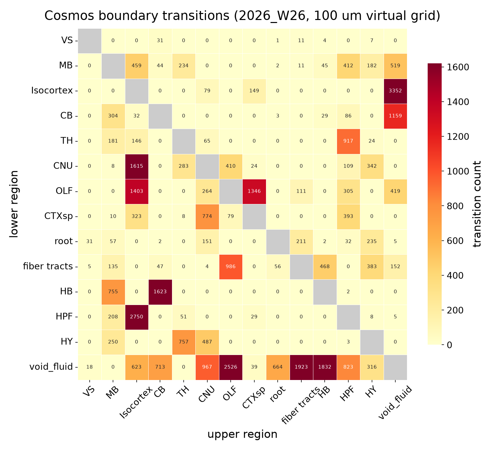
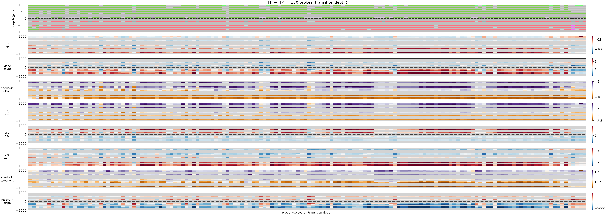
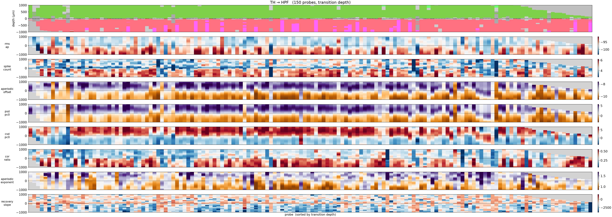
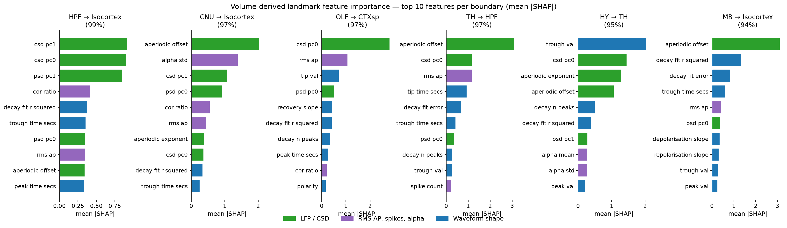

## Introduction

Sharp transitions in electrophysiological features at brain-region boundaries can serve as anatomical landmarks for Neuropixels probe localisation — a well-known example is the **hippocampus–thalamus boundary** ([Benson et al. eLife 2024](https://elifesciences.org/articles/100840#fig3), Fig. 3b).

This analysis mines the IBL Ephys Atlas to discover which Cosmos-level boundaries carry the strongest, most consistent feature jumps across animals. Discovery runs on the dense, noise-free **brainwide encoding volume** first (Step 1) — a 4-D reconstruction of ephys features across the whole brain — with real Neuropixels recordings used to sanity-check the top candidates it surfaces. The boundaries are then characterised in more detail with classifiers trained directly on measured data (Steps 2–5), and the measured-classifier accuracy ceiling is cross-checked against the same pipeline run on the volume (Step 6).

---

## Step 1 — Volume-first landmark discovery (vintage 2026_W26)

The encoding volume is used as the **primary** discovery substrate, with measured data used only to sanity-check the top candidates it surfaces — because the ceiling analysis (Step 6) shows the volume carries essentially all of the signal, at none of the recording noise.

A dense 100 µm AP × ML virtual-probe grid (1.36M channels, `build_virtual_probe_df`) was sampled
from the newest available encoding volume (**2026_W26**, 50 µm — the only vintage newer than
2026_W12 with a volume on S3), and the same Cohen's-d boundary scan used for the original
measured-data search (`compute_boundary_feature_stats`) was run on it unchanged. Because the dense
grid removes the real-probe sparsity floor, **63 directed Cosmos pairs** now qualify (≥32
crossings) versus the 18 reachable with real probes.

{#fig-vp-transition-matrix .lightbox}

Excluding trivial CSF/root/fiber-tract crossings, the top 20 tissue–tissue transitions by breadth
of significant features (Cohen's d > 0.8, Bonferroni-corrected p < 0.01) then effect size are:

```{python}
#| echo: false
#| label: tbl-significant-transitions
#| tbl-cap: "Top 20 significant tissue–tissue boundary transitions from the dense encoding-volume scan, ranked by # significant features then max Cohen's d."

import pandas as pd
df_sig = pd.read_csv('figures/volume_landmark_ranking_2026_W26_tissue_only.csv').head(20)
df_sig['transition'] = df_sig['from'] + ' → ' + df_sig['to']
df_sig = df_sig.set_index('transition')[['max_cohens_d', 'n_significant_features', 'n_trans']]
df_sig.columns = ["Max Cohen's d", '# significant features', '# crossings']
df_sig
```

**TH → HPF reproduces the known DG–thalamus landmark** — a useful cross-check that the
volume-first approach recovers the same landmark the measured-data classifier below (Step 3)
independently ranks among its most reliably classified transitions.

{#fig-vol-th-hpf .lightbox}

{#fig-measured-th-hpf .lightbox}

`csd_pc0` and `psd_pc0` show the same sign and timing of the transition in both panels; the
measured panel is visibly noisier (single-recording variance) but the underlying step is the same
— exactly what the Step 6 ceiling analysis would predict. (Each panel uses its own colour scale,
scaled to its own 2nd–98th percentile range — a shared scale washes the smoother volume panel out,
since it has far less spread than single-recording measured data.)

Of the top 5 tissue–tissue candidates, **3 are directly corroborated** in measured 2026_W26 data
(HPF → MB, TH → HPF, CNU → Isocortex). The other 2 (Isocortex → CNU, CNU → HPF) are not absent from
real data so much as **direction-flipped or unobserved**: real Neuropixels trajectories only
sample a limited set of entry angles, so a transition direction that's common in the dense,
uniformly-sampled virtual grid can be rare or missing among the ~1,000 real insertions — this is
flagged as encoding-volume-only rather than silently promoted to landmark status.

### Feature importance on the volume data

Reproducing Step 5's measured-data SHAP analysis directly on the volume: a GB classifier was
trained on mean-diff feature vectors for the 20 significant transitions above (dense virtual-probe
crossings, ±1000 µm window), reaching **94.6% accuracy** (85.7% balanced) over 4-fold CV — in the
same range as the Step 6 ceiling classifier. SHAP (TreeExplainer) then identifies which features
drive each of the 6 best-classified transitions specifically.

{#fig-vol-feature-importance .lightbox}

`aperiodic_offset`, `csd_pc0` and `rms_ap` dominate **TH → HPF** here too, consistent with the
measured-data fingerprint in Step 5 — the volume-derived classifier recovers the same
feature-level signature as the noisier real-data one, with none of the sampling limitations of
real probe coverage.

Full ranked tables: `figures/volume_landmark_ranking_2026_W26_tissue_only.csv` (all 33 tissue–tissue
pairs) and `figures/volume_boundary_feature_stats_2026_W26.csv` (per-feature detail).

---

## Step 2 — Dimensionality reduction (PCA)

Raw LFP features include 21 PSD-related columns (7 raw-PSD + 14 CSD-PSD) that are highly correlated due to the 1/f spectral background.
Two independent PCAs compress these into 4 components:

* **PSD group** (7 features) → `psd_pc0`, `psd_pc1`
* **CSD group** (14 features) → `csd_pc0`, `csd_pc1`

The original PSD/CSD columns are dropped. After also removing `distance_to_tip_um` and the aperiodic-residual PSD features, **26 features** remain for downstream analysis:

| Group | Features |
|-------|----------|
| PCA (LFP) | `psd_pc0`, `psd_pc1`, `csd_pc0`, `csd_pc1` |
| Waveform shape | `tip_val`, `trough_val`, `peak_val`, `recovery_time_secs`, `tip_time_secs`, `trough_time_secs`, `peak_time_secs`, `depolarisation_slope`, `repolarisation_slope`, `recovery_slope` |
| Unit quality | `rms_ap`, `spike_count`, `polarity`, `cor_ratio`, `alpha_mean`, `alpha_std`, `decay_n_peaks`, `decay_fit_error`, `decay_fit_r_squared` |
| LFP aperiodic | `rms_lf_no_car`, `aperiodic_offset`, `aperiodic_exponent` |

After PCA, Cosmos-level regions are already partially separable in the 2D PC space:

{#fig-psd-pca-scatter .lightbox}

---

## Step 3 — Boundary classifier

### Feature vector construction

For each (probe, boundary) crossing, a **difference vector** is computed:

$$\mathbf{x} = \bar{\mathbf{f}}_{\text{below}} - \bar{\mathbf{f}}_{\text{above}}$$

where "below" is the from-region side (deeper) and "above" is the to-region side (shallower), each averaged over the ±1000 µm window around the crossing depth.
This yields a 26-dimensional vector per sample encoding the *direction and magnitude* of the feature change.

### Model

A **Gradient Boosted classifier** (`HistGradientBoostingClassifier`, 300 iterations) is trained on the 18-class problem using **4-fold stratified cross-validation** (1,714 samples total).

### Accuracy

```{python}
#| echo: false
#| label: tbl-accuracy
#| tbl-cap: "Per-class CV accuracy (gradient boosting)."

import pandas as pd
df_acc = pd.read_csv('figures/classifier_accuracy.csv')
df_gb = df_acc[df_acc['model'] == 'gb'].copy()
df_gb = df_gb[df_gb['class'] != 'overall'].set_index('class')['accuracy']
df_gb = df_gb.sort_values(ascending=False)
df_gb.index = df_gb.index.str.replace('_to_', ' → ')
df_gb.name = 'GB accuracy'
df_gb.map(lambda x: f"{x:.1%}")
```

```{python}
#| echo: false
import pandas as pd
df_acc = pd.read_csv('figures/classifier_accuracy.csv')
overall = df_acc[(df_acc['model'] == 'gb') & (df_acc['class'] == 'overall')]['accuracy'].values[0]
print(f"Overall GB CV accuracy: {overall:.1%}")
```

Overall CV accuracy: **GB ≈ 47%** against a null of ~9.3% (permutation test, p = 0.0099) — roughly **5× chance level**, confirming that LFP features carry strong boundary-specific information.

### Confusion matrix

{#fig-confusion-gb .lightbox}

---

## Step 4 — Top 6 transitions: brain-section visualisation

The six most consistently classified transitions (by GB per-class accuracy) are identified automatically.

### Coronal sections

{#fig-coronal .lightbox}

### Sagittal sections

{#fig-sagittal .lightbox}

### Depth-profile heatmaps

```{python}
#| echo: false
import pandas as pd
df_acc = pd.read_csv('figures/classifier_accuracy.csv')
df_gb = df_acc[(df_acc['model'] == 'gb') & (df_acc['class'] != 'overall')]
top6 = df_gb.nlargest(6, 'accuracy')[['class', 'accuracy']].values.tolist()
```

::: {layout-ncol=2}
```{python}
#| echo: false
#| output: asis
import pandas as pd
df_acc = pd.read_csv('figures/classifier_accuracy.csv')
df_gb = df_acc[(df_acc['model'] == 'gb') & (df_acc['class'] != 'overall')]
top6 = df_gb.nlargest(6, 'accuracy')[['class', 'accuracy']].values.tolist()
for cls, acc in top6:
    slug = cls.replace('_to_', '_to_')
    label = cls.replace('_to_', ' → ')
    print(f'{{#fig-heatmap-{slug} .lightbox}}\n')
```
:::

---

## Step 5 — Per-landmark feature importance

For each of the top-6 transitions, SHAP values (TreeExplainer on the full training set) identify which features the model relies on specifically for **that boundary**.
Only the samples belonging to each class are used, so the result is a per-landmark fingerprint rather than a global importance ranking.

{#fig-landmark-feature-importance .lightbox}

The per-landmark fingerprints reveal two distinct boundary types:

**LFP-power boundaries** — driven by `psd_pc0` / `csd_pc0` (broadband LFP and CSD):
- **TH → HPF** (`psd_pc0`, `csd_pc0`, `rms_ap`) — broadband LFP power drop, consistent with the known DG landmark from repro-ephys.
- **HPF → Isocortex** (`csd_pc0`, `rms_lf_no_car`, `aperiodic_exponent`) — CSD-dominated, reflects cortical layering.
- **CNU → Isocortex** (`psd_pc0`, `rms_ap`, `aperiodic_offset`) — similar broadband + spiking signature.

**Waveform-shape boundaries** — driven by spike kinetics, not LFP:
- **HB → CB** (`recovery_slope`, `decay_fit_r_squared`, `cor_ratio`) — purely waveform-shape; no LFP contribution.
- **MB → HPF** (`aperiodic_offset`, `recovery_slope`, `trough_time_secs`) — mixed LFP + waveform.
- **OLF → CTXsp** (`recovery_time_secs`, `alpha_std`, `trough_time_secs`) — waveform kinetics dominate strongly.

The clean split between LFP-power and waveform-shape landmarks suggests that **different recording modalities** are optimal for different anatomical boundaries — a practical guide for online landmark detection.

---

## Step 6 — Ceiling validation: encoding-volume virtual probes

The measured-probe classifier tops out at ~47% because real recordings are noisy and probes are sparse.
To check whether this ceiling reflects *noise* rather than a lack of information in the features, the same pipeline (mean-diff feature vector → GB classifier, 4-fold stratified CV) was re-run on **synthetic virtual probes**: a dense 200 µm AP/ML grid of vertical probes sampled directly from the brainwide encoding volume, with no real Neuropixels data involved.
Because the virtual-probe grid densely covers the whole brain (including CSF/`void_fluid` space), it yields a broader set of **26 transitions** rather than the 18 from real probes — a related but not identical label set.

{#fig-confusion-vol-gb .lightbox}

The noise-free volume classifier reaches **94.5% accuracy** (93.8% balanced) — near-perfect, versus ~47% on real data.
This confirms the measured-probe accuracy is **limited by recording noise and biological variability, not by the discriminative power of the feature set or the classification method**: the same features, sampled without noise, almost perfectly separate every boundary.

---

## Discussion

The classification result — ~47% accuracy against a 9.3% chance level — confirms that LFP features carry **strong, boundary-specific information** at every well-sampled Cosmos-level interface.
The top transitions (TH → HPF, HPF → Isocortex, HB → CB, CNU → Isocortex) all achieve **70–74% per-class accuracy**.

The repro-ephys DG–thalamus landmark corresponds roughly to **TH → HPF** in Cosmos space, consistent with our finding that this is among the most reliably classified transitions, and the first landmark independently recovered by the volume-first scan in Step 1.
The analysis extends this to 17 additional boundaries, several of which appear even more distinctive.

The encoding-volume ceiling analysis (Step 6) shows the ~47% real-data accuracy is a **noise floor, not an information floor** — the same feature set reaches 94.5% when sampled without recording noise — so future gains should come from denoising / averaging across repeats rather than new features.

### Caveats

* Accuracies describe generalisation across probes, not expected precision in a single experiment.
* Cosmos-level regions aggregate heterogeneous substructures; finer-grained Beryl-level analysis would reveal variability within each Cosmos boundary.
* Transitions involving unlabelled tissue (void, root) are biologically less interpretable — they mark where probes exit the brain rather than genuine tissue differences.
* The virtual-probe ceiling analysis (Step 6) uses a broader 26-transition set than the 18 measured transitions (it includes CSF/`void_fluid` crossings absent from real probes), so its accuracy is not a strictly apples-to-apples upper bound on the measured-probe numbers, only a strong indication of the noise-vs-information split.

### Next steps

* Unsupervised **SLIC supervoxel segmentation** of the encoding volume is being explored as a classifier-independent check of whether boundaries emerge without any labels; not yet quantified against Cosmos boundaries.
* Coronal/sagittal **atlas-coverage QC panels** (per-feature slices with virtual-probe overlays) have been generated to visualise where the encoding volume has real recording support vs. gaps, as a supplement to Step 4.
