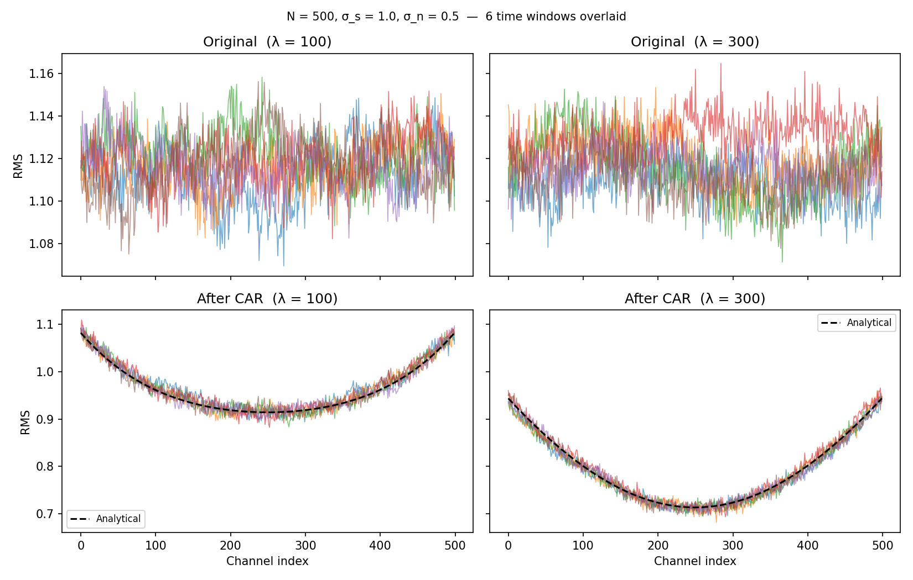

## Overview

Common Average Referencing (CAR) subtracts the mean across channels at each time step.
When channels are spatially correlated this introduces a **position-dependent bias** in
per-channel RMS: edge channels lose less variance than central ones, producing a
characteristic U-shape.

## Model

### Covariance

Consider $N$ channels with an exponentially decaying covariance plus uncorrelated noise:

$$C_{jk} = \sigma_s^2\,e^{-|j-k|/\lambda} + \sigma_n^2\,\delta_{jk}$$

where $\lambda$ is the spatial correlation length in channels.

### Variance after CAR

The CAR-subtracted signal $y_j = x_j - \frac{1}{N}\sum_k x_k$ has variance

$$\operatorname{Var}(y_j)
  = C_{jj}
  - \frac{2}{N}\sum_k C_{jk}
  + \frac{1}{N^2}\sum_{j,k} C_{jk}$$

Setting $r = e^{-1/\lambda}$ and splitting the absolute value, the row sum closes in a
geometric series:

$$S_j \equiv \sum_{k=0}^{N-1} r^{|j-k|}
         = \frac{1 + r - r^{j+1} - r^{N-j}}{1-r}$$

The grand sum $T \equiv \sum_j S_j$ is

$$T = \frac{N(1+r) - \dfrac{2r(1-r^N)}{1-r}}{1-r}$$

Substituting and separating the noise contribution gives the closed-form **RMS profile**:

$$\boxed{
  \mathrm{RMS}_j = \sqrt{
    \sigma_s^2\!\left(1 - \frac{2S_j}{N} + \frac{T}{N^2}\right)
    + \sigma_n^2\,\frac{N-1}{N}
  }
}$$

The noise term $\sigma_n^2(N-1)/N$ is position-independent — it is the standard
single-degree-of-freedom reduction from mean subtraction.

### Asymptotic limits

For a channel deep in the array ($r^j \approx 0$, $r^{N-j} \approx 0$):

$$S_j^\infty = \frac{1+r}{1-r} \approx 2\lambda \quad (\lambda \gg 1)$$

For an edge channel ($j = 0$ or $j = N-1$, with $N \gg \lambda$):

$$S_0 = \frac{1-r^N}{1-r} \approx \lambda$$

The edge row sum is roughly **half** the bulk value, so CAR removes half as much signal
variance at the edges. The transition from elevated-edge to flat-bulk RMS occurs over
$\approx\lambda$ channels — the width of the U-shape horns is a direct read-out of the
spatial correlation length.

## Simulation

```{python}
#| label: setup
import warnings
import numpy as np
import matplotlib.pyplot as plt
import matplotlib.gridspec as gridspec
```

```{python}
#| label: simulate
#| output: false

rng = np.random.default_rng(42)

N = 500          # channels
T_samp = 20_000  # time samples
sigma_s = 1.0
sigma_n = 0.5
n_win = 6        # time windows for variability display

def analytical_rms(N, lam, sigma_s, sigma_n):
    """Closed-form per-channel RMS after CAR."""
    r = np.exp(-1.0 / lam)
    j = np.arange(N)
    S = (1 + r - r ** (j + 1) - r ** (N - j)) / (1 - r)
    T_grand = (N * (1 + r) - 2 * r * (1 - r**N) / (1 - r)) / (1 - r)
    var = sigma_s**2 * (1 - 2 * S / N + T_grand / N**2) + sigma_n**2 * (N - 1) / N
    return np.sqrt(np.clip(var, 0, None))

def simulate(N, lam, sigma_s, sigma_n, T_samp, rng):
    """Generate correlated data, apply CAR, return (data, data_car)."""
    idx = np.arange(N)
    C = sigma_s**2 * np.exp(-np.abs(idx[:, None] - idx[None, :]) / lam)
    C += sigma_n**2 * np.eye(N)
    evals, evecs = np.linalg.eigh(C)
    L = evecs * np.sqrt(np.maximum(evals, 0))[None, :]
    with warnings.catch_warnings():
        warnings.simplefilter("ignore")
        data = L @ rng.standard_normal((N, T_samp))
    data_car = data - data.mean(axis=0, keepdims=True)
    return data, data_car

lambdas = [100, 300]
fig, axes = plt.subplots(2, 2, figsize=(11, 7), sharey="row", sharex=True)
cmap = plt.get_cmap("tab10")
win = T_samp // n_win

for col, lam in enumerate(lambdas):
    data, data_car = simulate(N, lam, sigma_s, sigma_n, T_samp, rng)
    rms_pred = analytical_rms(N, lam, sigma_s, sigma_n)

    # top row: original
    for i in range(n_win):
        s, e = i * win, (i + 1) * win
        axes[0, col].plot(np.sqrt(np.mean(data[:, s:e]**2, axis=1)),
                          color=cmap(i), alpha=0.6, lw=0.8)
    axes[0, col].set_title(f"Original  (λ = {lam})")
    axes[0, col].set_ylabel("RMS" if col == 0 else "")

    # bottom row: after CAR
    for i in range(n_win):
        s, e = i * win, (i + 1) * win
        axes[1, col].plot(np.sqrt(np.mean(data_car[:, s:e]**2, axis=1)),
                          color=cmap(i), alpha=0.6, lw=0.8)
    axes[1, col].plot(rms_pred, "k--", lw=1.5, label="Analytical")
    axes[1, col].set_title(f"After CAR  (λ = {lam})")
    axes[1, col].set_ylabel("RMS" if col == 0 else "")
    axes[1, col].set_xlabel("Channel index")
    axes[1, col].legend(fontsize=8)

fig.suptitle(
    f"N = {N}, σ_s = {sigma_s}, σ_n = {sigma_n}  —  {n_win} time windows overlaid",
    fontsize=10,
)
plt.tight_layout()
from pathlib import Path
Path("figures").mkdir(exist_ok=True)
plt.savefig("figures/simulate.png", dpi=150)
plt.close()
```



## Conclusion

CAR suppresses the spatially correlated signal most effectively for central channels —
those with correlated neighbours on both sides — and least at the edges.  The resulting
U-shaped RMS profile is fully predicted by a closed-form expression in terms of $r =
e^{-1/\lambda}$.  Crucially, the **horn width** of the U directly estimates $\lambda$:
for $\lambda = 100$ the upturn spans ~100 channels; for $\lambda = 300$ it spans the
entire 500-channel array, preventing the profile from ever flattening.  This makes the
post-CAR RMS a cheap diagnostic for the spatial correlation scale of the recording.
