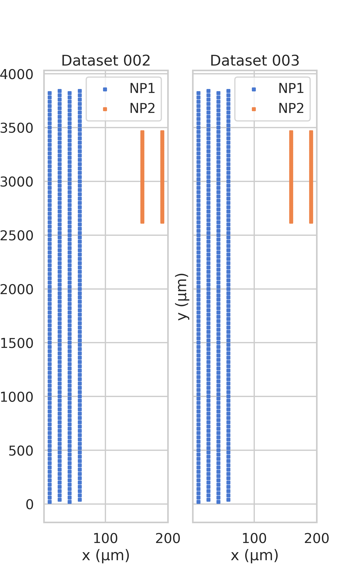
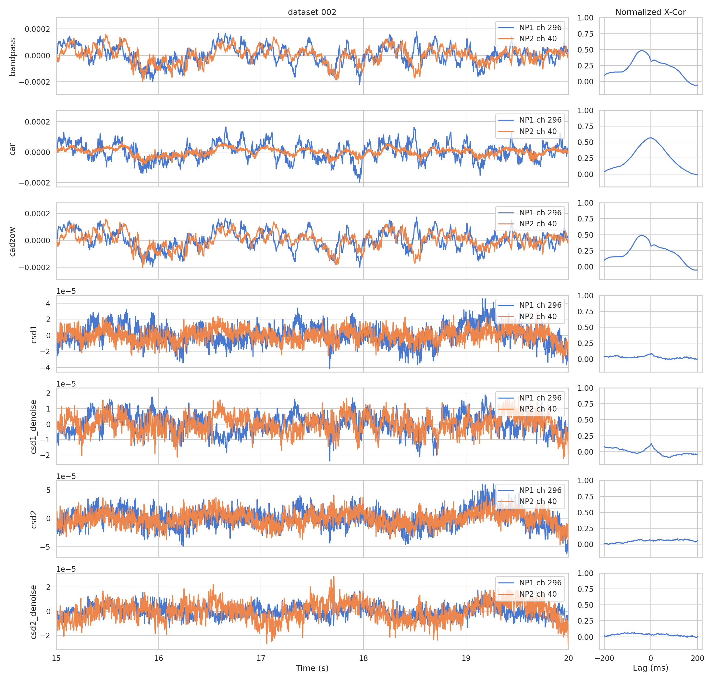
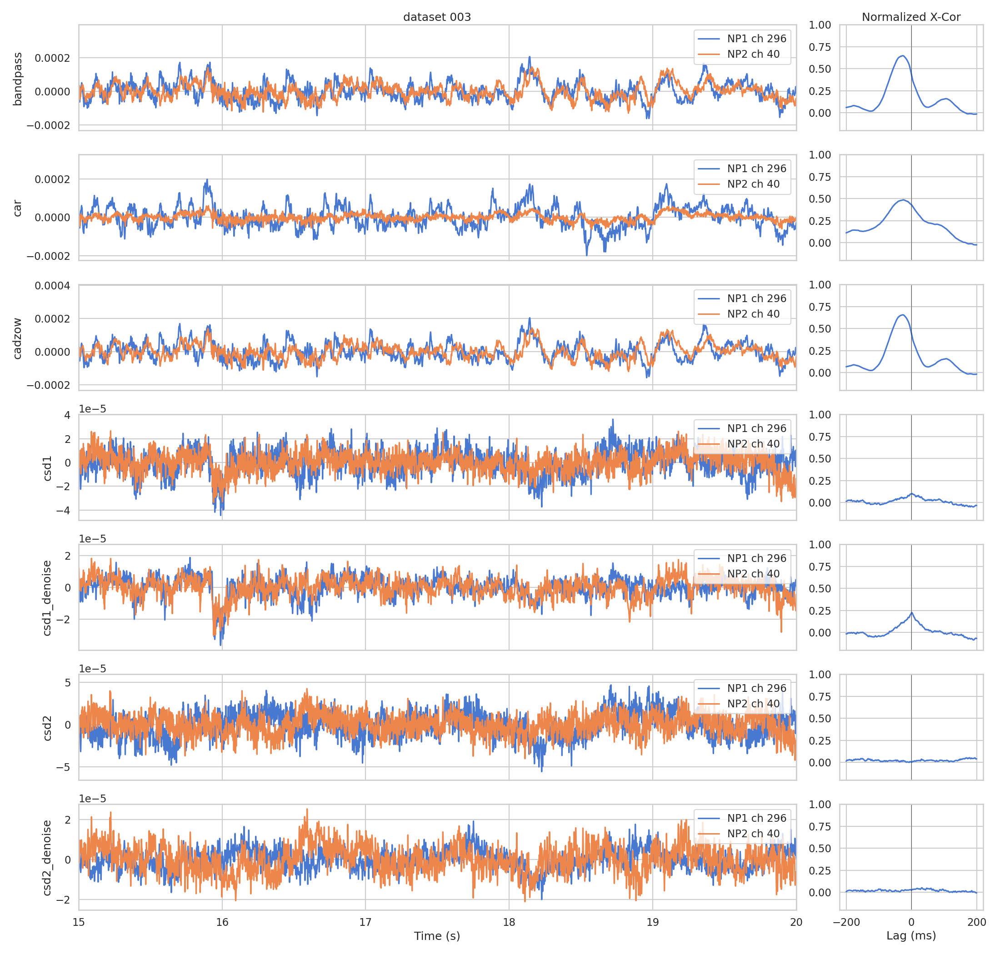
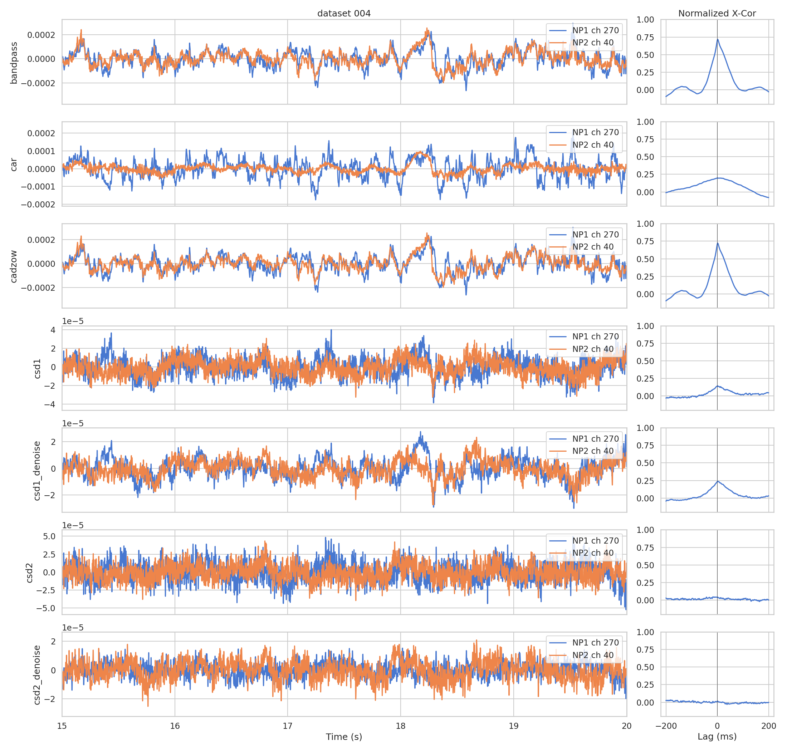
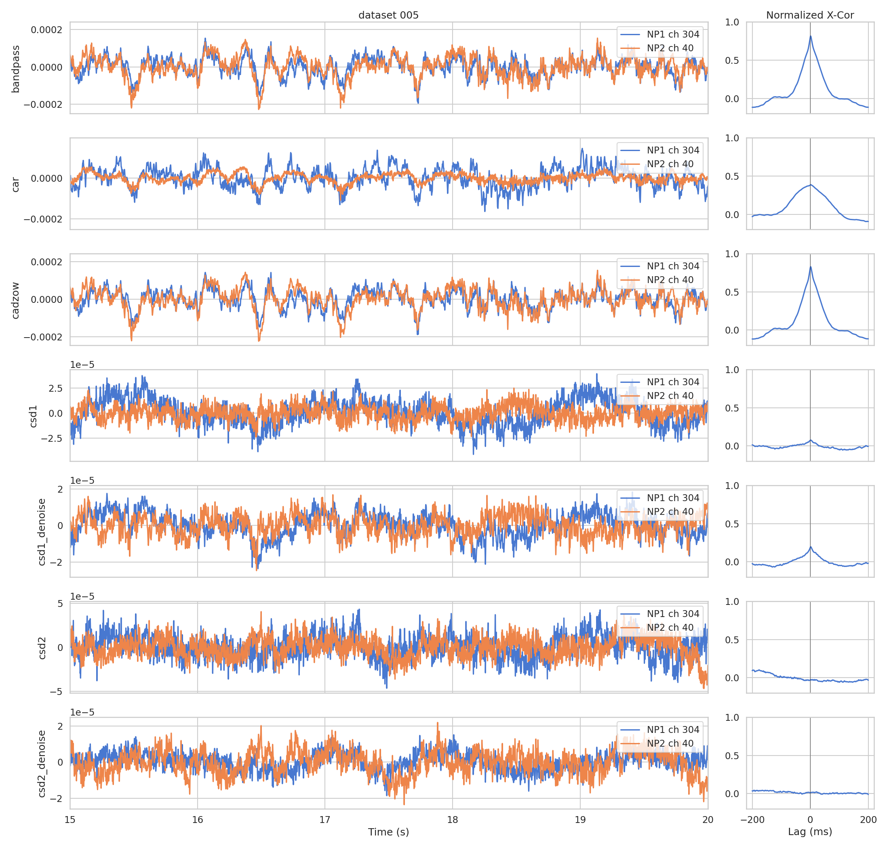
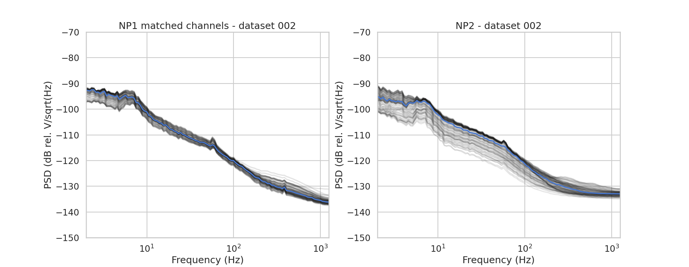
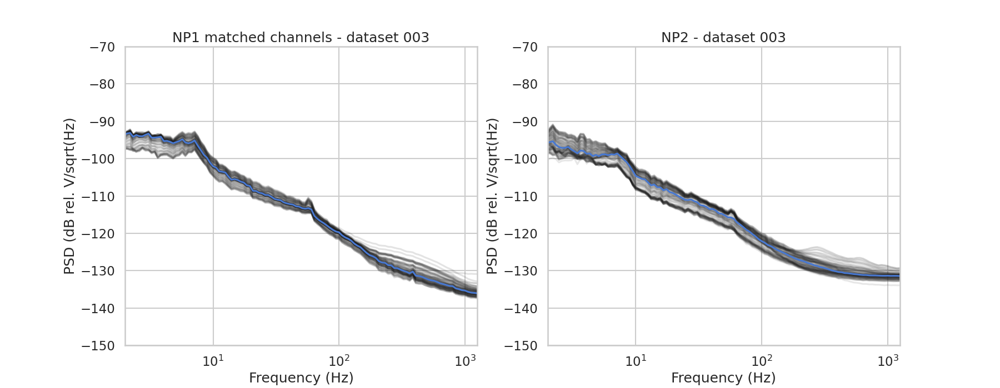
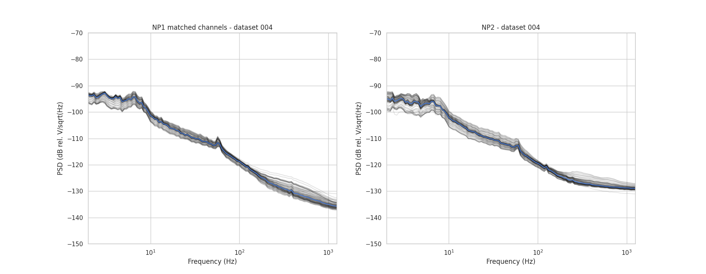
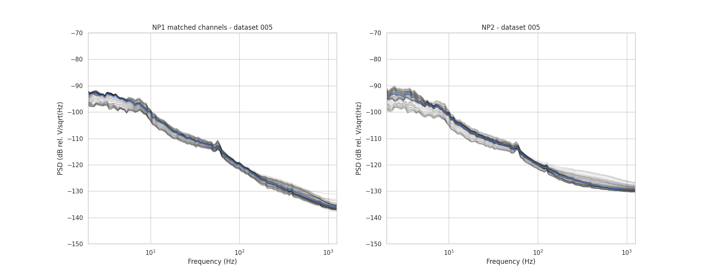

## Overview

Seven simultaneous NP1+NP2 recordings (datasets 001–007) were collected by Kim in the Steinmetz lab to characterise how probe version and referencing scheme affect LFP quality.
NP2 was recorded with three referencing conditions (external, tip reference, join tip references) at two cortical depths (high/low), controlled by the NP2 channel mapping;
NP1 always used external referencing.

**The datasets with matched external referencing (004, 005) provide a ground-truth convergence test: effective denoising should bring the NP1 and NP2 CSD distributions closer together.**

## Conclusions
- **Voltage amplitude is equivalent** between NP1 and NP2 when the same external referencing scheme is applied, once hardware filters are accounted for.
- **CAR can´t be applied on both NP1 and NP2**, the NP2 spatial span is much shorter than NP1, resulting in a destructive effect.
- First order CSD conserves a small amount of correlation, while second order CSD destroys it completely. Spatial noise attenuation slightly improves on the correlation after spatial derivative.

## Probe geometry
NP1 has 384 channels in a checkerboard pattern (two interleaved columns); NP2.4 has 96 channels arranged in four straight columns on a single shank.
In experiments 1-4 the lower channels of NP2 recorded. Then for experiments 5-7, NP2 was driven down and higher channels were selected to be recorded.

{width=70%}

## Preprocessing - Cross-correlation Evaluation

The evaluation metric is the peak of the normalised cross-correlation between matched NP1/NP2 channel pairs.
Each raw snippet goes through the following ordered stages:

| Stage | Description |
|---|---|
| `bandpass` | 0.2-300Hz bandpass filter (includes sample shifts) |
| `car` | Global CAR subtracted from `bandpass` |
| `cadzow` | Spatiotemporal SVD denoising (rank 4, fmax 200 Hz) |
| `csd1` | 1st-order finite-difference CSD on `bandpass` |
| `csd1_denoise` | 1st-order CSD on `cadzow`|
| `csd2` | 2nd-order CSD on `bandpass` |
| `csd2_denoise` | 2nd-order CSD on `cadzow`|

## Power spectral density

PSD curves for all matched channels (30 s epoch, 30 kHz → 2.5 kHz LF band).

Both probes show similar spectral profiles. The 50 Hz mains harmonic is visible but moderate.

