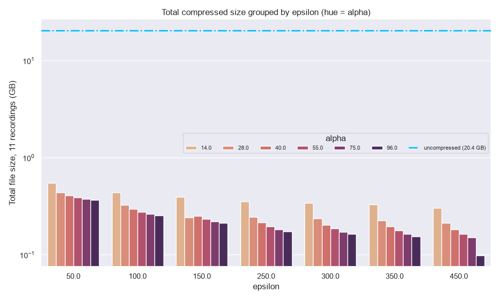

## Overview

The [SVD/WP compression benchmark](index.qmd) calibrates ε and α against **RMSE and SNR** — a
spatial/amplitude fidelity proxy that says nothing about whether the *information* downstream
analyses use survives compression. This page checks that directly, by decoding wheel speed,
choice and feedback from LFP band-power envelopes across the 11 benchmark recordings, then uses
the result to search for a better operating point than the current two-tier design.

**lfpack's codec is two independent stages, applied in sequence** (`compress()` in
`packages/lfpack/src/lfpack/_core.py`):

1. **SVD stage — ε only.** Rank `r = #{k : sv[k] > ε·σ₀}` is fixed from the raw singular-value
   spectrum before α is used at all. ε alone decides how many spatial components survive.
2. **WP (wavelet-packet) stage — α only.** Each of the `r` surviving components is
   wavelet-packet compressed with threshold `τ_k = α·σ₀/sv[k]`. α alone decides how much fine
   temporal/high-frequency detail survives *within* those components.

They're not fully independent in effect, though: `τ_k` is normalized by `sv[k]`, and which
singular values survive to be thresholded is exactly what ε controls — so a given α lands
differently depending on ε's choice of surviving components. This turns out to matter a lot
below.

**Bottom line:** the shipped aggressive tier (ε=450, α=96) measurably hurts decoding — feedback
especially — with no warning from RMSE. Neither parameter is a usable lever on its own: α alone
reliably costs decoding fidelity (confirmed with a paired test below) without buying real
compression, and ε alone buys no compression either, nor — once properly tested — does it
reliably cost decoding at all. Real compression only appears when both are pushed together,
and a full 42-cell (ε, α) grid (mild through aggressive) now maps that trade-off directly.
**Recommendation: retire the aggressive tier; keep default (ε=150, α=28) as standard; ε=450,
α=28 is the best non-dominated upgrade if more compression is required.**

## Method

Band-power envelope features (log Hilbert amplitude, delta/theta/beta/gamma, 96 channels after
4:1 spatial binning), computed identically for every compression tier from the same
Cadzow-denoised checkpoint (`lf_resampled_car_cadzow.npy`), decoded with:

| Target | Feature window | Decoder | Metric |
|---|---|---|---|
| \|wheel velocity\| | continuous, 50 ms bins | RidgeCV, 5-fold chronological CV | R² |
| choice | [-0.2, 0) s rel. `firstMovement_times` | Standardized LogisticRegressionCV, 5-fold stratified CV | balanced accuracy |
| feedback | [0, 0.2) s rel. `feedback_times` | same | balanced accuracy |

Null: a simple per-fold label/target shuffle — not a pseudo-session control, so it understates
single-recording significance, but it's held identical across tiers, which is what matters for
a *relative* compression-effect comparison. Sample times (t0 is `nan` on these benchmark files)
are reconstructed via `SpikeSortingLoader.timesprobe2times`.

## Does compression hurt decoding?

```{python}
#| echo: false
import pandas as pd
m = pd.read_csv("2026-08-31_compression_tuning_metrics.csv")
base_order = ["uncompressed", "alpha28 (default)", "aggressive (eps450, alpha96, shipped)"]
m.groupby("tier")[["r2_wheel", "balanced_accuracy_choice", "balanced_accuracy_feedback"]].agg(["mean", "median"]).loc[base_order].round(3)
```

{.lightbox}

{.lightbox}

Default tracks uncompressed closely on every target. Aggressive erodes all three, feedback most
severely (mean 0.642 → 0.557), because it's decoded from a brief post-event window — exactly
the fast, phasic structure the WP stage's per-coefficient threshold removes first (small-magnitude
coefficients are discarded before large ones, and fine time-scale structure is where LFP
wavelet coefficients tend to be smallest). Wheel speed, a slower band-power average, is the
least affected.

## Searching for an intermediate tier

Sweeping **ε alone** (α=28 fixed, ε ∈ 150–450) or **α alone** (ε=150 fixed, α ∈ 28–96) both left
total file size across the 11 recordings essentially flat (0.242 GB → ~0.21 GB either way, an
~13% reduction). But their effect on decoding fidelity is *not* symmetric, and the raw per-
recording numbers are easy to misread here: feedback balanced accuracy varies enormously
between recordings (SD ≈0.11 at a single grid cell — some recordings decode feedback near
chance, others above 0.8), which swamps both parameters' effects unless it's controlled for. A
paired per-recording test (same 11 recordings, before vs. after moving one parameter) shows
they're not equivalent: moving **α** from 28→96 (ε=150 fixed) drops feedback balanced accuracy
in **10/11 recordings** (Wilcoxon p=0.005) — a real, consistent effect. Moving **ε** from
150→450 (α=28 fixed) only drops it in 6/11 (p=0.17) — **not distinguishable from
between-recording noise**, and driven almost entirely by two strong-feedback-decoding
recordings rather than a general effect. So: α alone reliably costs decoding fidelity without
buying compression; ε alone buys no compression either, but its apparent decoding cost mostly
isn't real. Yet at ε=450, moving α from 28→96 — the shipped aggressive tier vs. the same ε at
default's α — *nearly halves* the file size (0.211 GB → 0.098 GB): the ε/α interaction
described above, in action. Real compression only appears when both are pushed together.

```{python}
#| echo: false
diag_order = ["uncompressed", "alpha28 (default)", "eps250/alpha50", "eps350/alpha75",
              "aggressive (eps450, alpha96, shipped)"]
tbl = m.groupby("tier")[["r2_wheel", "balanced_accuracy_choice", "balanced_accuracy_feedback", "cr_realized"]].mean().loc[diag_order]
tbl["total_GB"] = m.groupby("tier")["file_bytes"].sum().loc[diag_order] / 1e9
tbl.round(3)
```

{.lightbox}

{.lightbox}

Realized CR climbs steadily (87×→104×→128×→217×) as feedback retention falls in step
(0.688→0.530→0.410→0.402) — **no free knee**: every step away from default costs real fidelity
immediately. `eps350/alpha75` is dominated by the shipped aggressive tier (almost the same
feedback cost, barely half the compression) — not worth using. This diagonal only sampled the
line between two points, though — the full grid below covers the surface.

## Full 2D grid

ε ∈ {50, 100, 150, 250, 300, 350, 450} × α ∈ {14, 28, 40, 55, 75, 96} — 42 cells (milder than
default through the shipped aggressive point), all 11 recordings, all three decode targets.

```{python}
#| echo: false
g = pd.read_csv("2026-09-01_full_grid_metrics.csv")
grid = g.dropna(subset=["epsilon"])
grid.groupby(["epsilon", "alpha"])[["r2_wheel", "balanced_accuracy_choice",
                                     "balanced_accuracy_feedback", "cr_realized"]].mean().round(3)
```

{.lightbox}

The heatmaps make the asymmetry from the previous section visible directly: wheel and feedback
both shift clearly moving *across* alpha (columns) but barely at all moving *down* epsilon
(rows) — until the (450, 96) corner, which stands out as a clear outlier in the CR panel (217×
vs. 140× and 135× in its immediate neighbors), the interaction in action. The corner cells also
show plainly how close default's decode metrics already sit to uncompressed (0.127 vs. 0.139
wheel R², 0.597 vs. 0.642 feedback), and how far realized CR has to climb from uncompressed's 1×.

{.lightbox}

{.lightbox}

**Retained fraction** (below) is how much of the uncompressed decode a tier keeps: for wheel,
`R²(tier) / R²(uncompressed)`; for choice/feedback, `(balanced_accuracy(tier) - 0.5) /
(balanced_accuracy(uncompressed) - 0.5)` — chance-corrected, since balanced accuracy's floor is
0.5, not 0. 1.0 means indistinguishable from uncompressed.

::: {.column-page}
{.lightbox}
:::

**The true Pareto frontier** (cells where no other cell has both higher realized CR and higher
retained feedback) contains 16 of the 42 cells, and default (150, 28) is on it — nothing
dominates it. Stepping along the frontier past default is a real, gradual trade the whole way:
(300, 28) barely improves CR (89× vs. 87×) for a real feedback cost (retained fraction
0.640 vs. 0.688); (350, 28) and (450, 28) are close together and both meaningfully better value
— (450, 28) reaches 100× for retained fraction 0.603, a small further cost over (350, 28)'s
93×/0.605 for real extra compression. Past that, the frontier only continues by also raising α,
which is where the interaction — and the larger feedback cost — kicks in.

## Recommendation

- **Keep default (ε=150, α=28)** as the standard cohort-wide tier — it's Pareto-efficient, and
  every tested alternative trades away real feedback fidelity.
- **If more compression is required, use ε=450, α=28** — 100× realized CR (0.211 GB vs.
  default's 0.242 GB across the 11 recordings, both tiny next to uncompressed's 20.4 GB), R²
  0.122 vs. default's 0.127, feedback balanced accuracy 0.585 vs. default's 0.597. That
  feedback gap is not statistically distinguishable from between-recording noise (paired
  Wilcoxon p=0.17) — the best-value, lowest-risk upgrade found on the whole grid.
- **Retire the aggressive tier (ε=450, α=96).** Nothing between ε=450/α=28 and aggressive is
  worth shipping — the frontier only gets there by also raising α, which is where the real,
  significant decoding cost (p=0.005) lives.
- **Worth knowing:** the α=14 row (any ε) gives noticeably *better* feedback retention than
  default (up to 0.90) at a real storage cost (38–70× vs. default's 87×) — an option if a
  future use case needs to beat default's fidelity rather than just approach it.
- **Build command** (per-recording, ≈10–60 s from the existing Cadzow checkpoint, no
  re-download needed): `lfpack.compress_to_h5(cadzow_npy, out_h5, recording=pid, epsilon=450.0,
  alpha=28.0, fs=250.0, ...)`.
