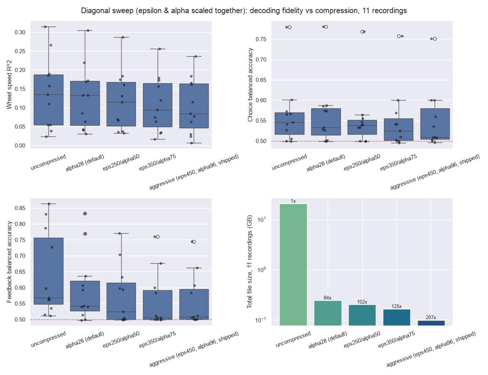
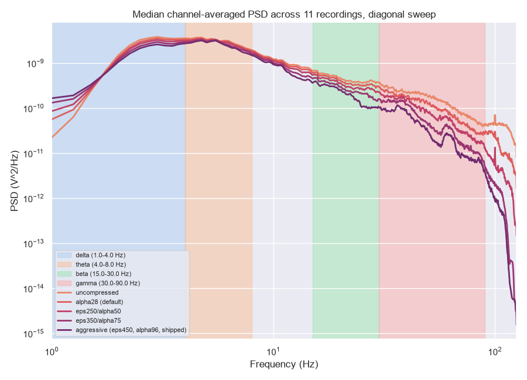
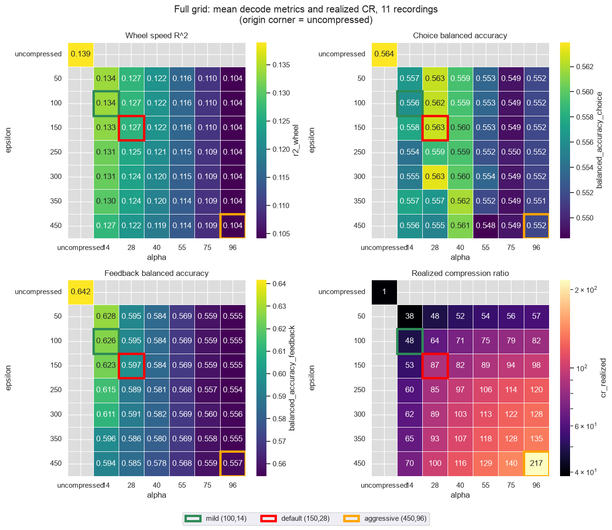
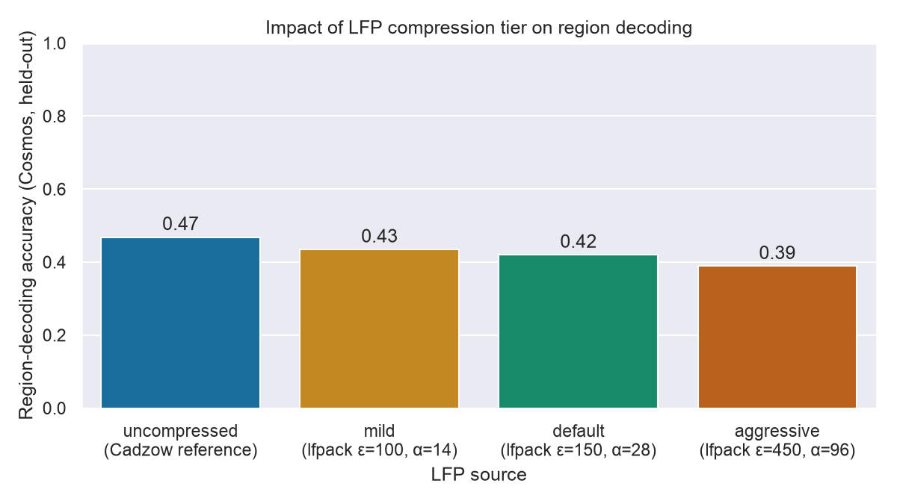
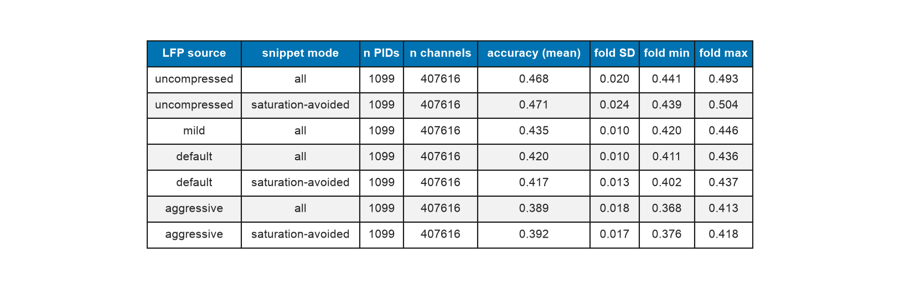

## Overview

The [SVD/WP compression benchmark](index.qmd) calibrates ε and α against **RMSE and SNR** — a
spatial/amplitude fidelity proxy that says nothing about whether the *information* downstream
analyses use survives compression. This page checks that directly, with two independent
functional validations against real scientific use cases:

1. **Behavioural decoding** — wheel speed, choice and feedback decoded from LFP band-power
   envelopes across 11 benchmark recordings, used to search for a better operating point than
   the original two-tier (default/aggressive) design.
2. **Region decoding** — brain-region (Cosmos) classification from LF+CSD features at full
   ephys-atlas cohort scale (1099 recordings) — an independent task, decoder, and ~100× larger
   sample, run *after* the tier search above to confirm its conclusion generalises.

**lfpack's codec is two independent stages, applied in sequence** (`compress()` in
`packages/lfpack/src/lfpack/_core.py`):

1. **SVD stage — ε only.** Rank `r = #{k : sv[k] > ε·σ₀}` is fixed from the raw singular-value
   spectrum before α is used at all. ε alone decides how many spatial components survive.
2. **WP (wavelet-packet) stage — α only.** Each of the `r` surviving components is
   wavelet-packet compressed with threshold `τ_k = α·σ₀/sv[k]`. α alone decides how much fine
   temporal/high-frequency detail survives *within* those components.

They're not fully independent in effect, though: `τ_k` is normalized by `sv[k]`, and which
singular values survive to be thresholded is exactly what ε controls — so a given α lands
differently depending on ε's choice of surviving components. This turns out to matter a lot
below.

**Bottom line:** both validations agree. The shipped aggressive tier (ε=450, α=96) measurably
hurts decoding — feedback especially, and region accuracy — with no warning from RMSE. Neither
parameter is a usable lever on its own: α alone reliably costs decoding fidelity (confirmed with
a paired test below) without buying real compression, and ε alone buys no compression either,
nor — once properly tested — does it reliably cost decoding at all. Real compression only
appears when both are pushed together, and a full 42-cell (ε, α) grid (mild through aggressive)
maps that trade-off directly. The region-decoding validation, run independently at ~100× the
sample size, reproduces the same tier ranking exactly: uncompressed > mild > default >
aggressive.
**Recommendation: retire the aggressive tier; keep default (ε=150, α=28) as standard; mild
(ε=100, α=14) for the highest fidelity; ε=450, α=28 is the best non-dominated upgrade if more
compression is required.**

## Behavioural decoding (wheel / choice / feedback)

### Method

Band-power envelope features (log Hilbert amplitude, delta/theta/beta/gamma, 96 channels after
4:1 spatial binning), computed identically for every compression tier from the same
Cadzow-denoised checkpoint (`lf_resampled_car_cadzow.npy`), decoded with:

| Target | Feature window | Decoder | Metric |
|---|---|---|---|
| \|wheel velocity\| | continuous, 50 ms bins | RidgeCV, 5-fold chronological CV | R² |
| choice | [-0.2, 0) s rel. `firstMovement_times` | Standardized LogisticRegressionCV, 5-fold stratified CV | balanced accuracy |
| feedback | [0, 0.2) s rel. `feedback_times` | same | balanced accuracy |

Null: a simple per-fold label/target shuffle — not a pseudo-session control, so it understates
single-recording significance, but it's held identical across tiers, which is what matters for
a *relative* compression-effect comparison. Sample times (t0 is `nan` on these benchmark files)
are reconstructed via `SpikeSortingLoader.timesprobe2times`.

### Does compression hurt decoding?

```{python}
#| echo: false
import pandas as pd
m = pd.read_csv("2026-08-31_compression_tuning_metrics.csv")
g_full = pd.read_csv("2026-09-01_full_grid_metrics.csv")
mild_rows = g_full[(g_full["epsilon"] == 100.0) & (g_full["alpha"] == 14.0)].copy()
mild_rows["tier"] = "mild (eps100, alpha14)"
m2 = pd.concat(
    [m, mild_rows[["tier", "r2_wheel", "balanced_accuracy_choice", "balanced_accuracy_feedback"]]],
    ignore_index=True,
)
base_order = ["uncompressed", "mild (eps100, alpha14)", "alpha28 (default)",
              "aggressive (eps450, alpha96, shipped)"]
m2.groupby("tier")[["r2_wheel", "balanced_accuracy_choice", "balanced_accuracy_feedback"]].agg(["mean", "median"]).loc[base_order].round(3)
```

{#fig-r2-by-pid .lightbox}

{#fig-categorical-boxplot .lightbox}

Default tracks uncompressed closely on every target; mild tracks it even more closely still
(feedback balanced accuracy 0.626 vs. default's 0.597 and uncompressed's 0.642 — see
@fig-r2-by-pid, @fig-categorical-boxplot). Aggressive erodes all three, feedback most
severely (mean 0.642 → 0.557), because it's decoded from a brief post-event window — exactly
the fast, phasic structure the WP stage's per-coefficient threshold removes first (small-magnitude
coefficients are discarded before large ones, and fine time-scale structure is where LFP
wavelet coefficients tend to be smallest). Wheel speed, a slower band-power average, is the
least affected.

### Searching for an intermediate tier

Sweeping **ε alone** (α=28 fixed, ε ∈ 150–450) or **α alone** (ε=150 fixed, α ∈ 28–96) both left
total file size across the 11 recordings essentially flat (0.242 GB → ~0.21 GB either way, an
~13% reduction). But their effect on decoding fidelity is *not* symmetric, and the raw per-
recording numbers are easy to misread here: feedback balanced accuracy varies enormously
between recordings (SD ≈0.11 at a single grid cell — some recordings decode feedback near
chance, others above 0.8), which swamps both parameters' effects unless it's controlled for. A
paired per-recording test (same 11 recordings, before vs. after moving one parameter) shows
they're not equivalent: moving **α** from 28→96 (ε=150 fixed) drops feedback balanced accuracy
in **10/11 recordings** (Wilcoxon p=0.005) — a real, consistent effect. Moving **ε** from
150→450 (α=28 fixed) only drops it in 6/11 (p=0.17) — **not distinguishable from
between-recording noise**, and driven almost entirely by two strong-feedback-decoding
recordings rather than a general effect. So: α alone reliably costs decoding fidelity without
buying compression; ε alone buys no compression either, but its apparent decoding cost mostly
isn't real. Yet at ε=450, moving α from 28→96 — the shipped aggressive tier vs. the same ε at
default's α — *nearly halves* the file size (0.211 GB → 0.098 GB): the ε/α interaction
described above, in action. Real compression only appears when both are pushed together.

```{python}
#| echo: false
diag_order = ["uncompressed", "alpha28 (default)", "eps250/alpha50", "eps350/alpha75",
              "aggressive (eps450, alpha96, shipped)"]
tbl = m.groupby("tier")[["r2_wheel", "balanced_accuracy_choice", "balanced_accuracy_feedback", "cr_realized"]].mean().loc[diag_order]
tbl["total_GB"] = m.groupby("tier")["file_bytes"].sum().loc[diag_order] / 1e9
tbl.round(3)
```

{#fig-diagonal-summary .lightbox}

{#fig-diagonal-psd .lightbox}

Realized CR climbs steadily (87×→104×→128×→217×) as feedback retention falls in step
(0.688→0.530→0.410→0.402) — **no free knee**: every step away from default costs real fidelity
immediately (@fig-diagonal-summary, @fig-diagonal-psd). `eps350/alpha75` is dominated by the
shipped aggressive tier (almost the same feedback cost, barely half the compression) — not
worth using. This diagonal only sampled the line between two points, though — the full grid
below covers the surface.

### Full 2D grid

ε ∈ {50, 100, 150, 250, 300, 350, 450} × α ∈ {14, 28, 40, 55, 75, 96} — 42 cells (milder than
default through the shipped aggressive point), all three decode targets, across the same 11
benchmark recordings used throughout this section — 14.8 h of LFP in total.

```{python}
#| echo: false
g = pd.read_csv("2026-09-01_full_grid_metrics.csv")
grid = g.dropna(subset=["epsilon"])
grid.groupby(["epsilon", "alpha"])[["r2_wheel", "balanced_accuracy_choice",
                                     "balanced_accuracy_feedback", "cr_realized"]].mean().round(3)
```

{#fig-grid-heatmaps .lightbox}

The heatmaps make the asymmetry from the previous section visible directly (@fig-grid-heatmaps):
wheel and feedback both shift clearly moving *across* alpha (columns) but barely at all moving
*down* epsilon (rows) — until the (450, 96) corner, which stands out as a clear outlier in the
CR panel (217× vs. 140× and 135× in its immediate neighbors), the interaction in action. The
corner cells also show plainly how close default's decode metrics already sit to uncompressed
(0.127 vs. 0.139 wheel R², 0.597 vs. 0.642 feedback) — and how much closer mild's sit (0.134
wheel R², 0.626 feedback) — and how far realized CR has to climb from uncompressed's 1×.

{#fig-grid-boxplots .lightbox}

{#fig-grid-barplot-log .lightbox}

{#fig-grid-barplot-linear .lightbox}

**Retained fraction** (below) is how much of the uncompressed decode a tier keeps: for wheel,
`R²(tier) / R²(uncompressed)`; for choice/feedback, `(balanced_accuracy(tier) - 0.5) /
(balanced_accuracy(uncompressed) - 0.5)` — chance-corrected, since balanced accuracy's floor is
0.5, not 0. 1.0 means indistinguishable from uncompressed.

::: {.column-page}
{#fig-grid-pareto .lightbox}
:::

**The true Pareto frontier** (cells where no other cell has both higher realized CR and higher
retained feedback) contains 16 of the 42 cells, and default (150, 28) is on it — nothing
dominates it (@fig-grid-pareto). Mild (100, 14) sits further up the fidelity axis, at lower CR —
also on the frontier, the best-fidelity point tested. Stepping along the frontier past default is
a real, gradual trade the whole way: (300, 28) barely improves CR (89× vs. 87×) for a real
feedback cost (retained fraction 0.640 vs. 0.688); (350, 28) and (450, 28) are close together and
both meaningfully better value — (450, 28) reaches 100× for retained fraction 0.603, a small
further cost over (350, 28)'s 93×/0.605 for real extra compression. Past that, the frontier only
continues by also raising α, which is where the interaction — and the larger feedback cost —
kicks in.

## Region decoding (brain-region classification)

A second, independent functional check, run *after* the tier search above, at a much larger and
more heterogeneous scale (1099 PIDs, not 11) and on a completely different task — to see whether
the tier ranking found above is a real property of the codec or an artefact of the
wheel/choice/feedback validation's specific method.

### Method

Per-recording LF-band-power and CSD features (raw_lf + raw_lf_csd feature families, 33 columns,
`ephysatlas.features.voltage_features_set`) are computed identically for every LFP source from
~8 snippets/PID (8.79 s windows, 600 s spacing, matching the canonical ephys-atlas snippet
grid), aggregated into one channel-level table, then classified with the canonical ephys-atlas
XGBoost pipeline (5-fold **PID-grouped** CV, Cosmos-level labels, `VINTAGE =
"2026-08_lfp-decoders"`).

| LFP source | Read from | Notes |
|---|---|---|
| `uncompressed` | `lf_resampled_car_cadzow.npy` (Cadzow checkpoint, pre-SVD/WP) | reference — already on the compute cluster |
| `mild` | `lf_compressed_mild_all.h5` | lfpack SVD+WP ε=100, α=14 |
| `default` | `lf_compressed_all.h5` | lfpack SVD+WP ε=150, α=28 |
| `aggressive` | `lf_compressed_aggressive_all.h5` | lfpack SVD+WP ε=450, α=96 |

Two snippet-selection modes are compared per source (except `mild`, run only at full-cohort
scale for `all` — see [Recap](#recap)): naive (`all`) vs. **saturation-avoided**, which drops
snippets overlapping an ADC-saturated interval. This isolates the saturation question from the
compression question directly, on the same cohort.

Cohort: every histology-resolved insertion in `ibl_neuropixel_brainwide_01` (the ephys-atlas
cohort — a strict superset of the curated ~700-PID BWM behavioural cohort), **1099 PIDs, 407616
channels** per source/mode combination.

### Does compression hurt region decoding?

```{python}
#| echo: false
r = pd.read_csv("2026-09-05_region_decoding_metrics.csv")
order = ["uncompressed", "mild", "default", "aggressive"]
r["lfp_source"] = pd.Categorical(r["lfp_source"], categories=order, ordered=True)
r.sort_values(["lfp_source", "snippet_mode"])[
    ["lfp_source", "snippet_mode", "accuracy", "n_pids", "n_channels"]
].reset_index(drop=True)
```

{#fig-region-compression-impact .lightbox}

Compression clearly costs region-decoding accuracy, and the cost is monotonic with compression
aggressiveness (@fig-region-compression-impact): uncompressed (0.468) > mild (0.435, −3.3pp) >
default (0.420, −4.8pp) > aggressive (0.389, −7.9pp vs. uncompressed). This mirrors the
wheel/choice/feedback validation's ranking exactly, on a completely different task, decoder, and
cohort scale — strong evidence that the compression-tier ordering is a real property of the
codec, not an artefact of one validation's specific method.

### Does avoiding saturated snippets help?

).](figures/2026-09-05_lfp-decoders_saturation-impact.png){#fig-region-saturation-impact .lightbox}

Small and inconsistent in direction (@fig-region-saturation-impact): default drops slightly
avoiding saturation (−0.3pp), aggressive and uncompressed both gain slightly (+0.3pp, +0.2pp) —
all differences are within the fold-to-fold spread seen within a single combo's own 5 folds.
Avoiding ADC-saturated snippets does not meaningfully change region-decoding accuracy at this
snippet-selection scale — a separate axis from the compression-tier effect above, and not
something saturation handling needs to trade off against.

### Recap {#recap}

{#fig-region-recap-table .lightbox}

`mild` was added to this validation after the wheel/choice/feedback grid had already identified
ε=100/α=14 as the best-fidelity operating point worth naming and shipping (see
[Full 2D grid](#full-2d-grid) above) — run only at `snippet_mode="all"` full-cohort scale, not
`saturation-avoided`, since the saturation question was already answered by the other three
sources and doesn't need re-litigating per tier (@fig-region-recap-table).

## Recommendation

- **Keep default (ε=150, α=28)** as the standard cohort-wide tier — it's Pareto-efficient on the
  behavioural grid, and every tested alternative in that direction trades away real feedback
  fidelity.
- **Use mild (ε=100, α=14) for the highest fidelity.** Named and shipped as a third production
  tier: realized CR 48× (vs. default's 87×, uncompressed's 1×), feedback balanced accuracy 0.626
  vs. default's 0.597 and uncompressed's 0.642 — a chance-corrected retained-feedback-fraction of
  **0.89** vs. default's 0.68. Confirmed independently at full ephys-atlas cohort scale (1099
  PIDs) by the region-decoding validation above (0.435 vs. default's 0.420, uncompressed's
  0.468).
- **If more compression is required, use ε=450, α=28** — 100× realized CR (0.211 GB vs.
  default's 0.242 GB across the 11 recordings, both tiny next to uncompressed's 20.4 GB), R²
  0.122 vs. default's 0.127, feedback balanced accuracy 0.585 vs. default's 0.597. That
  feedback gap is not statistically distinguishable from between-recording noise (paired
  Wilcoxon p=0.17) — the best-value, lowest-risk upgrade found on the whole grid.
- **Retire the aggressive tier (ε=450, α=96).** Nothing between ε=450/α=28 and aggressive is
  worth shipping — the frontier only gets there by also raising α, which is where the real,
  significant decoding cost (p=0.005) lives, and the largest region-decoding cost measured
  (−7.9pp vs. uncompressed).
- **Build command** (per-recording, ≈10–60 s from the existing Cadzow checkpoint, no
  re-download needed): `lfpack.compress_to_h5(cadzow_npy, out_h5, recording=pid, epsilon=450.0,
  alpha=28.0, fs=250.0, ...)`.

## Code

**Behavioural decoding**: `oliche-quarto/analyses/2026-06-lfp-compression-svd/` —
`compression_benchmark.py`, `svd_adaptive_wp.py` and the dated
`2026-08-31_LFP_compression_*.py` / `2026-08-31_LFP_compression_full_grid_displays.py` scripts
under `~/Documents/ibldevtools/olivier/` (sweep computation + this page's figures).

**Region decoding**: `sdsc-slurms/2026-08_lfp-decoders/` — `extract.py` (per-PID/per-snippet
LF+CSD feature extraction, joblib-parallel), `aggregate.py` (thin wrapper around
`ephysatlas.aggregation.produce_output_dataframes`), `train_classifier.py` (5-fold PID-grouped
XGBoost), `report.py` (this section's table + figures, run locally after rsyncing
`accuracy.json` back from the cluster). Region annotations (`atlas_id`/`acronym`/`x`/`y`/`z`)
come embedded in each lfpack archive via `attach_ibl_metadata.py`
(`sdsc-slurms/2026-06-lfpack/`).
