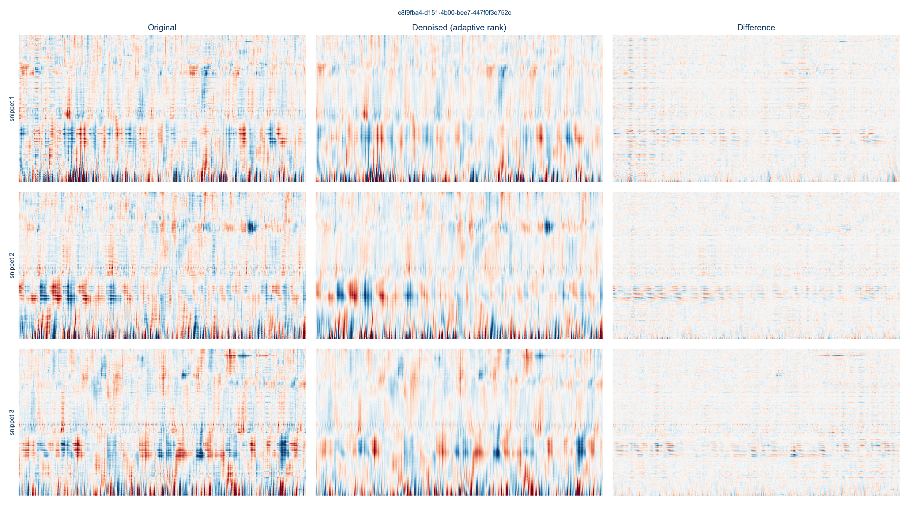
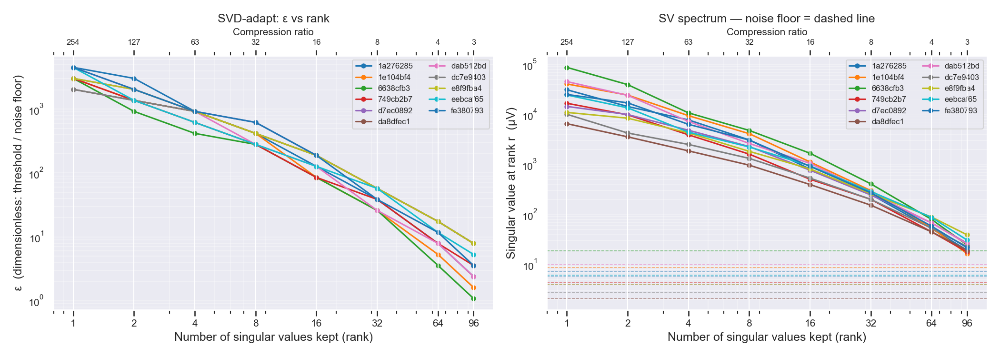
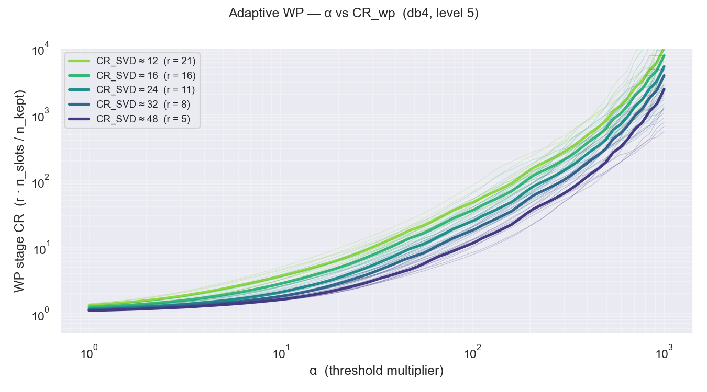
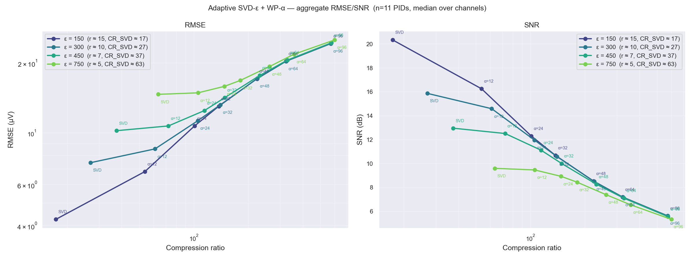
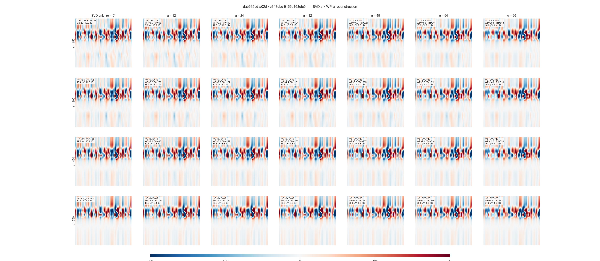
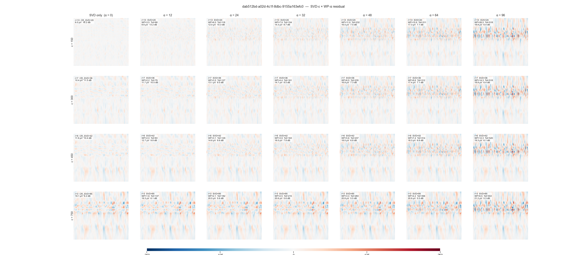
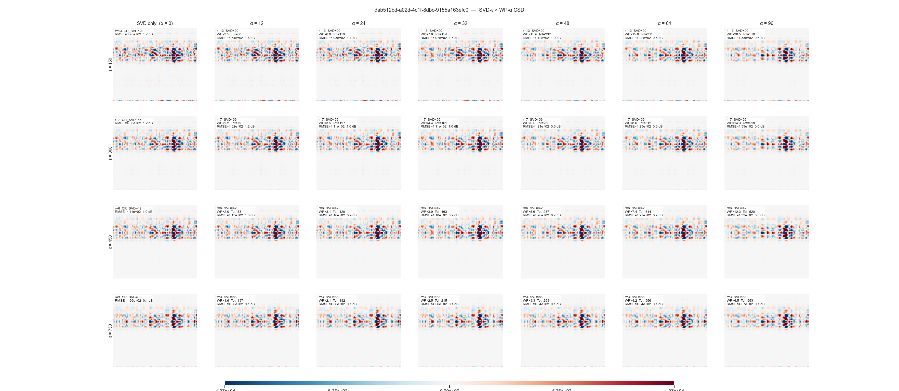
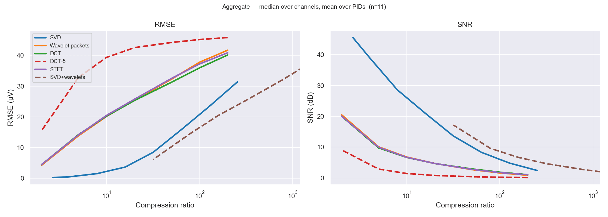
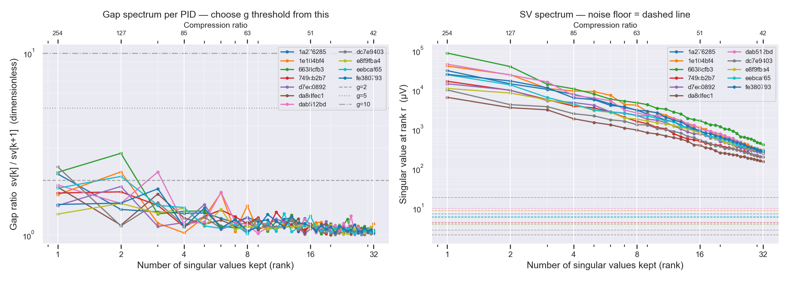

## Summary

lfpack decimates Neuropixels LFP to 250 Hz, denoises it with Cadzow, and compresses each 8 s chunk with an SVD
(spatial) followed by wavelet-packet thresholding of the temporal rows. Two lossless-to-negligible changes and one
decoding-driven choice set the next archive release, **v04** (v03 deprecated):

1. **File format 2** (lossless): **−29 %** against format 1, same random-access latency.
2. **Shared spatial basis** per recording (m = 32, float16 coefficients): makes every tier **20–50 % smaller** at
   identical decoding.
3. **α, the temporal threshold, is the only parameter that moves behaviour decoding.** v04 ships three tiers at
   ε = 100: α = 14, 7 and 2.5.

| v04 tier (ε = 100, m = 32) | 1/CR | size / mild | SNR (dB) | wheel R² below uncompressed (mean / median over probes) | Ephys Atlas (1099 PIDs) | BWM |
|---|---:|---:|---:|---:|---:|---:|
| α = 14 | 0.82 % | 0.51 | 14.4 | 0.0054 / 0.0039 | ~12 GB | ~8.5 GB |
| α = 7 | 1.55 % | 0.97 | 18.5 | 0.0030 / 0.0016 | ~24 GB | ~16 GB |
| α = 2.5 | 3.09 % | 1.94 | 23.4 | 0.0005 / 0.0003 | ~47 GB | ~32 GB |
| *v03 mild (format 1, per-chunk U, α = 14)* | *2.24 %* | *1.41* | *14.4* | *0.0053 / 0.0027* | *34.2 GB* | *23.3 GB* |

Sizes: 1/CR = file / uncompressed float32 at 250 Hz, and file / mild tier (format 2, per-chunk U, ε = 100, α = 14),
both on summed file sizes over 11 benchmark probes. Archive sizes scale the real v03 mild files by 0.71 (format 2) and
by size / mild; the Ephys Atlas cohort includes BWM. Choice and feedback decoding stay within noise at every tier; the
effect of the tiers on region decoding is on the [functional validation page](functional_validation.qmd).

## Codec in brief

Each 8 s chunk $X_j$ (384 channels × 2048 samples, plus 128 guard samples each side) is factorised as

$$X_j \approx U_r\,\mathrm{diag}(s_r)\,\hat V_r^\top, \qquad r = \#\{k : s_k > \varepsilon\,\sigma_0\}, \qquad
\tau_k = \alpha\,\sigma_0 / s_k$$

where $\sigma_0$ is the median of the lower half of the singular values, ε sets the rank (≈ 17 at ε = 100) and α the
hard threshold on the db4 level-5 wavelet-packet coefficients of each temporal row. Every discarded coefficient
therefore costs less than α σ₀ of reconstruction error, whatever its component. The dominant row always keeps its 64
largest coefficients, so a low-SNR chunk never reconstructs to zero. A walk-through of every array is in the
**lfpack Matrix Anatomy** page (<https://claude.ai/artifact/3KqmXv3z7tsrbWSrMXTsU1>).

## File format 2

Format 2 (lfpack branch `feat/container-v2`) stores all chunks of a scale in four flat datasets (`chunk_table`,
`u_values`, `vh_deltas`, `vh_values`) with offsets from the chunk table, so a random read still touches one or two
64 kB storage blocks. Indices are uint16 deltas, and the ~9 % of kept wavelet coefficients whose synthesis function is
zero over the written samples are dropped, which is exactly lossless. Old files stay readable; `lfpack.upgrade_h5`
converts them.

Per 8 s chunk, mild tier, 1a276285 (1.4 h, 607 chunks):

| Layout | HDF5 overhead | spatial U | temporal Vh | total |
|---|---:|---:|---:|---:|
| Format 1: one HDF5 group per chunk, int32 indices | 9.5 kB | 22.7 kB | 31.7 kB | 63.8 kB |
| Format 2 | — | 21.6 kB | 25.1 kB | 46.7 kB |
| Format 2 + shared basis m = 48 | — | 1.7 kB | 25.1 kB | 26.8 kB |

## Shared spatial basis

In format 2 the per-chunk U matrices are nearly half of the file, while the spatial subspace of a recording barely moves
(cos² 0.98 between neighbouring chunks, 0.95 at 40 min apart). The codec runs per chunk unchanged; only the spatial
factor is replaced:

$$C_j = B^\top U_j \;(m \times r,\ \text{float16, float32 per-column scale folded into } s), \qquad U_j \approx B\,C_j$$

$B$ (384 × m, float32, once per recording) holds the top-m eigenvectors of $\sum_j U_j s_j^2 U_j^\top / \lVert U_j s_j
\rVert^2$, with $U_j$ truncated at the chunk's rank so every chunk weighs the same. The temporal rows and thresholds do
not depend on $B$, so an encoder can write them as it goes and keep only $U_j s_j$ in memory (~26 kB per chunk) until
$B$ is computed at the end. Re-decomposing each chunk inside $B$ instead gives the same result (bytes 0.003 %, SNR
0.001 dB, wheel R² 0.0001).

## Size vs decoding

**Protocol.** 11 benchmark probes, every point fully decoded with the functional-validation pipeline (wheel R², choice
and feedback balanced accuracy) on the in-memory reconstruction. α ∈ {2.5, 3.5, 5, 7, 10, 14}; m = 48 at
ε ∈ {50, 70, 100}; m ∈ {32, 24, 16} and int8 C (m = 48, 24) at ε = 100; per-chunk U at ε = 100. Code:
`shared_basis_sweep.py`, `pareto_sweep.py`, `plot_pareto.py`; results `2026-09-26_pareto_*.csv`.

| ε = 100 | α | 1/CR | size / mild | SNR (dB) | worst-decile SNR | Δ wheel R² mean | median |
|---|---:|---:|---:|---:|---:|---:|---:|
| per-chunk U (mild) | 14 | 1.59 % | 1.00 | 14.4 | 13.3 | 0 | 0 |
| per-chunk U | 7 | 2.33 % | 1.46 | 18.5 | 17.3 | +0.0025 | +0.0015 |
| per-chunk U | 2.5 | 3.87 % | 2.43 | 23.5 | 22.2 | +0.0047 | +0.0031 |
| shared m = 32 | 14 | 0.82 % | 0.51 | 14.4 | 13.3 | −0.0002 | −0.0001 |
| shared m = 32 | 10 | 1.13 % | 0.71 | 16.4 | 15.2 | +0.0016 | +0.0007 |
| shared m = 32 | 7 | 1.55 % | 0.97 | 18.5 | 17.3 | +0.0022 | +0.0017 |
| shared m = 32 | 5 | 2.02 % | 1.27 | 20.4 | 19.2 | +0.0032 | +0.0017 |
| shared m = 32 | 3.5 | 2.57 % | 1.61 | 22.2 | 20.9 | +0.0040 | +0.0026 |
| shared m = 32 | 2.5 | 3.09 % | 1.94 | 23.4 | 22.1 | +0.0048 | +0.0030 |
| uncompressed | — | 100 % | — | — | — | +0.0053 | +0.0027 |

- **Only α moves decoding.** At equal α the shared basis and per-chunk U decode identically (median paired difference
  0.00001); the basis makes each α 20–50 % cheaper, more at high α.
- **More rank does not pay:** ε = 70 matches ε = 100 and ε = 50 is slightly worse per byte.
- **The spatial part is exhausted at m ≈ 24–32** (1–4 % of the file); m = 24–48 decode alike, m = 16 loses up to
  1.6 dB SNR.
- **int8 C is a trap:** −1 to −5 % bytes and < 0.12 dB SNR, but wheel R² drops on 83 % of probe-α pairs (up to
  −0.011 on dab512bd). SNR is a poor proxy for decoding; keep C in float16.
- **The mean gap is carried by two probes** (e8f9fba4 +0.031, eebcaf65 +0.014 uncompressed vs mild). Per probe,
  lowering α moves R² monotonically towards its own uncompressed value; the median probe reaches it at α ≈ 3.5.
- **dab512bd is the exception:** worst at intermediate α (−0.013 at α = 5–7) and the probe most sensitive to any
  spatial approximation; unexplained.

## Next steps

1. Port the shared basis (projection, m = 32, float16 C) into lfpack format 2 and write v04 with
   `sdsc-slurms/2026-06-lfpack/compress.py` (tiers α = 14 / 7 / 2.5, reusing the archived Cadzow checkpoints).
2. ~~Region decoding on the v04 tiers~~ (done 2026-10-01, [functional validation](functional_validation.qmd)):
   α = 14 matches v03 mild at 0.33× the size, and unlike behaviour decoding, region decoding still
   improves at lower α (CV accuracy 0.518 / 0.538 / 0.544 at α = 14 / 7 / 2.5). Remaining: look
   into dab512bd.

## Appendix

Earlier work, kept for reference: a 250 Hz decimation + Cadzow denoising pipeline; a transform-method comparison
where SVD dominated; an SVD-ε × WP-α calibration (which set the v03 default ε = 150, α = 28 and aggressive ε = 450,
α = 96 tiers); and a gap-based rank criterion that was discarded.

::: {.callout-note collapse="true" appearance="minimal"}
## Pre-processing pipeline

1. **Bad-channel detection**: channels with anomalous variance flagged and excluded.
2. **Bandpass + CAR + decimation**: 2–250 Hz FIR bandpass, common-average reference, ×10 FIR decimation → 250 Hz float32.
3. **Cadzow F-X denoising**: per frequency bin ≤ 100 Hz, rank-r (≤ 5, adaptive by singular-value gap 2.0) SVD of the
   block-Toeplitz trajectory matrix of the channel vector, with outlier channels (median + 2 MAD) imputed from the
   model and the SVD repeated; 3 s snippets, nw = 64.

All benchmarks run on the Cadzow-denoised signal, so residuals reflect compression loss only.

:::

::: {.callout-note collapse="true" appearance="minimal"}
## Metrics

The Pareto and shared-basis sweeps pool signal and error energy over all written samples of a recording,
SNR = 10·log₁₀ Σx² / Σe² (worst decile: 10th percentile of per-chunk SNR). The earlier SVD/WP benchmark used the
median over channels of $20\log_{10}(\mathrm{RMS}/\mathrm{RMSE})$ on snippets, then the mean over 11 PIDs.
:::

::: {.callout-note collapse="true" appearance="minimal"}
## ε and α calibration

| Rank | ε median | ε range (11 PIDs) |
|-----:|--------:|:--------|
| 4 | 909 | 574–1240 |
| 8 | 461 | 255–584 |
| 16 | 155 | 89–207 |
| 32 | 47 | 22–73 |

When α/ε exceeds the largest wavelet coefficient of a weak component, that component is zeroed entirely: the
wavelet stage then overrides the SVD rank.
:::

::: {.callout-note collapse="true" appearance="minimal"}
## ε × α reconstruction gallery (dab512bd)

:::

::: {.callout-note collapse="true" appearance="minimal"}
## Transform methods and gap-based rank (discarded)

SVD, wavelet packets, DCT, DCT-δ, STFT and SVD+WP were compared on the 11 probes; SVD and SVD+WP dominate at every CR.

A rank criterion on the largest singular-value ratio $s_i / s_{i+1}$ was discarded: after Cadzow the ratio at rank 1
is only 1.3–2.4, with no clean signal/noise gap, so it barely tracks compression.

:::
