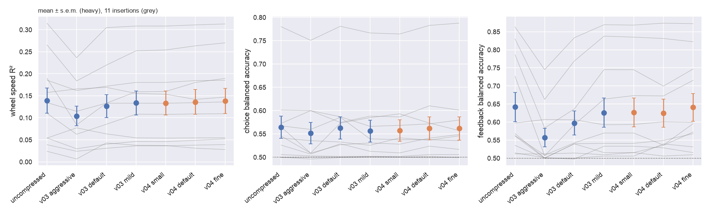
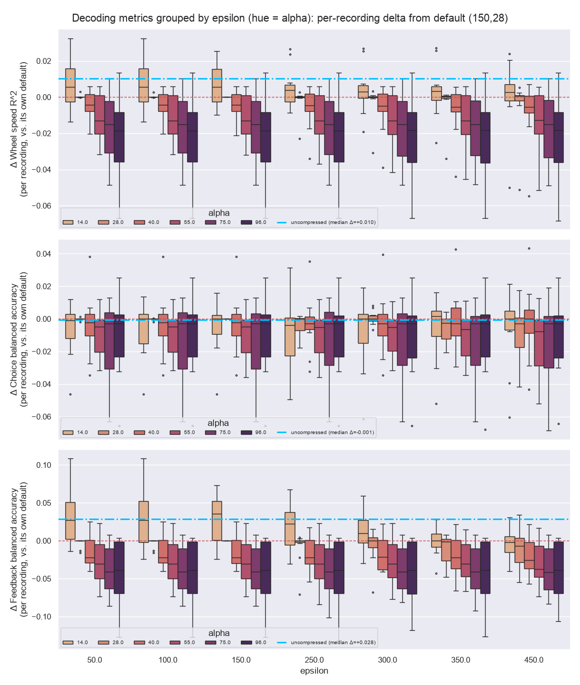
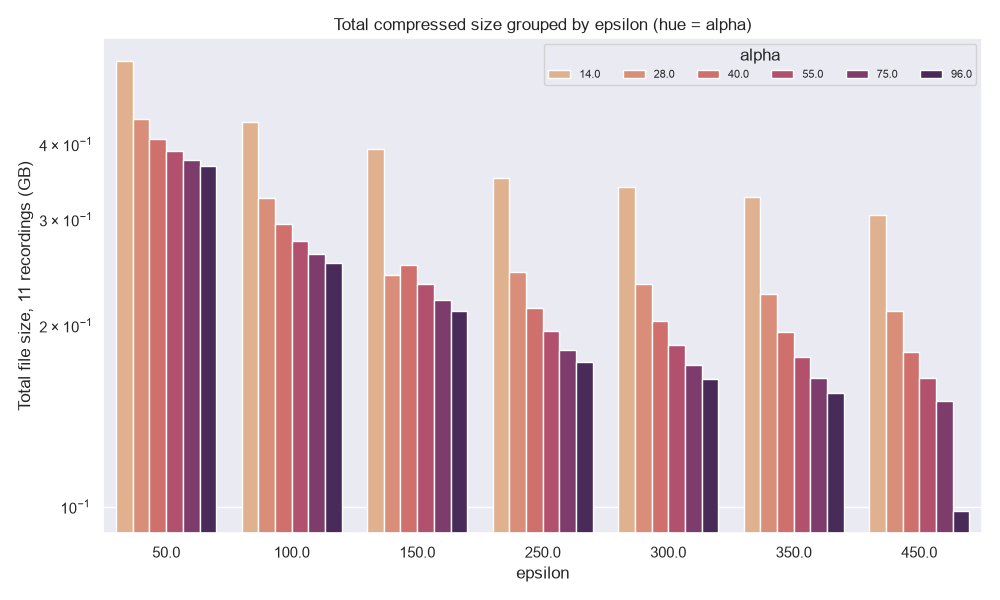
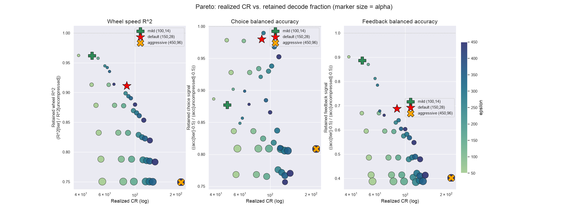

## Summary

lfpack decimates Neuropixels LFP to 250 Hz, denoises it with Cadzow, and compresses each 8 s chunk with an SVD
(spatial) followed by wavelet-packet thresholding of the temporal rows. The v04 archive (v03 deprecated) ships three
tiers that differ only in the wavelet threshold α. All use file format 2 and a shared spatial basis (m = 32, ε = 100).

| v04 tier | α | 1/CR (11 probes) | 1/CR (archive) | SNR (dB) | Ephys Atlas (1099 PIDs) | BWM | wheel R² | feedback bal. acc. | Region CV accuracy |
|---|---:|---:|---:|---:|---:|---:|---:|---:|---:|
| small | 14 | 0.82 % | 0.57 % | 14.4 | 11.2 GB | 7.7 GB | 0.134 | 0.627 | 0.518 |
| default | 7 | 1.55 % | 1.10 % | 18.5 | 21.5 GB | 14.9 GB | 0.136 | 0.625 | 0.538 |
| fine | 2.5 | 3.09 % | 2.36 % | **23.4** | 46.1 GB | 31.9 GB | **0.139** | **0.641** | **0.544** |
| *v03 mild (format 1, per-chunk U)* | *14* | *2.14 %* | *1.75 %* | *14.4* | *34.2 GB* | *23.3 GB* | *0.134* | *0.626* | *0.513* |
| **uncompressed (float32, 250 Hz)** | — | **100 %** | **100 %** | — | **1955.7 GB** | — | **0.139** | **0.642** | **0.551** |

1/CR = file / uncompressed float32 at 250 Hz, on summed file sizes over the 11 benchmark insertions or over the 1099
archive PIDs (longer recordings compress better). SNR, wheel R² and feedback accuracy: mean over the 11 insertions; region: 5-fold PID-grouped held-out accuracy of the TS3 classifier on the 1054 training insertions, mean over 3 model seeds (the 3222 eval units are too few to rank tiers, see the Results). Bold: best performance among the compressed tiers (SNR, wheel R², feedback, TS3) and the uncompressed reference. Wheel R², choice and feedback accuracy at
`small` are within the between-insertion spread of the uncompressed signal. Region decoding keeps improving down to
α = 2.5, so `fine` is the tier for atlas-scale work.

## Why compress LFP

Over the 1099 histology-resolved insertions of the ephys atlas (including the Brain Wide Map, BWM), the decimated
250 Hz float32 LFP alone is 1955.7 GB, too large to move around or to read at random for analyses that need a few
seconds from many probes. The downstream uses are:

- **Brain-region classification** from LF and CSD features of every channel (ephys atlas, TS3 of the brain-wide
  benchmark).
- **Behaviour decoding** (wheel speed, choice, feedback) from LFP band power.
- **Lagged encoding models** of the LFP from task variables.

The v04 `small` archive makes the whole cohort fit on a laptop disk (11.2 GB) and still supports these analyses. The
question this page answers is how far the file can shrink before the science changes.

## Methods

### Pre-processing and Cadzow denoising

For each insertion the LF band is (1) checked for bad channels (anomalous variance, flagged and excluded),
(2) high-passed (3rd-order Butterworth, zero-phase, 0.5 Hz in production), common-average referenced and decimated ×10
to 250 Hz float32, then (3) denoised with **Cadzow F-X filtering**: per frequency bin ≤ 100 Hz, a rank-r (≤ 5, adaptive
by singular-value gap 2.0) SVD of the block-Toeplitz trajectory matrix of the channel vector, with outlier channels
(median + 2 MAD) imputed from the model and the SVD repeated; 3 s snippets, nw = 64. Cadzow removes spatially
incoherent noise before compression, so the codec spends its bytes on signal. The Cadzow step (@fig-cadzow; all insertions in the collapsible below) is unchanged since v03,
and **every benchmark below runs on the Cadzow-denoised signal**, so residuals reflect compression loss only.

{#fig-cadzow}

::: {.callout-note collapse="true" appearance="minimal"}
## Cadzow denoising for the 11 benchmark insertions

::: {.panel-tabset}
```{python}
#| echo: false
#| output: asis
import pandas as pd
from IPython.display import Markdown, display

PIDS = pd.read_csv("2026-09-26_pareto_wheel.csv")["pid"].drop_duplicates().sort_values().tolist()
for pid in PIDS:
    display(Markdown(f"### {pid[:8]}\n\n![Cadzow denoising, insertion {pid[:8]}.]"
                     f"(figures/2026-06-06_cadzow_{pid}.png){{#fig-cadzow-{pid[:8]}}}\n"))
```
:::
:::

### Codec

Each 8 s chunk $X_j$ (384 channels × 2048 samples, plus 128 guard samples each side) is factorised as

$$X_j \approx U_r\,\mathrm{diag}(s_r)\,\hat V_r^\top, \qquad r = \#\{k : s_k > \varepsilon\,\sigma_0\}, \qquad
\tau_k = \alpha\,\sigma_0 / s_k$$

where $\sigma_0$ is the median of the lower half of the singular values, ε sets the rank (≈ 17 at ε = 100) and α the
hard threshold on the db4 level-5 wavelet-packet coefficients of each temporal row. Every discarded coefficient
therefore costs less than α σ₀ of reconstruction error, whatever its component. The dominant row always keeps its 64
largest coefficients, so a low-SNR chunk never reconstructs to zero. The two stages are independent in their
definition (ε sets the rank from the raw spectrum, α the temporal detail kept within it), but not in effect: τ is
normalised by $s_k$, so a given α lands differently for a different ε. A walk-through of every array is in the
**lfpack Matrix Anatomy** page (<https://claude.ai/artifact/3KqmXv3z7tsrbWSrMXTsU1>).

### Bracketing ε and α

ε and α were bracketed on the 11 benchmark insertions before any tier was chosen. The singular-value spectra give the
ε that selects a given rank (ε ≈ 155 for rank 16, ≈ 47 for rank 32), and the α sweep gives the wavelet-stage
compression for each SVD-stage ratio. The curves are tight across insertions, so one (ε, α) generalises across
recordings (@fig-eps-rank, @fig-alpha-sweep, @fig-wp-aggregate). When α/ε exceeds the largest wavelet coefficient of a weak component, that component is zeroed entirely:
the wavelet stage then overrides the SVD rank.

{#fig-eps-rank}

{#fig-alpha-sweep}

{#fig-wp-aggregate}

The bracket was then closed on decoding rather than on RMSE: a 42-cell (ε, α) grid (ε 50–450, α 14–96) decoded for
behaviour showed α is the lever that moves decoding while ε alone buys neither size nor a reliable decoding cost (see
the appendix). That is why v04 fixes ε = 100 and varies only α.

### File format 2

Format 2 (lfpack branch `feat/container-v2`) stores all chunks of a scale in four flat datasets (`chunk_table`,
`u_values`, `vh_deltas`, `vh_values`) with offsets from the chunk table, so a random read still touches one or two
64 kB storage blocks. Indices are uint16 deltas, and the ~9 % of kept wavelet coefficients whose synthesis function is
zero over the written samples are dropped, which is exactly lossless. Old files stay readable; `lfpack.upgrade_h5`
converts them. Per 8 s chunk, mild tier, 1a276285 (1.4 h, 607 chunks):

| Layout | HDF5 overhead | spatial U | temporal Vh | total |
|---|---:|---:|---:|---:|
| Format 1: one HDF5 group per chunk, int32 indices | 9.5 kB | 22.7 kB | 31.7 kB | 63.8 kB |
| Format 2 | — | 21.6 kB | 25.1 kB | 46.7 kB |
| Format 2 + shared basis m = 48 | — | 1.7 kB | 25.1 kB | 26.8 kB |

### Shared spatial basis

In format 2 the per-chunk U matrices are nearly half of the file, while the spatial subspace of a recording barely
moves (cos² 0.98 between neighbouring chunks, 0.95 at 40 min apart). The codec runs per chunk unchanged; only the
spatial factor is replaced:

$$C_j = B^\top U_j \;(m \times r,\ \text{float16, float32 per-column scale folded into } s), \qquad U_j \approx B\,C_j$$

$B$ (384 × m, float32, once per recording) holds the top-m eigenvectors of $\sum_j U_j s_j^2 U_j^\top / \lVert U_j s_j
\rVert^2$, with $U_j$ truncated at the chunk's rank so every chunk weighs the same. The temporal rows and thresholds do
not depend on $B$, so an encoder can write them as it goes and keep only $U_j s_j$ in memory (~26 kB per chunk) until
$B$ is computed at the end. Re-decomposing each chunk inside $B$ instead gives the same result (bytes 0.003 %, SNR
0.001 dB, wheel R² 0.0001).

### Evaluation

- **Fidelity.** SNR = 10·log₁₀ Σx² / Σe², pooled over all written samples of a recording (worst decile: 10th
  percentile of per-chunk SNR).
- **Behaviour decoding (11 insertions).** Band-power envelope features (log Hilbert amplitude, delta / theta / beta /
  gamma, 96 channels after 4:1 spatial binning), identical for every tier, from the Cadzow checkpoint or its
  in-memory reconstruction. |wheel velocity|: RidgeCV on 50 ms bins, 5-fold chronological CV, R². Choice
  ([−0.2, 0) s around first movement) and feedback ([0, 0.2) s around feedback): standardised LogisticRegressionCV,
  5-fold stratified CV, balanced accuracy. The null is a per-fold shuffle, held identical across tiers, which is what
  a relative comparison needs.
- **Region decoding, ephys atlas (1099 insertions, 407 616 channels).** 33 LF and CSD features per channel
  (`raw_lf`, `raw_lf_csd`) from ~8 snippets per insertion (8.79 s windows, 600 s spacing), 5-fold PID-grouped
  XGBoost on Cosmos labels (`VINTAGE = "2026-08_lfp-decoders"`). Snippets are either naive (`all`) or
  **saturation-avoided** (no overlap with an ADC-saturated interval).
- **Region decoding, TS3 of the brain-wide benchmark.** The same classifier, trained on the 1054 non-eval insertions
  and applied to each of the 3222 eval units through its nearest LFP channel by depth; scored with
  `ibl_bwb_eval.scoring.ts3`. The comparison across tiers is paired: same insertions, same saturation-avoided snippet
  times (saturation comes from the raw ADC signal and the Cadzow checkpoints are shared), same 5-fold split, same
  ground truth. Only the archive changes. Mean ± s.e.m. over 3 model seeds (43 / 44 / 45).

## Results

### Size against fidelity and decoding

Every point of the sweep was decoded with the behaviour pipeline on the in-memory reconstruction: α ∈ {2.5, 3.5, 5, 7,
10, 14}; m = 48 at ε ∈ {50, 70, 100}; m ∈ {32, 24, 16} and int8 C (m = 48, 24) at ε = 100; per-chunk U at ε = 100.
Code: `shared_basis_sweep.py`, `pareto_sweep.py`, `plot_pareto.py`; results `2026-09-26_pareto_*.csv`.

{#fig-pareto}

| ε = 100 | α | 1/CR | size / mild | SNR (dB) | worst-decile SNR | Δ wheel R² mean | median |
|---|---:|---:|---:|---:|---:|---:|---:|
| per-chunk U (mild) | 14 | 1.59 % | 1.00 | 14.4 | 13.3 | 0 | 0 |
| per-chunk U | 7 | 2.33 % | 1.46 | 18.5 | 17.3 | +0.0025 | +0.0015 |
| per-chunk U | 2.5 | 3.87 % | 2.43 | 23.5 | 22.2 | +0.0047 | +0.0031 |
| shared m = 32 | 14 | 0.82 % | 0.51 | 14.4 | 13.3 | −0.0002 | −0.0001 |
| shared m = 32 | 10 | 1.13 % | 0.71 | 16.4 | 15.2 | +0.0016 | +0.0007 |
| shared m = 32 | 7 | 1.55 % | 0.97 | 18.5 | 17.3 | +0.0022 | +0.0017 |
| shared m = 32 | 5 | 2.02 % | 1.27 | 20.4 | 19.2 | +0.0032 | +0.0017 |
| shared m = 32 | 3.5 | 2.57 % | 1.61 | 22.2 | 20.9 | +0.0040 | +0.0026 |
| shared m = 32 | 2.5 | 3.09 % | 1.94 | 23.4 | 22.1 | +0.0048 | +0.0030 |
| uncompressed | — | 100 % | — | — | — | +0.0053 | +0.0027 |

- **Only α moves decoding.** At equal α the shared basis and per-chunk U decode identically (median paired difference
  0.00001); the basis makes each α 20–50 % cheaper, more at high α.
- **More rank does not pay:** ε = 70 matches ε = 100 and ε = 50 is slightly worse per byte.
- **The spatial part is exhausted at m ≈ 24–32** (1–4 % of the file); m = 24–48 decode alike, m = 16 loses up to
  1.6 dB SNR.
- **int8 C is a trap:** −1 to −5 % bytes and < 0.12 dB SNR, but wheel R² drops on 83 % of probe-α pairs (up to
  −0.011 on dab512bd). SNR is a poor proxy for decoding; C stays in float16.
- **The mean gap is carried by two insertions** (e8f9fba4 +0.031, eebcaf65 +0.014 uncompressed vs mild). Per
  insertion, lowering α moves R² monotonically towards its own uncompressed value; the median insertion reaches it at
  α ≈ 3.5.
- **dab512bd is the exception:** worst at intermediate α (−0.013 at α = 5–7) and the most sensitive to any spatial
  approximation; unexplained.

The three tiers sit on this curve at α = 14, 7 and 2.5 (@fig-pareto, @fig-tiers):

{#fig-tiers}

### Reconstruction of each insertion

Each Cadzow-denoised checkpoint was re-encoded (@fig-ins-1a276285 to @fig-ins-fe380793, one tab per insertion) with the v04 codec at α = 2.5, 7 and 14 (real format-2 files, not the
in-memory reconstructions of the sweep) and a 3 s window is shown mid-recording as LFP, residual and CSD next to the
original. The residual is displayed with a 5× tighter colour scale than the LFP. SNR and size are for the whole
recording. The CSD (second spatial difference between channels two rows apart) is the most demanding view: `small`
smooths fine spatial structure that `fine` keeps.

```{python}
#| echo: false
#| label: tbl-v04-insertions
#| tbl-cap: "Whole-recording SNR (dB) and file size (MB) of each benchmark insertion at the three v04 tiers (shared basis m = 32, ε = 100)."
snr = pd.read_csv("2026-10-02_v04_insertions_snr.csv")
snr["pid"] = snr["pid"].str[:8]
tab = snr.assign(MB=snr["bytes"] / 1e6).pivot(index="pid", columns="tier", values=["snr", "MB"])
tab = tab.reindex(columns=pd.MultiIndex.from_product([["snr", "MB"], ["fine", "default", "small"]]))
tab.columns = [f"{t} {'SNR' if k == 'snr' else 'MB'}" for k, t in tab.columns]
tab.loc["mean"] = tab.mean()
tab.round(1)
```

::: {.panel-tabset}
```{python}
#| echo: false
#| output: asis
for pid in PIDS:
    display(Markdown(f"### {pid[:8]}\n\n![Insertion {pid[:8]}: original, fine (α = 2.5), default (α = 7) and small "
                     f"(α = 14). Rows: LFP, residual (original − reconstruction, colour scale ÷ 5), CSD.]"
                     f"(figures/2026-10-02_v04_insertion_{pid[:8]}.png){{#fig-ins-{pid[:8]} .lightbox}}\n"))
```
:::

### Behaviour decoding on single probes

Wheel speed, choice and feedback were decoded on the 11 insertions for the uncompressed signal, the three v03 tiers
(the 42-cell grid of the appendix: `aggressive` ε = 450 / α = 96, `default` ε = 150 / α = 28, `mild` ε = 100 / α = 14,
format 1) and the three v04 tiers (@fig-decoding).

```{python}
#| echo: false
#| label: tbl-decoding-tiers
#| tbl-cap: "Behaviour decoding on 11 insertions, mean ± s.e.m. 1/CR: summed file size / uncompressed float32 at 250 Hz; file / v03 mild: summed file sizes. Chance is 0.5 for choice and feedback."
dec = pd.read_csv("2026-10-02_decoding_tiers.csv")
order = ["uncompressed", "v03 aggressive", "v03 default", "v03 mild", "v04 small", "v04 default", "v04 fine"]
size = dec.groupby("tier")["bytes"].sum().loc[order]
pm = lambda c: (dec.groupby("tier")[c].mean().map("{:.3f}".format) + " ± "  # noqa: E731
                + dec.groupby("tier")[c].sem().map("{:.3f}".format)).loc[order]
pd.DataFrame({
    "1/CR": (size / size["uncompressed"]).map("{:.2%}".format),
    "file / v03 mild": (size / size["v03 mild"]).round(2),
    "wheel R²": pm("wheel"),
    "choice": pm("choice"),
    "feedback": pm("feedback"),
}).rename_axis("tier")
```

{#fig-decoding .lightbox}

- **v04 `small` matches v03 mild at 0.38× its size on these insertions (0.33× on the full archive)**: wheel R² 0.1336 vs 0.1337, feedback 0.627 vs 0.626.
- **Lowering α recovers the uncompressed score**, feedback first: 0.627 → 0.625 → 0.641 (α = 14 → 7 → 2.5) against
  0.642 uncompressed. Wheel R² goes 0.1336 → 0.1360 → 0.1385 against 0.1390. Choice is flat within noise at every tier.
- **The v03 tiers rank as before:** `aggressive` loses the most (feedback 0.557, wheel R² 0.104), because feedback is
  decoded from a brief post-event window, exactly the fast phasic structure the wavelet threshold removes first.
- Per-insertion feedback accuracy varies widely (SD ≈ 0.11 between insertions), which swamps the tier effect in raw
  values; the lines in the figure are paired within insertion.

### Region decoding

**Ephys atlas, v03 tiers (1099 insertions).** Held-out Cosmos accuracy decreases monotonically with compression
(13 classes, `snippet_mode = "all"`): uncompressed 0.468 > mild 0.435 (−3.3 pp) > default 0.420 (−4.8 pp) > aggressive
0.389 (−7.9 pp). This mirrors the behaviour ranking on a different task, decoder and a ~100× larger cohort (@fig-region-v03).

```{python}
#| echo: false
r = pd.read_csv("2026-09-05_region_decoding_metrics.csv")
r["lfp_source"] = pd.Categorical(r["lfp_source"], categories=["uncompressed", "mild", "default", "aggressive"],
                                 ordered=True)
r.sort_values(["lfp_source", "snippet_mode"])[["lfp_source", "snippet_mode", "accuracy", "n_pids"]].reset_index(drop=True)
```

{#fig-region-v03 .lightbox}

Avoiding ADC-saturated snippets does not change region decoding beyond fold-to-fold spread (default −0.3 pp,
aggressive +0.3 pp, uncompressed +0.2 pp), so saturation handling does not trade off against the tier (@fig-saturation).

{#fig-saturation .lightbox}

**TS3 Cosmos benchmark, v04 tiers.** `small` decodes regions as well as v03 mild at 0.33× its size, and lowering α
keeps improving region decoding, unlike behaviour decoding, which saturates at `default`. The uncompressed signal
sets the ceiling: 0.621 accuracy, 0.551 CV accuracy. Of the v03 tiers only mild was scored on TS3, rescored from its existing channel predictions on the current eval build (3222 units, up from 3209,
so its 2026-09-04 single-run score of 0.584 / 0.416 is not directly comparable). The uncompressed features were
extracted on Popeye from the Cadzow checkpoints (`2026-08_lfp-decoders`, same saturation-avoided grid; 2 insertions
differ by a few snippets) and trained locally with the same recipe, seeds, folds and channel table as the other tiers.

```{python}
#| echo: false
#| label: tbl-ts3-v04
#| tbl-cap: "TS3 Cosmos region classification per lfpack tier: mean ± s.e.m. over 3 model seeds (43/44/45), 3222 eval units. CV accuracy (ranking metric): 5-fold PID-grouped held-out accuracy on the 1054 training PIDs (~330k channels). Eval: 3222 TS3 eval units, a small set. 1/CR: file / uncompressed float32 at 250 Hz (1955.7 GB over 1099 PIDs)."
ts3 = pd.read_csv("2026-10-02_ts3_all_tiers_region_decoding.csv")
UNCOMPRESSED_GB = 1955.7
alpha = {"v03-mild": "14", "v04-small": "14", "v04-default": "7", "v04-fine": "2.5", "uncompressed": "—"}
g = ts3.groupby("tier", sort=False)


def pm_ts3(col):
    return g[col].mean().map("{:.3f}".format) + " ± " + g[col].sem().map("{:.3f}".format)


file_gb = g["file_gb"].first()
pd.DataFrame({
    "α": pd.Series(alpha),
    "file (GB)": file_gb.round(1),
    "1/CR": (file_gb / UNCOMPRESSED_GB).map("{:.2%}".format),
    "file / v03 mild": (file_gb / file_gb["v03-mild"]).round(2),
    "CV accuracy": pm_ts3("cv_accuracy"),
    "eval accuracy": pm_ts3("accuracy"),
    "eval macro F1": pm_ts3("macro_f1"),
}).rename_axis("tier")
```

```{python}
#| echo: false
#| label: tbl-ts3-v04-classes
#| tbl-cap: "Per-class F1 (mean over 3 seeds) for the classes whose F1 moves by more than 0.05 across tiers (MB, 0.69–0.71, is left out). n: eval units per class."
n_units = {"CB": 162, "CNU": 187, "CTXsp": 48, "HB": 218, "HPF": 323, "HY": 54,
           "Isocortex": 578, "MB": 697, "OLF": 265, "TH": 690}
f1 = g[[f"{c}_f1" for c in n_units]].mean().T
f1.index = [c.removesuffix("_f1") for c in f1.index]
f1 = f1[(f1.max(axis=1) - f1.min(axis=1)) > 0.05].round(3)
f1.insert(0, "n", pd.Series(n_units))
f1
```

- **Equal α, smaller file: no loss.** v04 `small` against v03 mild (both α = 14; format 2 and a shared basis instead of
  format 1 and per-chunk U): accuracy 0.576 vs 0.572, macro F1 0.444 vs 0.438, CV accuracy 0.518 vs 0.513. Every
  per-class F1 agrees within noise. Region decoding, like behaviour decoding, depends on α and not on the codec
  layout.
- **Lower α helps region decoding.** CV accuracy rises monotonically, 0.518 → 0.538 → 0.544 (α = 14 → 7 → 2.5), and so
  does eval accuracy, 0.576 → 0.580 → 0.593. Isocortex, CB, OLF and HB gain the most; TH and HPF lose 0.1 F1, so lower
  α also shifts which regions get predicted.
- **Eval macro F1 peaks at `default`** (0.513 vs `fine`'s 0.489), almost entirely from HY (0.57 vs 0.16, 54 units) and
  CTXsp (48 units). With classes that small, from 29 sessions, macro F1 is noisy; CV accuracy (330k channels) is the
  more reliable ranking.
- **Distance to uncompressed.** Eval accuracy 0.572 (v03 mild) → 0.593 (`fine`) → 0.621 (uncompressed); CV accuracy
  0.513 → 0.544 → 0.551. `fine` closes 82 % of the mild-to-uncompressed gap on CV accuracy (the more reliable
  measure) and 43 % on eval accuracy, so some region information is still lost at α = 2.5 on the TS3 units.

## Discussion

- **Usefulness.** `small` (0.82 % of float32, 11.2 GB for 1099 insertions) decodes behaviour and brain region as
  well as v03 mild, which was 3× larger. `fine` (3.1 %, 46.1 GB) recovers the uncompressed behaviour scores and, for
  regions, most of the CV accuracy (0.544 vs 0.551 uncompressed), though not the TS3 eval accuracy (0.593 vs 0.621). `default` sits between and is the safe general-purpose tier.
- **Why α.** Format 2 and the shared basis are lossless or neutral for decoding; ε beyond 70 buys nothing; the wavelet
  threshold α is the one parameter that moves what a downstream analysis sees, and region decoding is more sensitive
  to it than behaviour decoding.
- **SNR is a poor proxy.** int8 coefficients cost < 0.12 dB yet hurt wheel decoding on most probes; `aggressive` v03
  looked acceptable by RMSE and cost feedback and region accuracy.
- **Limits.** Behaviour decoding is on 11 insertions with large between-insertion spread, and dab512bd behaves
  unlike the rest. TS3 differences between compressed tiers are 1–2 pp on 3222 units and 3 seeds; the 330k-channel CV ranking is
  the more reliable one. The sweep decodes in-memory reconstructions of the benchmark checkpoints (2 Hz highpass),
  whereas the production archives use a 0.5 Hz corner; the insertion galleries re-encode the same checkpoints with the
  real format-2 codec for that reason.

## Appendix

### v03 tier search on behaviour decoding (retired tiers)

The v03 tiers were chosen on a 42-cell grid, ε ∈ {50, 100, 150, 250, 300, 350, 450} × α ∈ {14, 28, 40, 55, 75, 96},
decoded on the same 11 insertions (14.8 h of LFP). Findings: α alone reliably costs feedback accuracy (paired Wilcoxon,
α 28 → 96 at ε = 150: 10/11 insertions, p = 0.005); ε alone buys no compression and its apparent decoding cost is not
distinguishable from between-insertion noise (150 → 450: 6/11, p = 0.17); real compression appears only when both are
pushed (ε = 450, α = 96 nearly halves the file, 0.211 → 0.098 GB, and costs the most). The aggressive tier was retired
and default / mild were kept until v04 (@fig-grid-heatmaps to @fig-recap).

::: {.callout-note collapse="true" appearance="minimal"}
## Grid heatmaps, Pareto and size by ε

{#fig-grid-heatmaps .lightbox}

{#fig-grid-boxplots .lightbox}

{#fig-grid-size .lightbox}

{#fig-grid-pareto .lightbox}

{#fig-diagonal .lightbox}

{#fig-diagonal-psd .lightbox}

{#fig-r2-by-pid .lightbox}

{#fig-categorical .lightbox}

{#fig-recap .lightbox}
:::

::: {.callout-note collapse="true" appearance="minimal"}
## ε × α reconstruction gallery (dab512bd, v03 grid)

{#fig-gallery .lightbox}

{#fig-gallery-resid .lightbox}

{#fig-gallery-csd .lightbox}
:::

::: {.callout-note collapse="true" appearance="minimal"}
## Transform methods and gap-based rank (discarded)

SVD, wavelet packets, DCT, DCT-δ, STFT and SVD+WP were compared on the 11 insertions; SVD and SVD+WP dominate at every
CR.

{#fig-transforms .lightbox}

A rank criterion on the largest singular-value ratio $s_i / s_{i+1}$ was discarded: after Cadzow the ratio at rank 1 is
only 1.3–2.4, with no clean signal / noise gap, so it barely tracks compression.

{#fig-gap .lightbox}
:::

### Code

- Codec and sweeps: `shared_basis_sweep.py`, `pareto_sweep.py`, `plot_pareto.py`, `compression_benchmark.py`,
  `svd_adaptive_wp.py` in `oliche-quarto/analyses/2026-06-lfp-compression-svd/`; this page's new figures:
  `plot_v04_insertions.py`, `plot_decoding_tiers.py`.
- v03 behaviour decoding: dated `2026-08-31_LFP_compression_*.py` / `2026-09-05_LFP_compression_*add_mild.py` under
  `~/Documents/ibldevtools/olivier/`.
- Region decoding on the atlas: `sdsc-slurms/2026-08_lfp-decoders/` (`extract.py`, `aggregate.py`,
  `train_classifier.py`, `report.py`); archive annotations from `sdsc-slurms/2026-06-lfpack/attach_ibl_metadata.py`.
- TS3: `~/Documents/ibldevtools/olivier/2026-09-04_ts3-lfp-baseline/` (`LFPACK_TIER` in `paths.py`; `score_tiers.py`
  writes `2026-10-02_ts3_all_tiers_region_decoding.csv`; the uncompressed tier is `LFPACK_TIER=uncompressed`, fed by
  the Popeye features). v04 archives are built with
  `sdsc-slurms/2026-06-lfpack/compress.py`.
