## Overview

This report fits a **lagged (finite-impulse-response) encoding model** that predicts the local
field potential (LFP) from what the animal sees and does. For every recording channel we learn a
temporal *kernel* — the LFP response spread over ±1.5 s — for each of six behavioural regressors,
and read out how much LFP variance each explains and where along the probe.

The central question (decision **D1**) is *which LFP target task/behaviour actually drives*:

- **raw broadband voltage** — the phase-locked evoked potential;
- **band-power envelopes** — delta (1–4), theta (4–8), beta (15–30), gamma (30–90 Hz),
  each the log of the Hilbert amplitude of the band-passed signal.

Both share the same design matrix, so the comparison is apples-to-apples.

Data comes from the local brain-wide-map aggregates: LFP decompressed from the `lfpack` archive
(250 Hz, 96 channel-binned targets per probe), trials and continuous behaviour from `bwm_behavior`
v1.1.0. This page reports the **flagship thalamic insertion**
`dab512bd-a02d-4c1f-8dbc-9155a163efc0` (session `d23a44ef…`, 410 trials); the pipeline is
PID-parametrised for the brain-wide run.

## Model

For a base regressor $s(t)$ (an event impulse train or a continuous trace) the prediction is a
convolution with a learned kernel $K$, summed over all regressors, plus an intercept. Each kernel is
expanded on a **raised-cosine basis** (10 bumps over the ±1.5 s window), so 10 weights parametrise a
smooth kernel rather than 751 free lags. For impulse regressors this is equivalent to stamping a
scaled copy of the kernel at every event, which is why the fit is a *deconvolution*: overlapping
events are separated rather than blurred together as in a simple event-triggered average.

**Regressors (five groups, nine base columns).** Three trial events, each an onset plus a signed
covariate, and two **gated** continuous-behaviour groups included only for sessions with usable
data (events are the only group present in every insertion, so their R² is the always-comparable
one). Paw (DLC) was dropped from an earlier version — uneven tracking quality gave it a negative
drop-R² (pure cross-validation overfit, not signal).

| Group | Column | Definition |
|---|---|---|
| `stimOn` | `stimOn_on` | Unit impulse at stimulus onset |
| | `stimOn_contrast` | Same times, weighted by signed contrast |
| `move` | `move_on` | Unit impulse at first-movement onset |
| | `move_choice` | Same times, weighted by signed choice |
| `feedback` | `feedback_on` | Unit impulse at feedback onset |
| | `feedback_type` | Same times, weighted by signed feedback type (correct/incorrect) |
| `wheel` (gated, ~84% of PIDs) | `wheel_vel` | z-scored wheel velocity |
| | `wheel_speed` | z-scored \|velocity\| — direction-agnostic movement vigor |
| `pupil` (gated, ~56% of PIDs) | `pupil` | z-scored pupil diameter — arousal proxy |

Each base column is convolved with the shared 10-bump raised-cosine basis (`design.py`), so a
"regressor" here means one behavioural time series, not yet a kernel — the kernel is what the fit
recovers for it.

**Fit.** The full design $X$ is never materialised (it reaches ~100 GB for a full-FIR brain-wide
run). Time-chunks are streamed and reduced to float64 sufficient statistics $X^\top X$, $X^\top Y$
plus the sums needed to centre and score. The model is a smoothness-regularised ridge
$(S_{xx} + \lambda\,\Gamma^\top\Gamma)\,W = S_{xy}$, with $\Gamma$ a second-difference penalty and a
per-group $\lambda$, solved by Cholesky factorisation.

**Cross-validation.** Five **contiguous** time-folds (~12 min each), not random samples — LFP and
behaviour are strongly autocorrelated and each event spreads ±1.5 s, so random splits would leak
near-identical neighbours across the train/test boundary and inflate R². One accumulator per fold
makes CV almost free: training on "the other four" is an addition, and held-out R² is a closed form.

## Result 1 — raw voltage vs band power (D1)

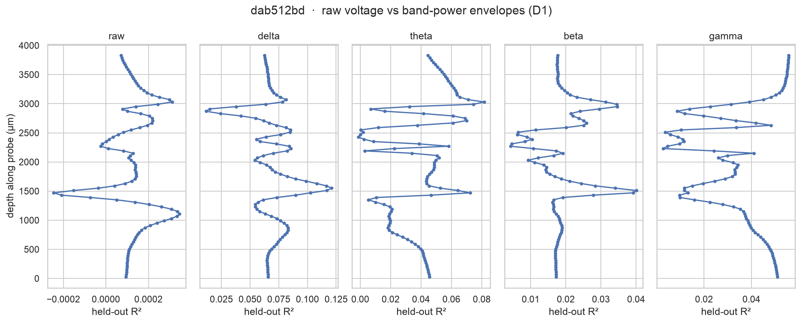

The two targets could hardly differ more. **Raw voltage is barely predictable** (median held-out
R² ≈ 1×10⁻⁴), while **band power reaches R² ≈ 0.12** (delta, in the thalamic LP nucleus).

The reason is the distinction between *evoked* and *induced* activity. The LFP is dominated by
ongoing oscillations. An event that resets an oscillation's **phase** produces a response at the
same latency every trial — it survives trial averaging (the evoked potential) and is what the
raw-voltage model can predict. But most task/behaviour modulation only changes an oscillation's
**amplitude**, leaving its phase random relative to the event; averaged voltage then cancels to
≈0, and raw-voltage R² misses it entirely. The band-power **envelope** is phase-agnostic, so it
captures exactly this induced modulation. Hence raw voltage sees only the thin phase-locked sliver;
band power sees the induced bulk.

## Result 2 — where behaviour drives the LFP

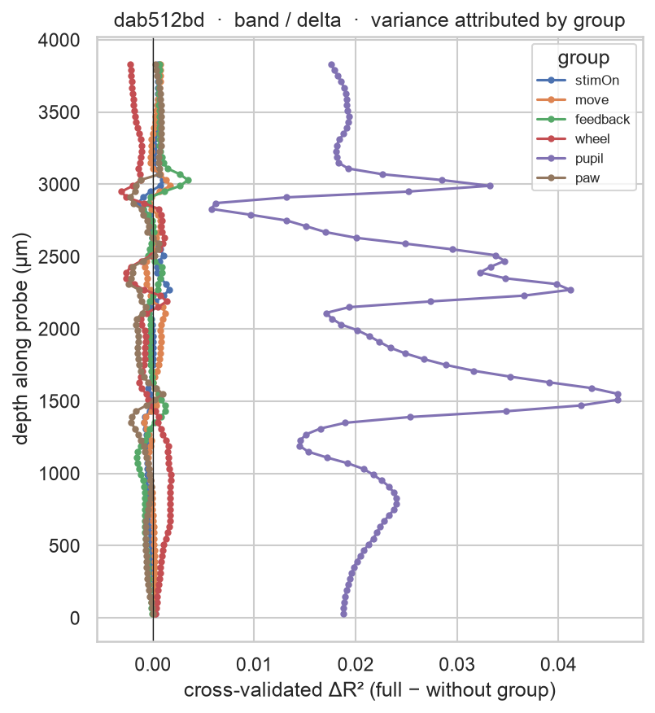

Drop-R² (full model minus the model with one group removed) attributes delta-band variance to each
group along the probe. **Pupil diameter dominates** — arousal is the strongest driver of
low-frequency LFP power — followed by wheel and feedback, with the pure event onsets contributing
little to *sustained power*. Groups whose drop-R² sits at or below zero add nothing beyond noise on
those channels.

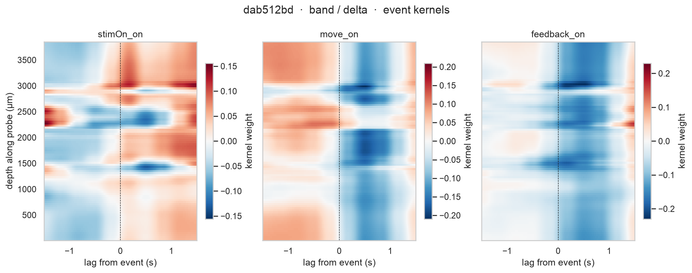

The kernels are spatiotemporally structured and depth-organised (CSD-like). Movement onset, for
instance, is followed by a delta-power **decrease** peaking ~0.5 s later across a band of channels —
a movement-related desynchronisation — while stimulus onset drives a depth-specific power increase.

## Result 3 — validation against event-triggered averages

The fitted single-event kernel should agree with a straight event-triggered average on *isolated*
events (confirming alignment and sign) and diverge where events overlap (showing the deconvolution).

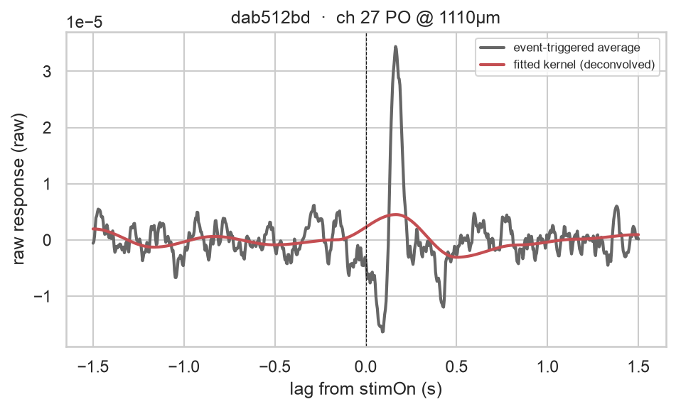

For raw voltage this is the classic **evoked potential** check: both traces are flat before the
stimulus (no acausal leak → alignment and sign are correct) and show the same biphasic deflection
with a peak at ~170 ms — a textbook visual-evoked latency. The fitted kernel is smoother and smaller
because the 10-bump basis cannot resolve the sharp ~50 ms ERP peak and the deconvolution removes
contributions that the raw average wrongly attributes to the stimulus.

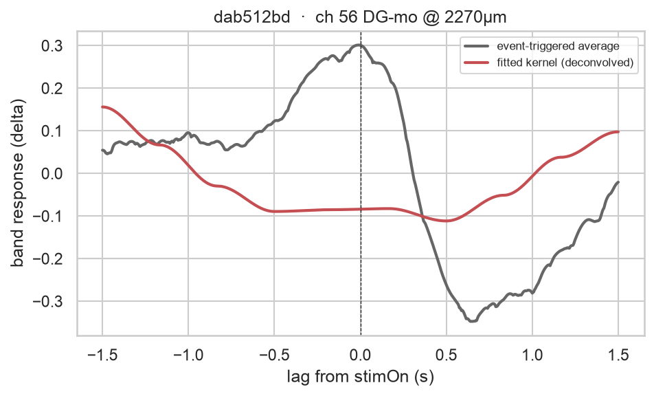

For band power the event-triggered average is contaminated by everything that co-varies with trial
timing (chiefly arousal), so it is large even where the stimulus itself contributes little; the
deconvolved kernel correctly isolates the smaller stimulus-specific component.

## Result 4 — is R² ≈ 0.04 real?

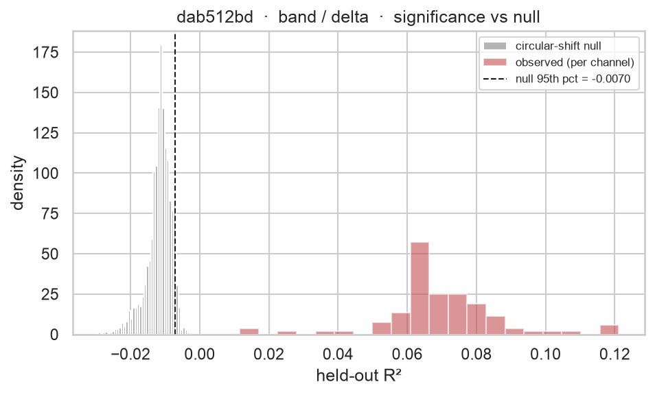

Because the data are heavily autocorrelated, the naive $p/n$ chance level badly understates the
true null (the *effective* sample size is far below the 917 k raw samples). Instead we build a
**circular-shift null**: roll the regressors by a large random offset and refit, which preserves the
autocorrelation of both sides while destroying the true alignment. The null held-out R² sits
**below zero** (median ≈ −0.012; a mis-aligned model predicts worse than the mean), and every
delta-band channel's observed R² (0.01–0.12) lands far to the right of the null's 95th percentile.
The band-power encoding is therefore unambiguously significant; raw voltage (≈1×10⁻⁴) hovers right
at the null, consistent with only a faint evoked potential.

## Result 5 — does LFP compression change the answer?

The brain-wide run (699 PIDs) was fit three times from three LFP sources: the pre-compression
Cadzow checkpoint (**uncompressed**, the reference) and the two `lfpack` tiers shipped in
production (**default**, **aggressive**). Each tier's R² is normalised against that tier's own
(differently-compressed) target variance, and the circular-shift null reuses the same `Y` — so
compression moves the real fit and its null floor together, and raw R² is **not** comparable across
tiers. The fair comparison is the real-vs-null significance gap.

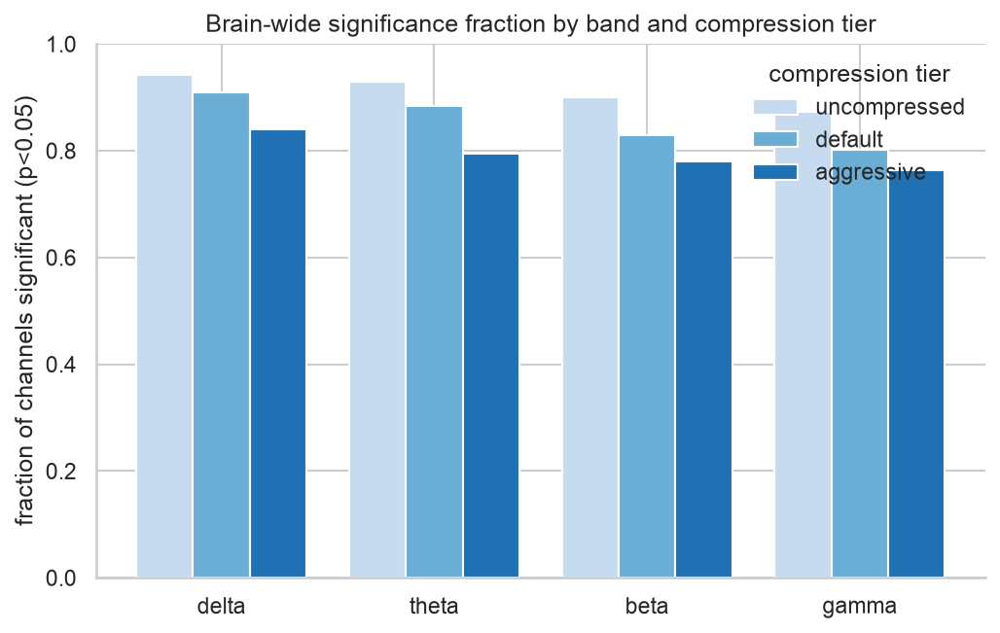

Significance drops modestly and monotonically — uncompressed > default > aggressive — across all
four bands (≈3–10 pp for default, ≈8–15 pp for aggressive).


The loss is broadly distributed rather than concentrated in one system — most regions lose a
similar few points of significant channels, not a specific anatomical group.

A marginal fraction can hide a **reshuffled** population (a different subset of channels crossing
threshold, same headline number), so the sharper test is retention: of the channels significant in
the uncompressed reference, what fraction stay significant after compression?

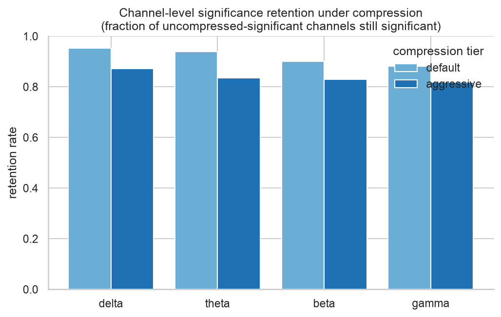

Retention is 83–95% (default) and 76–88% (aggressive) — compression behaves mostly like added
uniform noise on the significance test, not a reshuffle.

A caveat that doesn't show up in either metric is in the kernel weights themselves. Pooling
`|kernel weight|` across every channel and computing its tail-heaviness (99.9th percentile ÷
median) gives ≈10 for uncompressed but **≈21–27 for both compressed tiers** — compression
introduces scattered, high-magnitude outlier kernels on individual channels that aren't there
pre-compression, concentrated in hindbrain/cerebellum:

Both rasters below are restricted to `pid_qc.KEEP_PIDS` (653/699) and to the channels significant
(p<0.05) in **both** the uncompressed and default tiers, so every column is the same physical
channel across the two figures — not each tier's own independent significance mask.


Chasing that speckle down to individual insertions turned up something more serious than "a few
noisy channels." **The per-PID lambda selection can fail outright under compression.**
`solve.select_lambda` picks one smoothing strength per (PID, target-kind) by maximising the
*median* held-out R² across all ~288 targets (4 bands × ~72 channels) — a criterion that is
completely blind to a fit collapsing in the tail, and the 6-point log-spaced grid means the
selected value can jump a full decade for a small shift in that median curve. Compression shifts
the curve just enough, for a minority of insertions, to tip the selection into a value so
under-regularised that the **entire band-power model for that insertion overfits catastrophically**
— in-sample R² balloons while held-out R² craters to strongly negative, and every channel's kernel
weight (not just one) inflates together:

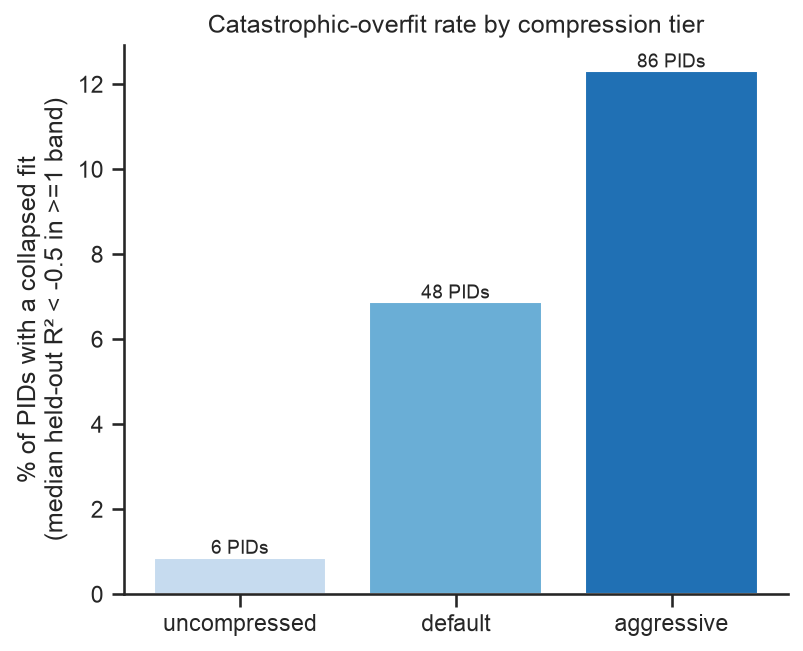

Counting a PID as "collapsed" when its median held-out R² drops below −0.5 in at least one band:
**6/699 (0.9%) uncompressed, 48/699 (6.9%) default, 86/699 (12.3%) aggressive** — the failure rate
rises roughly an order of magnitude at each compression step, and for most affected PIDs (58% under
aggressive) *all four bands* collapse together, confirming it's the shared per-PID lambda, not a
one-off channel.

This is invisible to `frac_sig`/retention above because the permutation null reuses the **same**
lambda: when the real fit overfits, the null overfits too, so the observed R² can still "beat" all
30 null draws and land at the significance floor (p = 1/31) — indistinguishable from a genuinely
excellent fit. The only way to see it is to look at R² sign/magnitude directly (`region_aggregate.
collapse_rate`). A concrete example — insertion `11a5a93e-58a9-4ed0-995e-52279ec16b98`, part of the
public reproducible-ephys ("repeated site") benchmark set, strongly significant in all four
uncompressed bands (93–100% of channels):


Uncompressed: CV R² ≈ −0.01, λ = 1000, a flat, near-zero kernel — an unremarkable, healthy fit.
Default: λ unchanged but CV R² already slipping to −0.13. Aggressive: λ drops to 10, CV R² collapses
to −0.99, and the "kernel" balloons to a smooth ±4 swing that looks nothing like a physiological
response — a **90× amplitude inflation** driven entirely by regularisation failure, not signal. Every
one of this PID's 96 gamma-band channels shows the same pattern (median CV R² = −0.97 under
aggressive vs. +0.045 uncompressed), yet its permutation p-value is identical across all three tiers.

**Bottom line, revised:** the marginal frac_sig/retention picture (safe-looking) undersells the
risk. A non-trivial share of insertions — ~7% under default, ~12% under aggressive — get a fully
collapsed, meaningless band-power fit that the existing significance test cannot flag, traced to a
median-based, coarsely-gridded lambda selection that compression makes more likely to fail. Before
shipping either compressed tier for downstream science, either (a) add a QC gate on median held-out
R² per PID/band (`region_aggregate.collapse_rate`) and exclude/reweight flagged insertions, or (b)
make `select_lambda` more robust (finer grid, a worst-case-aware criterion instead of the median, or
per-channel rather than per-PID lambda). Aggressive compression should not be a default regardless —
it roughly doubles the default tier's already-nontrivial collapse rate for a further, smaller
frac_sig cost.

## Result 6 — v01 checkpoint: updated LFP pre-processing

Result 5 was fit on `v00` (`results_bwm_2026-07-07`). This section is a checkpoint on a
reprocessed archive, `v01`, after four changes landed upstream in `lfpack` (the LFP
pre-processing/compression package). Only the LFP source changed — the encoding model
itself (design, regressors, lags, CV, null) is byte-identical between `v00` and `v01`.

- **Highpass corner 2.0 → 0.5 Hz.** Applied in the shared Cadzow/CAR stage every tier
  decimates from, so it affects **all three tiers**, not just the compressed ones.
- **Default-tier WP alpha 32 → 28**, plus a **survival floor** (`floor_k=64`) that stops
  the wavelet-packet codec from zeroing an entire chunk when even its dominant SVD
  component is weak relative to the noise floor.
- **LFP saturation detection + muting**: ADC-clipped stretches are now detected and
  forced to exact zero before decimation, instead of passing through as clipped
  (non-zero) samples.
- A probe-geometry storage fix.

**1. The raw-broadband ERP encoding is recovered.** Held-out R² for the `raw` target
jumped roughly **100×** across all three tiers (e.g. `default`: median CV-R² 0.00012 →
0.019, fraction of channels significant 82% → 98%) — attributable to the highpass-corner
drop, since the previous 2 Hz corner likely removed most of the slow, evoked content the
raw target depends on. Band-power (delta/theta/beta/gamma) fits moved far less by
comparison. **This overturns D1's conclusion** ("raw R² ~1e-4, band dominates") — raw is
no longer two orders of magnitude below band-power. Result 1 will need rewriting once
`v01` is adopted as the analysis of record.

Each panel below shares one x-axis (channel count) and one colour scale within its band,
so a shorter bar reads directly as fewer significant channels rather than being
stretched to fill the panel, and a colour means the same weight magnitude everywhere.


The band-power targets tell a subtler story — the effect here isn't about raw sensitivity, it's the same aggressive-tier speckle from Result 5 visibly cleaning up:


**2. Compression collapse improved, especially for `aggressive`.** Catastrophic-overfit
rate (median held-out R² < −0.5 in ≥1 band, all 699 PIDs): `aggressive` 11.9% → 3.3%
(83 → 23 PIDs), `default` 6.6% → 4.3% (46 → 30 PIDs). Checked against the specific
DATA_ISSUES.md groups: the `nc=24` archive-corruption bug (4 PIDs) is **100% fixed**,
`AGGRESSIVE_ONLY_COLLAPSE` (44 PIDs) is **84% recovered**, and
`DEFAULT_COMPRESSION_ARTIFACT` (38 PIDs) is **45% recovered** — the alpha/survival-floor
fix clearly helps but doesn't fully solve that last population.

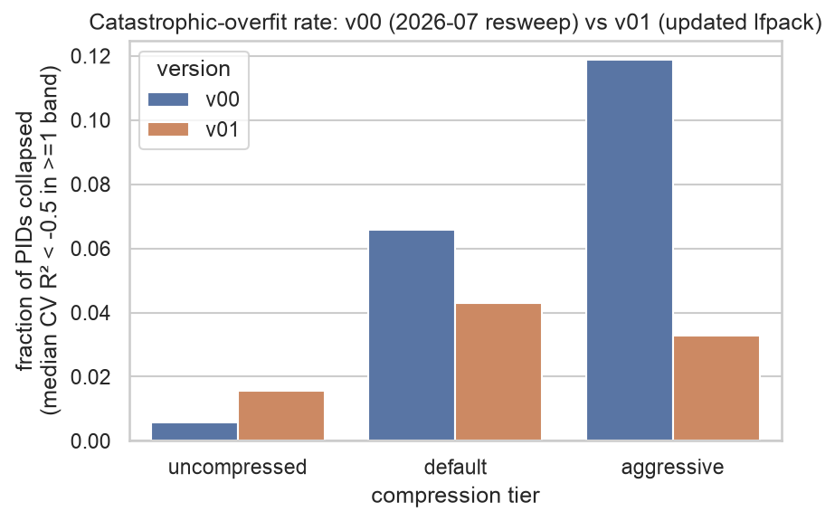

**3. `uncompressed` got *worse*: 0.6% → 1.6% collapsed (4 → 11 PIDs).** Compression
parameters don't touch this tier, so the cause has to be in the shared pre-processing —
and it is: **saturation muting**. Genuinely saturated (ADC-clipped) stretches used to
pass through as clipped-but-nonzero samples; they're now forced to exact zero in every
tier, including `uncompressed`. When a CV fold's held-out window overlaps mostly with a
muted span, that fold's target variance collapses toward zero, and R² (which divides by
that variance) swings wildly negative — the same near-zero-variance mechanism already
guarded against elsewhere in this codebase (`region_aggregate.py` clips `r2_cv` to
`[-1, 1]` for exactly this reason). Consistent with this: all 7 of the newly-collapsed
`uncompressed` PIDs are ordinary `nc=96` recordings (not a `nc=24` relapse), and at least
4 of the 7 were already flagged as fragile/borderline under compression in `v00`
(members of `DEFAULT_COMPRESSION_ARTIFACT` or `AGGRESSIVE_ONLY_COLLAPSE`) — saturation
muting looks to be tipping over recordings that were already close to the edge, not
corrupting healthy ones at random.

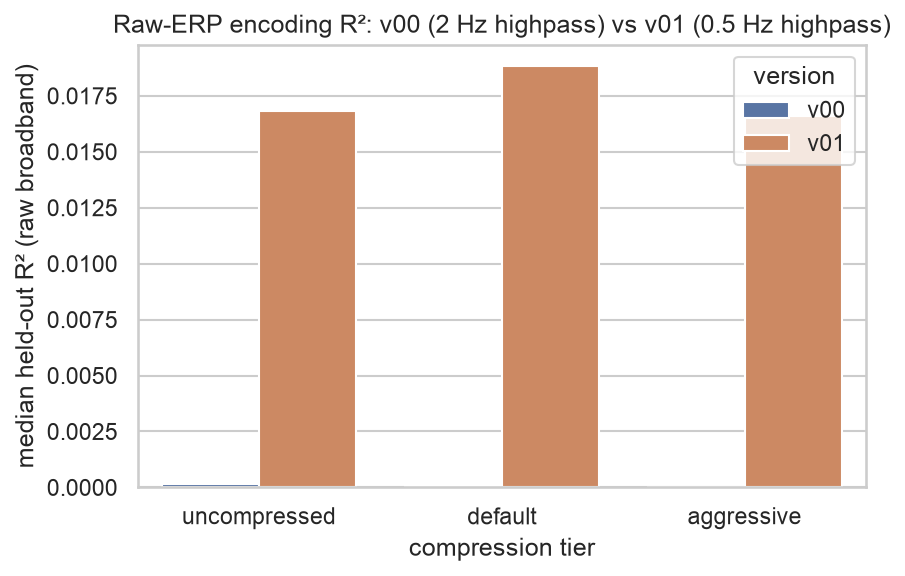

**Caveats and next steps.** `pid_qc.KEEP_PIDS` is still the `v00`-derived QC filter,
reused as-is for this comparison — it's now stale in both directions (it excludes PIDs
that recovered in `v01`, and doesn't exclude the new `uncompressed` collapses), so a
fresh QC pass is needed before `v01` becomes the analysis of record. The saturation-muting
mechanism above is inferred, not yet directly confirmed on a trace — a PSD/trace
comparison on one of the 7 newly-collapsed PIDs (`v00` vs `v01`, `uncompressed`) would
close the loop.

## Result 7 — saturated samples: row-exclusion instead of trusting the mute

Result 6 traced `v01`'s `uncompressed`-tier regression (0.6% → 1.6% collapsed, 4 → 11
PIDs) to saturation muting: genuinely ADC-clipped stretches are now forced to exact
zero before decimation, and a CV fold whose held-out window overlaps mostly with a
muted span has near-zero target variance, so its R² swings hugely negative. The stored
saturation interval boundaries are also an approximate detection, not exact — trusting
the muted-to-zero signal as if it were real (if low-variance) data was the wrong
approach regardless of the collapse. The fix: **exclude saturated samples from the fit
entirely**, both from training (the sufficient statistics) and held-out CV scoring,
rather than muting them to zero and letting the regression see them at all.

`solve.py`'s `accumulate_folds` — the single choke point every fit/score function
streams through — gained an optional boolean row mask (`valid`), threaded through all
six entry points (`solve_encoding[_grouped]`, `permutation_null_r2[_grouped]`,
`select_lambda[_robust]`); dropping a row is just leaving it out of the sums that build
`Sxx`/`Sxy`/`n`, so nothing downstream changes. `encode.py` builds the mask once per PID
from the saturation table (`LFPackReader.saturation_times()`, scale-independent —
confirmed identical whether read from the `default` or `aggressive` archive), applied
identically to every kind and source. A QC gate (`encode.check_fold_coverage`) errors
out a PID/kind whose row exclusion leaves a CV fold too thin for a well-posed solve,
caught by the same per-PID try/except every other fit error already uses.

Two questions this rested on were checked empirically rather than assumed, on a real
trace (`1a276285-8b0e-4cc9-9f0a-a3a002978724`, saturation freshly re-detected under the
`v01` pipeline parameters): **(1) padding margin** — a zero-phase filter's transient
could in principle smear a saturated span's influence beyond the stored boundary, but
RMS around the 8 largest saturation events showed no ringing past the stored interval
even with zero padding, and an end-to-end fit/lambda-selection comparison across 0 s /
7-sample / 6.656 s (`ibldsp.voltage._warmup_pad_out`'s own transient-margin estimate)
margins gave nearly identical results while the fold-imbalance cost rose with margin —
**default margin is 0.0 s**, exclude exactly the stored interval. **(2) band-power
leakage** — band power is a Hilbert transform + bandpass applied globally over the
whole trace, so a saturation event could in principle leak into nominally-clean
samples' band-power values in a way row-exclusion at the regression stage can't undo;
comparing the muted trace against a version with the muted span smoothly interpolated
away found the difference decays to 4–9 orders of magnitude below the band's natural
log-power variance within the same margin — row-exclusion at the solve stage alone is
sufficient, no change needed in `targets.py`.

The result, from a full 699-PID brain-wide resweep (`results_bwm_v01_smart`, row
exclusion the only change on top of `v01`):


**`uncompressed` collapse dropped 1.6% → 0.6% (11 → 4 PIDs)** — every one of the 7 PIDs
newly collapsed under `v01` recovered, and zero new collapses were introduced. This was
not the only tier that improved: `default` 4.3% → 3.3% (30 → 23) and `aggressive`
3.3% → 2.7% (23 → 19) also dropped, so saturation was corrupting CV scoring in the
compressed tiers too, not just `uncompressed`. Beyond the collapse tail, `KEEP_PIDS`
headline numbers nudged up modestly across essentially every (tier, band) — e.g.
`uncompressed`/gamma frac_sig 83.4% → 90.5%, median CV-R² 0.0046 → 0.0066 — consistent
with row-exclusion removing corrupting variance from ordinary CV scoring, not only the
catastrophic tail. The flagship `11a5a93e` (already fixed by `v01` itself, see Result 6)
was untouched by this change either way. Pooled, full-population kernel-weight rasters
(one regressor, all bands, all channels) look visually indistinguishable before vs
after at this scale — expected, since the fix changes outcomes for under 2% of PIDs,
diluted across 699 insertions' worth of columns; the collapse-rate numbers above are
where the effect actually shows.

**Caveats.** Local prototyping (padding-margin and band-leakage checks) used one
locally-reachable PID with real saturation, not one of the specific flagged PIDs
themselves — the brain-wide resweep above is the real test and the one that matters.
`pid_qc.KEEP_PIDS` is still `v00`-derived and unrefreshed for `v01`/`v01_smart`; a fresh
QC pass is still open before either becomes the analysis of record.

## Diagnostics

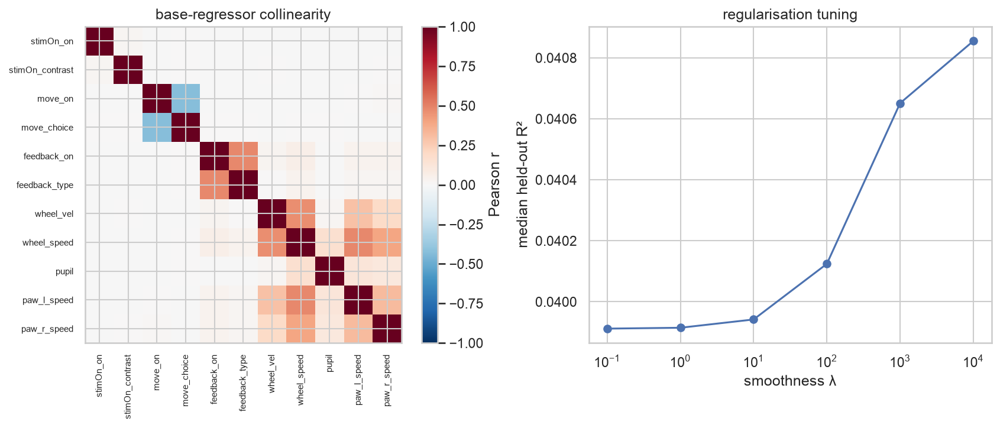

The base regressors are only mildly collinear (the onset/modulation pairs aside), so kernels are
well identified. The R²(λ) curve is nearly flat at 10 basis functions — the problem is
well-conditioned and does not need strong smoothing at this resolution; regularisation matters more
for the full-FIR validation runs.

## Reproducing and scaling

```python
import run_encoding as R
run = R.run_pid("dab512bd-a02d-4c1f-8dbc-9155a163efc0")  # fit both targets + CV
R.make_all_figures(run)                                  # write the figure set
```

The pipeline is `lfpack_io.py` (data access) → `design.py` (FIR design, streamed) →
`targets.py` (raw / band targets) → `solve.py` (out-of-core ridge, CV, null) →
`figures.py` / `run_encoding.py`. The brain-wide, three-tier comparison (Result 5) is
`region_aggregate.py` (Beryl-region pooling, per-tier and cross-tier agreement) +
`figures_swanson.py` / `figures_kernelraster.py` (region maps and cross-recording kernel rasters,
read from `results_bwm_cluster/<tier>/`).

**Cost.** One recording is **~39 s including full 5-fold cross-validation** (dominated by the four
Hilbert transforms for the band targets), or ~90 s with the 30-permutation significance null. All
699 brain-wide insertions therefore run in **~7.6 h on one core, or ~1 h across the laptop's 8
usable cores** — cross-validation kept throughout. A cluster is not required; the main constraint is
RAM (the band-power `Y` is ~1.4 GB per probe, so parallel workers should discard it once R² and
kernels are extracted).

## Caveats

- Raw-voltage R² captures only phase-locked responses; band-power envelopes are the better target
  for task modulation, as the D1 comparison shows.
- Pose is DLC (`bwm_behavior` v1.1.0); a Lightning-Pose swap and motion-energy regressors are
  deferred to separate work.
- Bands are capped at 90 Hz, below the 100 Hz compression `fmax` / 125 Hz Nyquist.
- LFP compression (Result 5) costs modest region-level significance, but for ~7% (default) / ~12%
  (aggressive) of insertions it triggers a lambda-selection failure that collapses the *entire*
  band-power fit — invisible to the permutation p-value. Screen with `region_aggregate.
  collapse_rate` (median held-out R² per PID/band) before trusting a fit from compressed data, and
  don't use aggressive compression as a default.
