## Overview

[lfpack#8](https://github.com/int-brain-lab/lfpack/issues/8) flagged 20 probes with NaN or
high-residual nidq sync. All 20 were re-derived from raw
`_spikeglx_sync.{channels,polarities,times}` fronts and re-run through
[`ibllib.ephys.sync_probes`](https://github.com/int-brain-lab/ibllib/blob/6215ee3f97e29b70b0953497370215774a197bb4/ibllib/ephys/sync_probes.py)
to tell genuine pulse-train defects from extraction artefacts. Only the small raw sync-front
datasets were downloaded — never the raw `.cbin`/`.ch` binaries.

## Diagnosis

20 pids collapse to 12 sessions. Four raw-pulse pathologies account for 11 probes; the rest are
within ordinary hardware tolerance. Residuals are the single global-affine check (see verification
note below).

- **`dropped_edges`** (5 probes / 3 sessions, 9-76s residual) — one channel's rate sustainedly
  halves partway through (usually the last ~10-15%) while the other channel keeps ticking
  normally. `367e94f6`; `4836a465`+`d0046384` (same session, identical onset); `7967a14e`+`ad597f5f`
  (same session).
- **`duplicate_burst`** (3 probes / 2 sessions) — a bounced/double-triggered edge adds spurious
  near-simultaneous edges. On **nidq** for `0b8ea3ec`+`a5f2ec22` (6 extra edges, ~1.5s residual);
  on the **probe** channel for `f2ea7211` (2 extra edges 33μs apart, ~0.8s residual).
- **`single_edge_glitch`** (2 probes / 2 sessions) — one isolated mistimed edge in the last ~1% of
  the recording, cadence reverts immediately after. `b2746c16` (139ms early, 154ms residual;
  sibling probe `c09b3c18` unaffected, confirming probe-local) and `81f0087b` (12ms early, 12ms
  residual).
- **`irregular_3A_reference`** (1 probe) — `0fed7207`, pre-2020 3A with no `wiring.json`.
  `version3A()`'s hardcoded frame2ttl-before-right_camera precedence locked onto `frame2ttl` — an
  unreliable per-pulse reference, not merely a bursty one — while a correctly-wired `right_camera`
  line (a ~150Hz hardware clock, matching exactly on both probes) sat unused. A genuine, fixable
  reference-channel selection bug, not an inherent behavioural-reference limit — see
  [Fixes](#fixes).
- **`clean`** (9 probes / 6 sessions, 1-4ms max residual) — ordinary crystal-oscillator drift.
  **Exception:** `4aab0f45` (1.2-1.3ms median, above the rest of this bucket) — a genuine
  saturation-linked permanent step, see [Appendix](#appendix-raw-ap-evidence-at-the-4aab0f45-burst).

None of these trip
[`version3B()`](https://github.com/int-brain-lab/ibllib/blob/6215ee3f97e29b70b0953497370215774a197bb4/ibllib/ephys/sync_probes.py#L117)'s
only integrity check (`np.isclose(rtol=0.1)` on gross pulse count) — and when a probe's spacing
already fails the 150ppm burst check, it falls back to `type='exact'`, whose QC is tautological
(interpolates through its own build points, residual ~0), silently passing tens-of-seconds-scale
defects. `version3A()` has no analogous check at all — it always uses `type='smooth'` with no
data-driven fallback, so committing to the wrong reference channel produces no warning short of
eyeballing the residual.

**Verification:** residual computed two ways per probe — from the Alyx-registered
`sync.timestamps` and from re-running `version3A()`/`version3B()` on raw fronts. All matched. So every defect
above is reproducible from raw pulses today, not a stale extraction artefact.

## Per-probe results

Click a column header to sort.

::: {.column-page}

```{ojs}
//| echo: false
data = FileAttachment("per_probe_results.csv").csv({typed: true})
```

```{ojs}
//| echo: false
Inputs.table(data, {
  columns: ["pid", "eid", "probe", "version", "diagnosis", "slope", "intercept", "max_residual_ms", "median_residual_ms"],
  header: {max_residual_ms: "max residual (ms)", median_residual_ms: "median residual (ms)"},
  width: {pid: 260, eid: 260, diagnosis: 180},
  // no internal vertical scroll: default maxHeight is sized for Inputs.table's own default `rows`
  // option (~11), not our data length (max 20) or this theme's actual (taller-than-default) row
  // height -- a generous fixed cap comfortably covers all 20 rows without wasted space, since the
  // table auto-sizes to content up to maxHeight.
  maxHeight: 1000
})
```

:::

## Extraction residual plots, all 20 probes

Two panels per probe, same order as the table above (worst `dropped_edges` first, `clean` last).

**Top — residual:**
[`sync_probe_front_times`](https://github.com/int-brain-lab/ibllib/blob/6215ee3f97e29b70b0953497370215774a197bb4/ibllib/ephys/sync_probes.py#L181)'s
own plot (raw + smoothed residual + the interpolation knots baked into `sync.timestamps`), samples
at 30kHz vs. session time. `type=exact` when the 150ppm burst check fails (tautological QC, see
Diagnosis); otherwise `type=smooth`.

**Bottom — inter-pulse interval:** raw `np.diff` of consecutive rising edges (ms) for probe (blue)
vs. reference (orange), same time axis as the residual panel. Rising edges only (matches
[`_check_diff_3b`](https://github.com/int-brain-lab/ibllib/blob/6215ee3f97e29b70b0953497370215774a197bb4/ibllib/ephys/sync_probes.py#L275)) —
falling edges would add a fast duty-cycle alternation that'd dominate the plot.

E.g. `4836a465`: both channels flat at 1.0s for ~2003s; the reference stays there, the probe jumps
to a sustained 2.0s for the final ~164s (83 doubled intervals) — the `dropped_edges` mechanism.
`2adc4f5d`/`0d59e3a1` (4aab0f45): flat except one single-sample dip at t≈1021s — the shared-line
micro-burst covered in the [Appendix](#appendix-raw-ap-evidence-at-the-4aab0f45-burst) below.

::: {.callout-note collapse="true" appearance="minimal"}
## 4836a465 — dropped_edges (probe), median 2553.0 ms
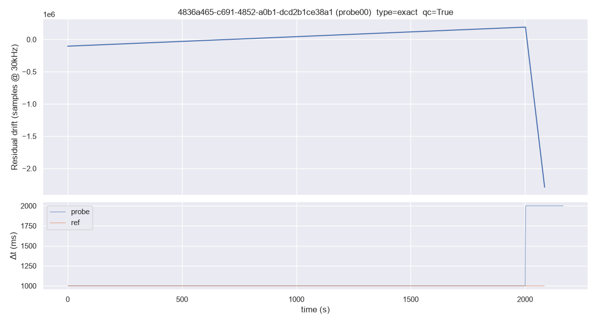
:::

::: {.callout-note collapse="true" appearance="minimal"}
## d0046384 — dropped_edges (probe), median 2539.7 ms
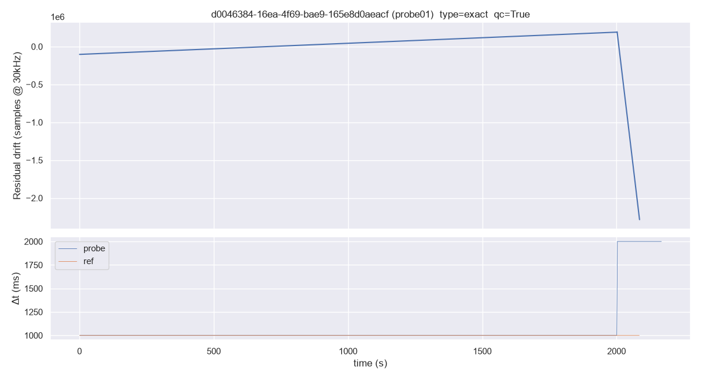
:::

::: {.callout-note collapse="true" appearance="minimal"}
## 367e94f6 — dropped_edges (probe), median 2642.9 ms
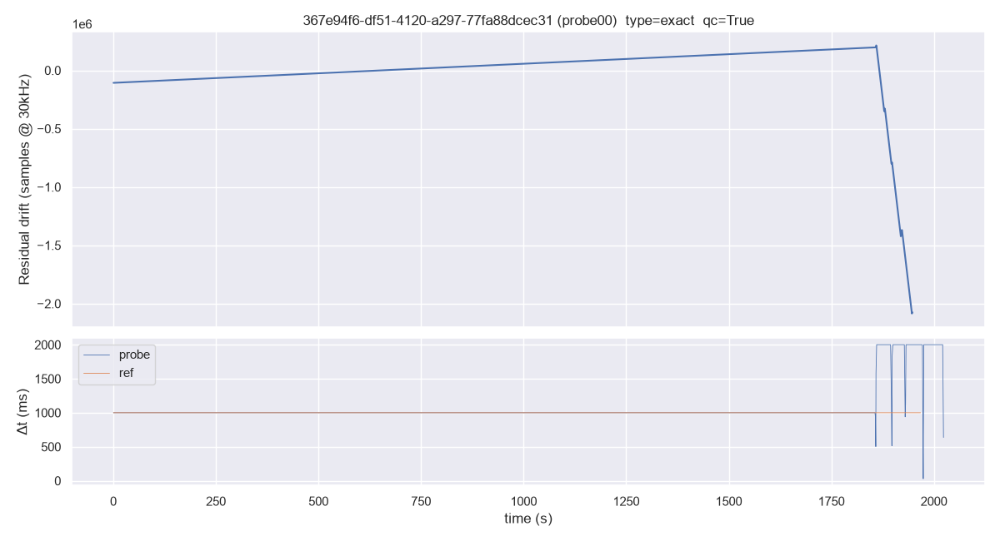
:::

::: {.callout-note collapse="true" appearance="minimal"}
## 7967a14e — dropped_edges (probe), median 45.5 ms
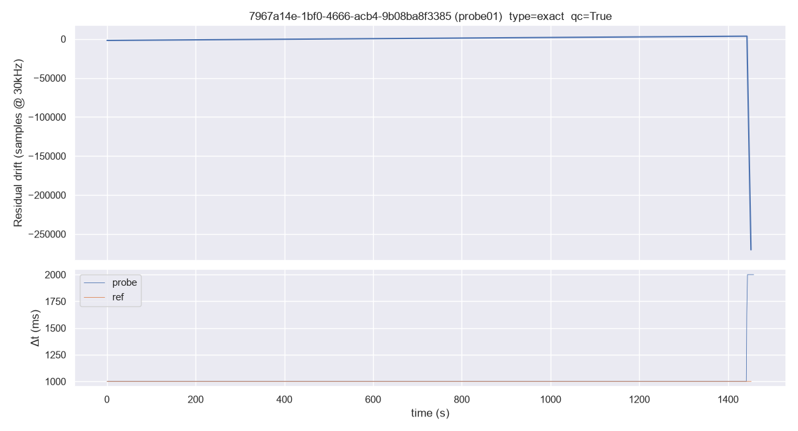
:::

::: {.callout-note collapse="true" appearance="minimal"}
## ad597f5f — dropped_edges (probe), median 45.3 ms

:::

::: {.callout-note collapse="true" appearance="minimal"}
## 0fed7207 — irregular_3A_reference, median 952.5 ms (pre-fix; see [Fixes](#fixes))
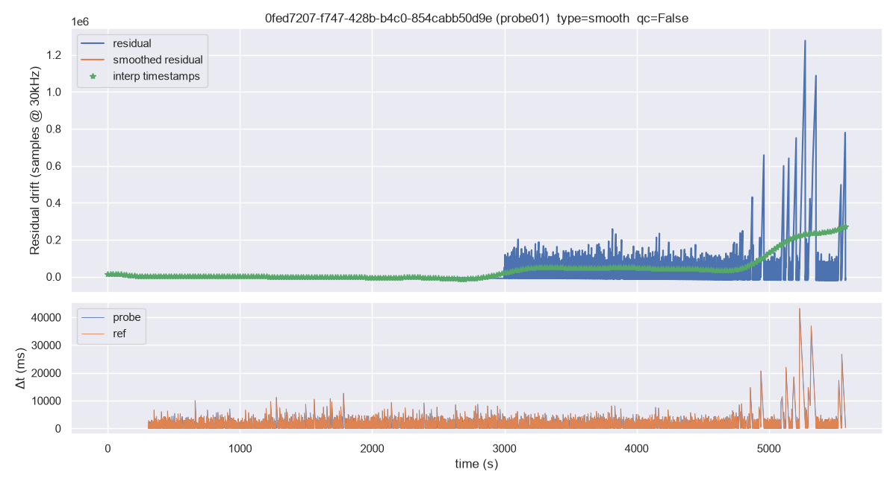
:::

::: {.callout-note collapse="true" appearance="minimal"}
## 0b8ea3ec — duplicate_burst (ref), median 692.5 ms
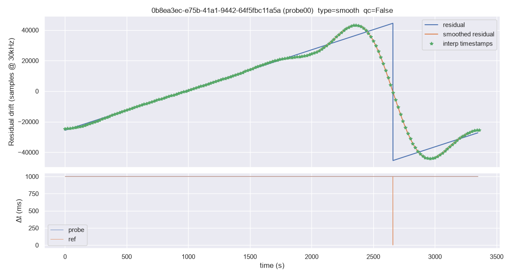
:::

::: {.callout-note collapse="true" appearance="minimal"}
## a5f2ec22 — duplicate_burst (ref), median 692.5 ms
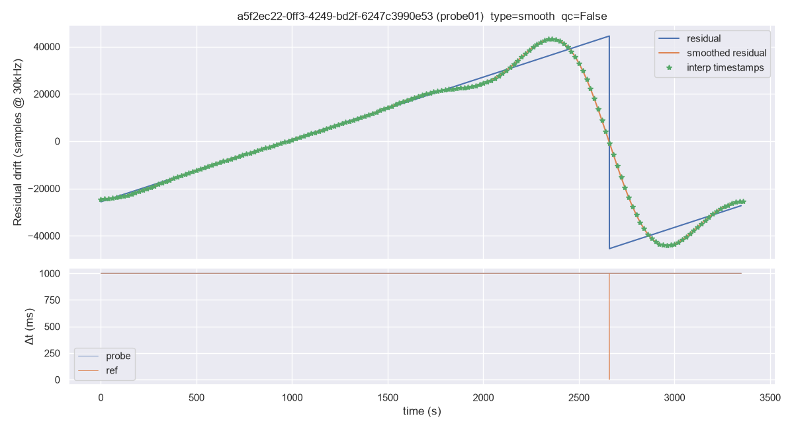
:::

::: {.callout-note collapse="true" appearance="minimal"}
## f2ea7211 — duplicate_burst (probe), median 107.4 ms
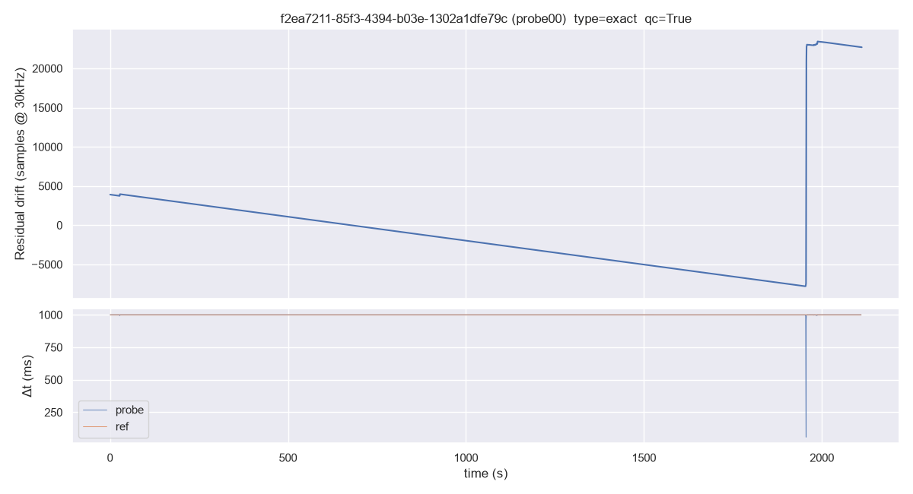
:::

::: {.callout-note collapse="true" appearance="minimal"}
## b2746c16 — single_edge_glitch (probe), median 0.3 ms
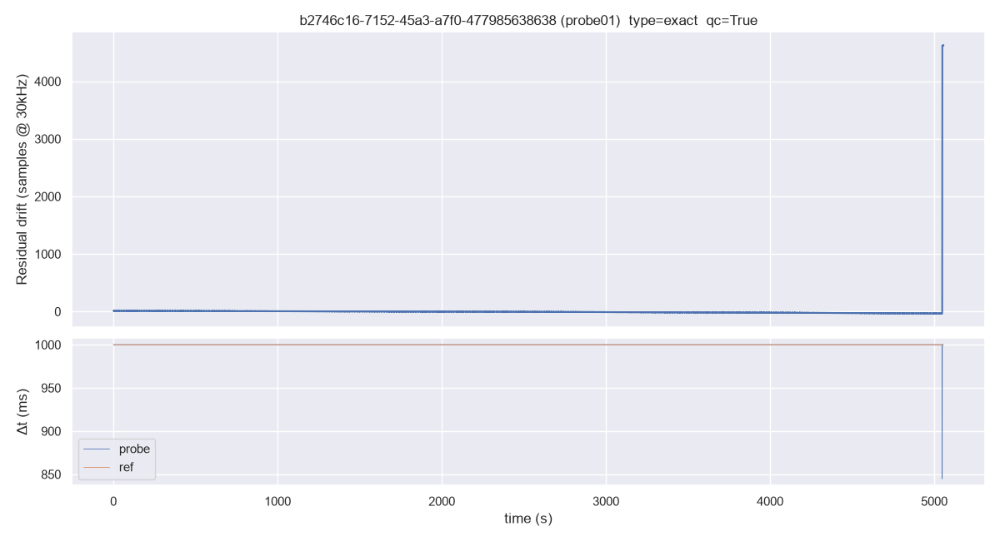
:::

::: {.callout-note collapse="true" appearance="minimal"}
## 81f0087b — single_edge_glitch (probe), median 0.1 ms
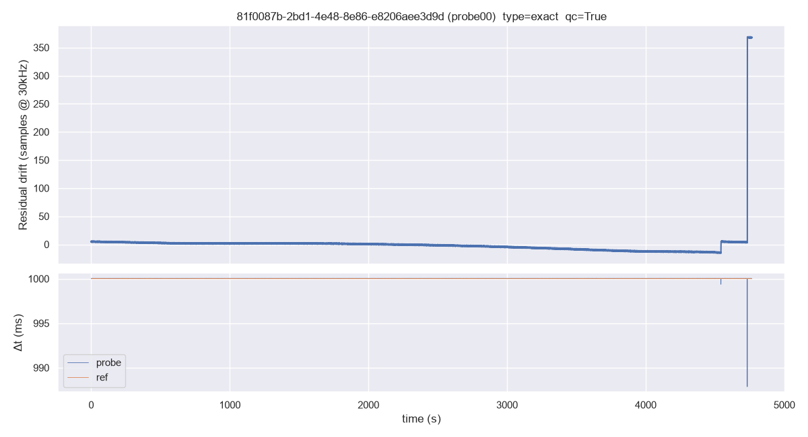
:::

::: {.callout-note collapse="true" appearance="minimal"}
## e6402305 — clean, median 0.5 ms
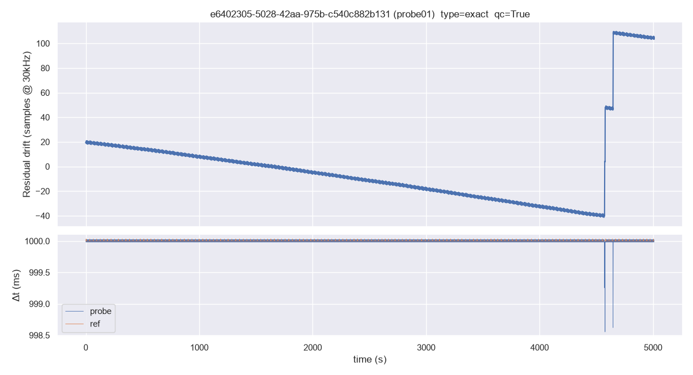
:::

::: {.callout-note collapse="true" appearance="minimal"}
## 2adc4f5d — clean, median 1.3 ms (see Appendix below)
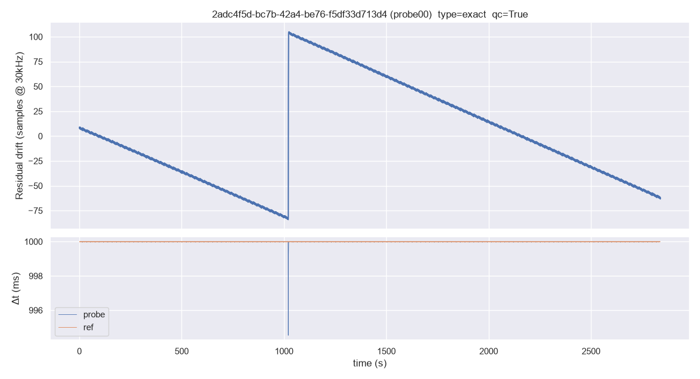
:::

::: {.callout-note collapse="true" appearance="minimal"}
## 0d59e3a1 — clean, median 1.2 ms (see Appendix below)
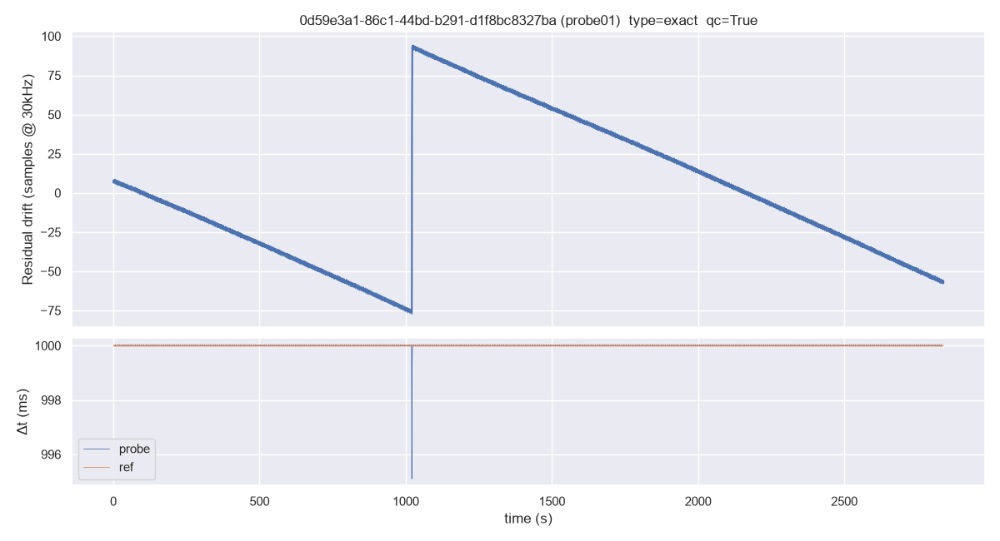
:::

::: {.callout-note collapse="true" appearance="minimal"}
## 5c63d860 — clean, median 0.2 ms
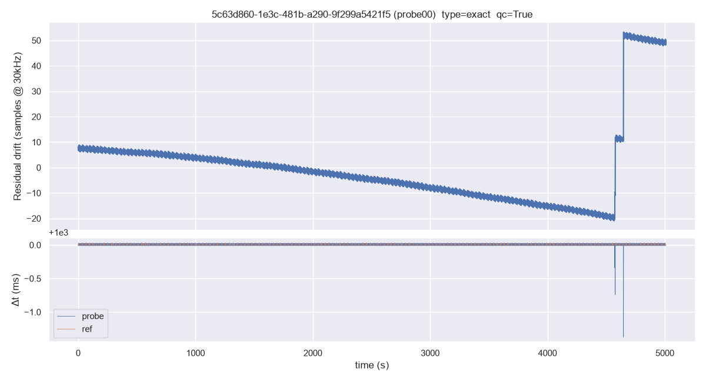
:::

::: {.callout-note collapse="true" appearance="minimal"}
## b543e81e — clean, median 0.2 ms
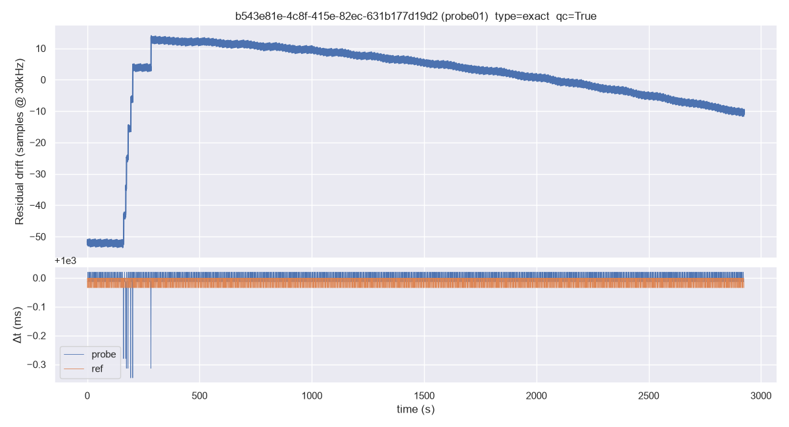
:::

::: {.callout-note collapse="true" appearance="minimal"}
## 53ecbf4f — clean, median 0.2 ms
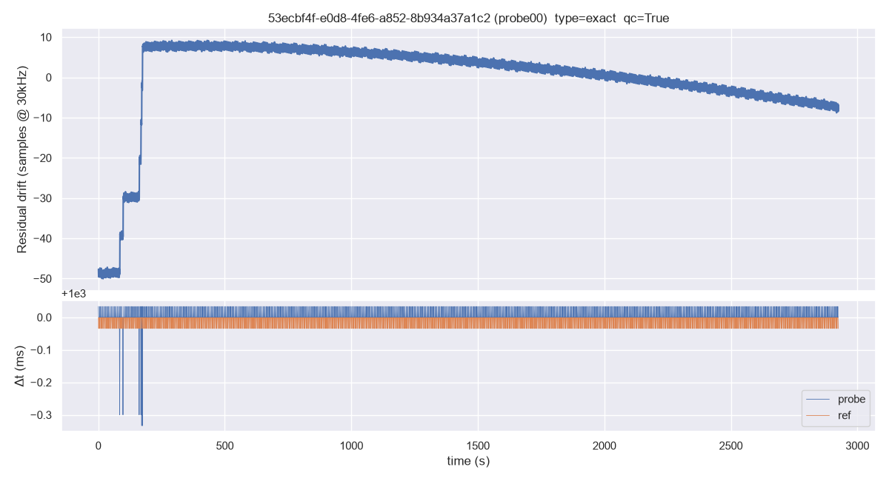
:::

::: {.callout-note collapse="true" appearance="minimal"}
## 735fa61d — clean, median 0.4 ms
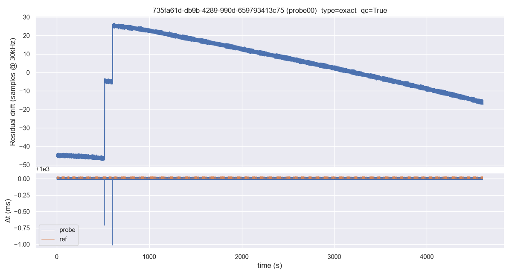
:::

::: {.callout-note collapse="true" appearance="minimal"}
## c09b3c18 — clean, median 0.0 ms
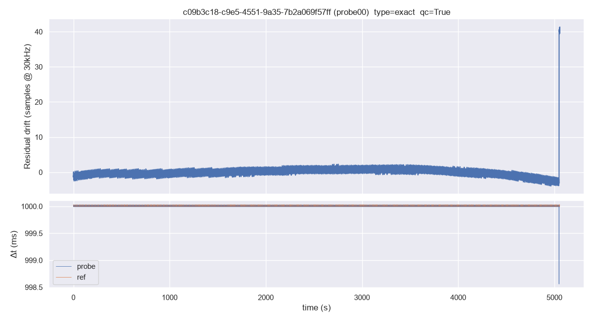
:::

::: {.callout-note collapse="true" appearance="minimal"}
## 5999eeca — clean, median 0.3 ms
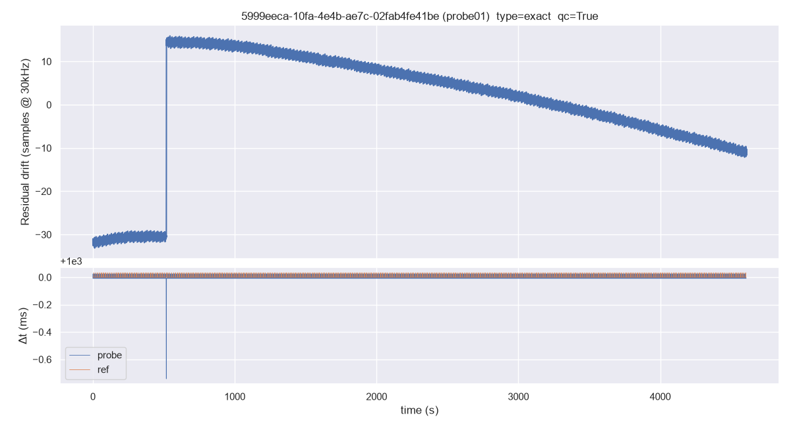
:::

## Fixes

Simpler than originally scoped, now that raw-AP verification (below) has settled which anomalies
are genuine and which are corrupted reads. Two pieces of work, not a per-class matrix:

1. **Re-issue the registered `_spikeglx_*.timestamps.npy` dataset** for four classes: three where
   the front-detection/extraction was genuinely fooled by a corrupted pulse — `dropped_edges`,
   `single_edge_glitch`, `duplicate_burst` — and `irregular_3A_reference`, where the extractor
   locked onto the wrong reference channel (see table below). For every other class — `clean`
   (including the `4aab0f45`-style shared cross-probe burst, confirmed to be a genuine permanent
   step in the clock-to-nidq relationship, and the ordinary per-probe jitter) — **the registered
   dataset is already fine; no re-issue needed.**
2. **lfpack needs to support non-linear timestamp interpolation.**
   [`compute_sync()`](https://github.com/int-brain-lab/sdsc-slurms/blob/3b192952d45aaef9e5fbc1df7a02f8327f6dda35/2026-06-lfpack/attach_ibl_metadata.py#L108)
   currently re-derives a single global affine (`t0_sync`/`fs_sync`) from scratch. That's a
   universal fix, not a per-class patch: even a fully correct dataset (any ordinary clean session,
   or `4aab0f45` as it already stands) gets mis-represented by one straight line once there's a
   genuine step or non-linear drift anywhere in it. Once this is in place, lfpack automatically
   benefits from every dataset re-issued in (1) and correctly represents every dataset that was
   already fine — no per-class lfpack-side logic needed at all.

`sync_probes.py` (the extractor) stays out of scope — these are corrections to already-extracted/
registered data, not extraction-code changes. (`version3A()`'s frame2ttl precedence is a real
extractor bug, but checked by max residual across the 1099 ephys-atlas insertions: no other 3A
probe shows this pattern, so `0fed7207` looks like an isolated instance — patching the extractor
itself remains separate follow-up work regardless.) Detection is a rate-agnostic per-channel check
(compare each inter-pulse-interval diff to the local/running median, tolerant across 0.1–100 Hz)
rather than a magnitude threshold on the affine residual — see Diagnosis above for why a fixed
threshold can't work. Detecting an anomaly doesn't automatically mean correcting it: it can turn
out to be a real, permanent change the fit should honor rather than a corrupted reading to strip
out — the two raw-AP appendices below are what settled that question for the two cases checked.

| Failure class | Registered dataset | Patch |
|---|---|---|
| `dropped_edges` (probe, end-of-recording rate-doubling — AP stream keeps running tens of seconds past nidq's last pulse, sync channel free-runs at ~2x nominal rate with onset *preceding* nidq dry-off, a power-down-style electrical transient) | Re-issue | Truncate at onset, then append one synthetic terminal anchor point computed from the trusted-region's fitted line, placed at the end of the AP recording — so `interp1d`'s `fill_value='extrapolate'` boundary reflects the smoothed session-wide rate instead of the noisy last real interval. |
| `duplicate_burst` (ref or probe — a bounced/double-triggered edge; confirmed via raw AP on `f2ea7211` to coincide with the channel hitting the ADC's own full-scale ceiling, ±77mV against an ordinary ~30-65μV baseline — a genuine saturation artefact, not a plain comparator/front-detection quirk) | Re-issue | Drop both duplicate timestamps (don't try to infer which is real); insert one synthetic timestamp at the midpoint of the neighboring valid pulses — minimizes squared deviation from the expected local period, doesn't depend on either bogus value. |
| `single_edge_glitch` (probe, isolated mistimed edge in the last ~1% of the recording, cadence reverts immediately after) | Re-issue | Same as `dropped_edges`: truncate at the glitch onset, append one synthetic terminal anchor point on the trusted-region fit line. |
| Shared cross-probe micro-burst (`4aab0f45`-style; confirmed via raw AP + a pre-/post-event affine comparison to be a genuine **permanent** step, ~5.6–6.2ms, flat for the remaining ~1000s of the recording) | Fine as-is | None — a misread single edge would have self-corrected on the next pulse; this doesn't, and the existing non-linear correction already bakes in the real step. |
| `clean`, including same-window-but-offset-timing cross-probe micro-anomalies | Fine as-is | None. Current hypothesis for the offset-timing pattern: non-simultaneous timing across probes rules out a shared-line cause, pointing to independent per-probe clock instability — real but local, faithfully represented already. Not re-checked with the raw-AP method (no independent landmark available the way saturation gave one for the two cases above). |
| `irregular_3A_reference` (`0fed7207`, pre-2020 3A, no `wiring.json`; `version3A()`'s frame2ttl-then-right_camera precedence commits to frame2ttl as soon as it's detected on both probes *at all*, never checking which channel is actually the better reference — see Diagnosis above for why that's the wrong call here) | Re-issue | Re-run the probe01-vs-probe00 fit with `right_camera` in place of `frame2ttl`; residual drops from max 35s / median several-hundred-ms to max 0.04ms / median 0.01ms — no synthetic points, no truncation, just the correct reference channel. |

## Re-issue: computed corrected knots, pending Alyx patch {#reissue-results}

::: {.callout-warning}
**Not yet pushed to Alyx.** [`reissue_sync.py`](reissue_sync.py) computes each corrected
`[sample, time]` array locally and writes it to `reissue_output/{pid[:8]}_{probe}_sync.timestamps.npy`
(same 2-column convention as `sync_probes._save_timestamps_npy`) — it never calls
`ibllib.oneibl.patcher.*.patch_dataset()`. This table is the review artifact before that call is
made against the live, shared Alyx dataset.
:::

**Before** = residual of the *currently-registered* `sync.timestamps` (via `SpikeSortingLoader`,
same method as the [Per-probe results](#per-probe-results) table above). **After** = residual of
the corrected knot array's own interpolant against the genuine (non-synthetic) front times it was
built from — not a fresh global-affine refit across all knots, which for the `dropped_edges`/
`single_edge_glitch` fix would be dominated by the appended terminal anchor's extrapolation
leverage rather than fit quality. For probes using `type='exact'` (raw fronts kept verbatim as
knots) this recovers the same near-zero residual noted as tautological in
[Diagnosis](#diagnosis) — it's confirming the trusted input satisfies the production tolerance
check (`qc`), not an independent accuracy claim.

| pid | probe | diagnosis | max before (ms) | median before (ms) | max after (ms) | median after (ms) | qc |
|---|---|---|--:|--:|--:|--:|---|
| `367e94f6` | probe00 | dropped_edges | 69506.6 | 2642.9 | 0.000 | 0.000 | PASS |
| `4836a465` | probe00 | dropped_edges | 76360.9 | 2553.0 | 0.050 | 0.017 | PASS |
| `d0046384` | probe01 | dropped_edges | 76182.1 | 2539.7 | 0.050 | 0.017 | PASS |
| `7967a14e` | probe01 | dropped_edges | 9006.2 | 45.5 | 0.052 | 0.017 | PASS |
| `ad597f5f` | probe00 | dropped_edges | 8985.5 | 45.3 | 0.052 | 0.016 | PASS |
| `b2746c16` | probe01 | single_edge_glitch | 154.1 | 0.31 | 0.051 | 0.017 | PASS |
| `81f0087b` | probe00 | single_edge_glitch | 12.3 | 0.10 | 0.000 | 0.000 | PASS |
| `0b8ea3ec` | probe00 | duplicate_burst (nidq) | 1455.4 | 692.5 | 0.050 | 0.017 | PASS |
| `a5f2ec22` | probe01 | duplicate_burst (nidq) | 1455.4 | 692.5 | 0.056 | 0.017 | PASS |
| `f2ea7211` | probe00 | duplicate_burst (probe) | 781.1 | 107.4 | 0.000 | 0.000 | PASS |
| `0fed7207` | probe01 | irregular_3A_reference | 4994.6 | 952.5 | 0.036 | 0.010 | PASS |

All 11 collapse from the 8-76s/tens-to-hundreds-of-ms defective range down to 0.00-0.06ms —
matching the `clean` bucket's 0.01-0.1ms range — and each corrected fit passes
`sync_probe_front_times`'s own production tolerance check.

Two refinements surfaced during implementation, both narrowing the fix beyond this page's
original per-class description rather than contradicting it:

- **`duplicate_burst`** — the "insert one synthetic midpoint front" step (Fixes table above) only
  fires when the two bounding valid fronts actually imply a lost pulse
  (`round(gap / nominal_period) - 1 >= 1`). For both `duplicate_burst` cases here (`0b8ea3ec`/
  `a5f2ec22`'s shared nidq burst, and `f2ea7211`'s probe-side burst), the bounding fronts already
  sit ~1 nominal period apart once correctly located — the burst was pure noise inside an
  otherwise-ordinary gap, so no pulse was actually lost and no synthetic front is inserted for
  either case, just the anomalous fronts dropped.
- **`dropped_edges`** (`367e94f6`, and separately `81f0087b`'s `single_edge_glitch`) — the
  "trusted" pre-onset region itself contained a few small, non-contiguous individual-pulse timing
  anomalies a couple of seconds before the main truncation point. The onset-detection now scans
  the preceding 50 intervals and trims back further when it finds one, rather than truncating at
  just the immediately-adjacent anomaly.

All fixes call only the low-level `sync_probes.sync_probe_front_times()`, never the
file-writing `version3A()`/`version3B()` wrappers — nothing in the local ONE cache is touched, so
the before/after comparison above can't have contaminated itself.

**Next step, pending your review of this table:** patch each probe's registered
`sync.timestamps.npy` via `ibllib.oneibl.patcher.Patcher.patch_dataset()` (backend depends on this
Alyx instance's configured patcher — `SSHPatcher`/`FTPPatcher`/`S3Patcher`/`GlobusPatcher`). This
mutates the canonical IBL-registered dataset, consumed by every downstream pipeline, not just
lfpack/ephys-atlas — needs explicit go-ahead, probe by probe or as a batch.

## Appendix: raw AP evidence at the 4aab0f45 burst

The `4aab0f45` sawtooth — a clean ramp, an abrupt ~190-sample (6.3ms) jump, then the same ramp
again — was first identified from the `2adc4f5d`/`0d59e3a1` extraction-time residual plots above,
from front-time diffs alone. To check what's actually happening on the probe at that instant, the
raw AP band was streamed directly from S3 for both probes, ±1s around the burst
(nidq t≈1020.92s) — undestriped and destriped — using
[`view_sync_event.py`](view_sync_event.py) (this directory, reusable across cases via its CONFIG
block) and
[`viewephys`](https://github.com/int-brain-lab/viewephys). Displayed in real physical units (volts,
`a_scalar=1` — `viewephys`'s default silently redisplays in µV, which makes it easy to misjudge a
saturation level against the ADC's actual voltage range). Gain is auto-computed and shared within
each processing type (one common gain across both probes' raw panels, one across both destriped
panels) so raw and destriped are each an apples-to-apples comparison across probes, though not
against each other (raw and destriped sit on very different amplitude scales, so forcing one gain
across both just washes out whichever panel it wasn't computed from).

The top axis overlays every digital sync bit that toggles in this window, stacked and colour-coded:
**red** is `imec_sync` — per each probe's own `wiring.json`, the *only* bit actually wired on the
probe's digital word — and **gray** is every other bit, which floats unconnected on the probe file
(only nidq carries the full camera/frame2ttl/audio digital map). `imec_sync` runs a clean, regular
square wave straight through the burst (its ~4-5ms single-interval deviation there is invisible at
this timescale); the floating bits are dead flat except for a tight noise burst exactly coincident
with the raw saturation band on both probes — a third, independent line of evidence for a shared
electrical transient, beyond the cross-probe timing match and the saturation itself.

Raw (undestriped): every channel rails to the same saturated band simultaneously, right at the
burst — not a per-channel or per-region effect, but a full-array common-mode event:

::: {layout-ncol=2}
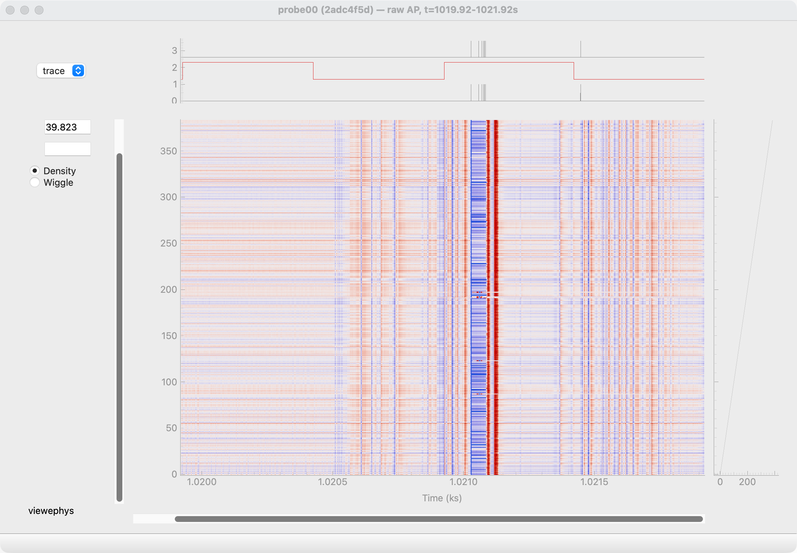

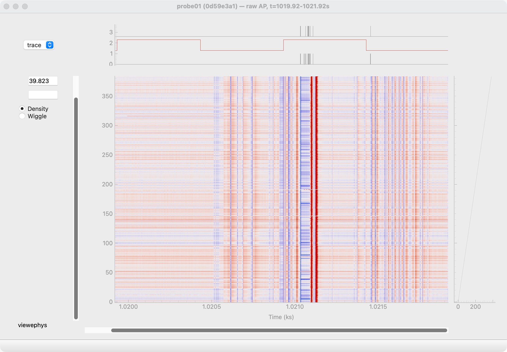
:::

Destriped: the spatial referencing removes most of the common-mode saturation, which is why the
defect is easy to miss in the extraction-time residual and only shows up as a small sawtooth:

::: {layout-ncol=2}
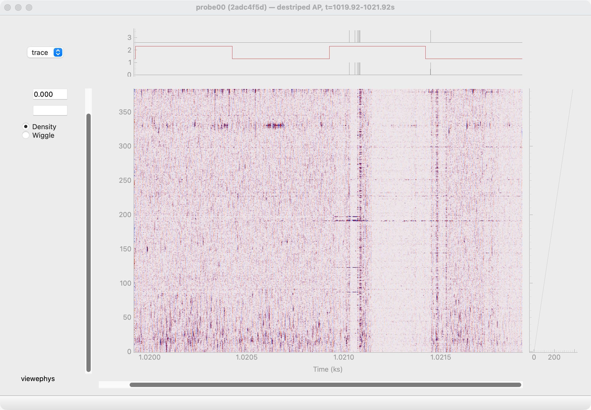

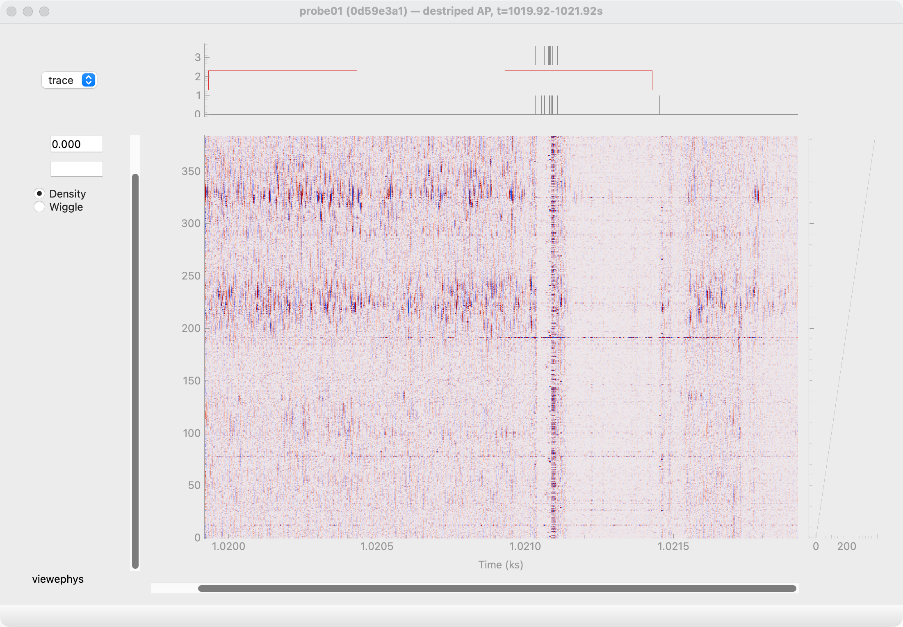
:::

Every channel saturating at once, on both probes, at the exact instant of the shared burst, is
consistent with an electrical saturation event on a line common to both probes (e.g. a shared
power or reference rail) rather than independent per-probe noise — stronger evidence than the
timing coincidence alone, though still one session's worth of it.

## Appendix: raw AP evidence at the f2ea7211 duplicate_burst

The same check applied to `f2ea7211` (`duplicate_burst`, probe channel): raw AP streamed ±1s
around the anomalous edge cluster (probe-local t≈1955.46s — a 58.3ms short gap, a 33.3μs
micro-gap, then a 434.9ms gap, not the single clean double-trigger the "2 extra edges 33μs apart"
summary suggests), same method and units as above.

{width=70%}

Every channel hits almost exactly **±0.077V** in that band — this is this probe's ADC bipolar
full-scale ceiling itself (±32767 counts × 2.34375μV/count ≈ ±76.8mV), pegged at both rails
simultaneously, the textbook signature of hard clipping: the true underlying signal exceeded the
ADC's input range and was clamped at its representable limit. Ordinary AP-band signal here sits
around 30-65μV (see the "raw stats" baseline printed by the script) — three orders of magnitude
below the clipped value. Unambiguous confirmation that the raw sample values themselves are
corrupted at that instant, not merely that a threshold-crossing was mistimed. The destriped view
isn't informative here (both the auto-gain and destriping's own referencing are themselves
distorted by an outlier this extreme) so it's omitted.

This settles the question the case was checked for: it's a genuine electrical/ADC-saturation
artefact coincident with the bad edges, not a plain comparator/front-detection quirk with
otherwise-valid data underneath — the same signature as the `4aab0f45` shared burst, just far more
extreme (full-scale clipping vs. a sub-mV excursion).

## Code references

- **[`ibllib/ephys/sync_probes.py`](https://github.com/int-brain-lab/ibllib/blob/6215ee3f97e29b70b0953497370215774a197bb4/ibllib/ephys/sync_probes.py)**
  (branch `pyproject-migration`) — extraction code under diagnosis, out of scope for the fixes above:
  [`version3A`](https://github.com/int-brain-lab/ibllib/blob/6215ee3f97e29b70b0953497370215774a197bb4/ibllib/ephys/sync_probes.py#L48),
  [`version3B`](https://github.com/int-brain-lab/ibllib/blob/6215ee3f97e29b70b0953497370215774a197bb4/ibllib/ephys/sync_probes.py#L117),
  [`sync_probe_front_times`](https://github.com/int-brain-lab/ibllib/blob/6215ee3f97e29b70b0953497370215774a197bb4/ibllib/ephys/sync_probes.py#L181),
  [`_check_diff_3b`](https://github.com/int-brain-lab/ibllib/blob/6215ee3f97e29b70b0953497370215774a197bb4/ibllib/ephys/sync_probes.py#L275).
- **[`brainbox/io/one.py`](https://github.com/int-brain-lab/ibllib/blob/6215ee3f97e29b70b0953497370215774a197bb4/brainbox/io/one.py)** —
  [`SpikeSortingLoader`](https://github.com/int-brain-lab/ibllib/blob/6215ee3f97e29b70b0953497370215774a197bb4/brainbox/io/one.py#L591),
  [`_get_probe_info`](https://github.com/int-brain-lab/ibllib/blob/6215ee3f97e29b70b0953497370215774a197bb4/brainbox/io/one.py#L1021)
  (builds the `interp1d(fill_value='extrapolate')` this analysis' long-term fix patches),
  [`samples2times`](https://github.com/int-brain-lab/ibllib/blob/6215ee3f97e29b70b0953497370215774a197bb4/brainbox/io/one.py#L1053).
- **[`attach_ibl_metadata.py::compute_sync()`](https://github.com/int-brain-lab/sdsc-slurms/blob/3b192952d45aaef9e5fbc1df7a02f8327f6dda35/2026-06-lfpack/attach_ibl_metadata.py#L108)** —
  the short-term lfpack fix target.
- **[`test_ephys_synchronization.py`](https://github.com/int-brain-lab/ibllib/blob/6215ee3f97e29b70b0953497370215774a197bb4/ibllib/tests/integration/test_ephys_synchronization.py)** —
  existing `version3A`/`version3B` coverage, must keep passing (extractor is out of scope, but
  this is the tripwire if that changes).
- `sync_investigation.py` (this directory) — the full re-derivation, classification, and
  figure-generation pipeline used for this analysis. **Not yet pushed** (local-only branch
  `analysis/lfpack-sync-issues` in `oliche-quarto`) — link to add once pushed.