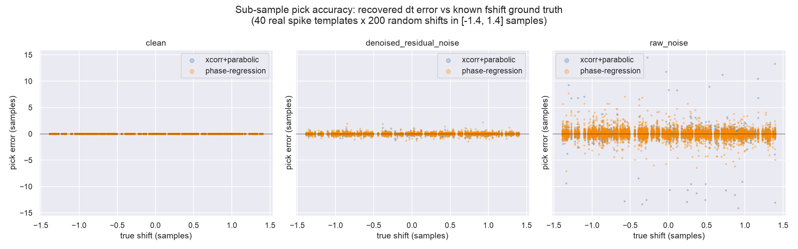
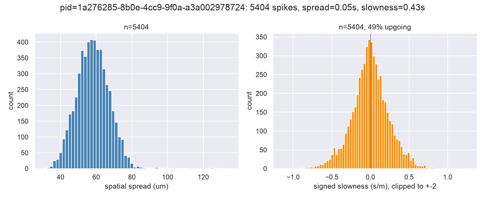

## Context

[ibleatools#123](https://github.com/int-brain-lab/ibleatools/issues/123) asks for two
new multi-channel waveform features: the spatial spread of a spike across its
neighbour channels, and its apparent velocity along the probe — reported as a
signed **slowness** (inverse velocity, proportional to the timing delta) rather
than velocity itself, per the issue's own framing, plus a Hanning window to
narrow the per-channel peak search.

This is a report of the prototyping path: loading real multi-channel waveforms
from IBL benchmark recordings, picking a timing-estimation method and
validating it against ground truth, checking the result holds up across
several probe insertions, and the bugs and environment issues found along the
way — before turning it into the three PRs linked at the bottom.

## Loading real waveforms

Snippets come from `IBLPIDFeatureCalculator.compute_snippet` (DARTsort
backend), 2s of AP band at `t=300s`, on `ibleatools`'s
[`waveform-amplitude-volts`](https://github.com/int-brain-lab/ibleatools/pull/124)
branch so amplitudes are real Volts rather than DARTsort's internal
per-channel-RMS-normalised units. `d_waveforms["channel_index"]` (DARTsort's
detection-channel → neighbour-channel lookup) plus the snippet's probe
geometry gives each spike's neighbourhood in real micrometres.

Getting this far needed one environment fix first: the monorepo's
`packages/spikeinterface` checkout was on an unrelated in-progress branch at a
spikeinterface commit incompatible with `dartsort==0.5.24` (two private-API
renames broke `dartsort.subtract()`). Confirmed `spikeinterface==0.104.9`
(latest PyPI release) is compatible; worked around it with a throwaway venv
rather than touching that branch, and separately fast-forwarded the
`int-brain-lab/spikeinterface` fork's `main` to upstream.

Raw (top row) vs. DARTsort-denoised (bottom row) multi-channel waveforms, a
random sample of detected spikes, real-Volts amplitude scale:

## Method: Hanning window, cross-correlation pick, weighted linear fit

For each spike, a Hanning window (0.5ms half-width) is centred on the
reference (max-deflection) channel's peak sample. Each neighbour channel's
sub-sample timing is picked by cross-correlating its windowed snippet against
the reference channel's own windowed snippet, with parabolic interpolation on
`|corr|` — picking on the *magnitude* means a phase-inverted channel is still
matched on shape rather than missed by amplitude sign. The pick's weight is
the normalized cross-correlation coefficient (a fit-quality score).

A weighted linear fit of pick time vs. each channel's axial distance from the
reference channel then gives the slope directly as **slowness** (s/m):
`dt = slowness · dy`. Fitting slowness instead of velocity is the point —
velocity is slowness's reciprocal, and blows up whenever the fit's slope is
near zero (near-simultaneous arrival across the neighbourhood, which happens
often). Sign convention: probe geometry `y` increases away from the tip
(towards the brain surface), so positive slowness means later arrival at
larger `y` — the wave moving "up".

A lateral (across-shank-columns) slowness component was tried and dropped: on
a single-shank NP1.0 probe the neighbourhood's lateral extent (a handful of
columns, tens of µm) is short enough relative to its axial extent that the
lateral estimate came out noise-dominated (`|slowness_x|` systematically
larger and flatter-distributed than `|slowness_y|`) rather than a real fast
signal — not without a fundamentally more careful estimator (larger radius,
pooling across spikes per unit, ...).

Per-spike diagnostic for 6 example spikes: the Hanning window (green) and each
channel's pick (dots, colour = weight) overlaid on the wiggle plot, and the
weighted fit behind the reported slowness/velocity, with the `dt` axis shared
across all 6 for comparability:

## Sub-sample pick accuracy: cross-correlation vs. phase-slope regression

`ibldsp.waveforms` already had the pieces for two different sub-sample timing
estimators: `parabolic_max` (used above), and a frequency-domain
phase-slope-regression path (`get_apf_from2spikes`/`get_phase_slope`, the
basis of `wave_shift_phase`). The latter's own docstring warns it "works
perfectly in theory, but does not work well with raw data sampled at 30kHz"
without a per-template calibration step — worth checking empirically rather
than trusting that caveat blind, and worth checking that the cross-correlation
pick isn't secretly just locking to the nearest sample either (it isn't: only
~6% of real picks land within 0.01 samples of an integer, spread std ≈0.28
samples).

Ground truth: 40 real spike templates, each given 200 known sub-sample shifts
via `ibldsp.fourier.fshift`, recovered with both estimators, under three noise
conditions.

| condition | xcorr + parabolic RMSE (samples) | phase-slope regression RMSE (samples) |
|---|---|---|
| clean (noiseless) | 0.0035 | **0.0000** |
| denoised residual noise *(what the pipeline actually picks against)* | **0.099** | 0.147 |
| raw (pre-denoising) noise | 0.80 | 0.79 |

Phase regression is exact in the noiseless limit, as the theory says. But
under the noise level the pipeline actually operates at — DARTsort-denoised
neighbour-channel residual noise, not raw — cross-correlation + parabolic
interpolation is the more accurate of the two, matching `wave_shift_phase`'s
documented caveat. Kept cross-correlation + parabolic as the production
method.

## Consistency across benchmark PIDs

Spatial spread and slowness distributions for one PID, same 2s-AP-at-300s
window:

Repeated on 4 PIDs from `BENCHMARKS.py`:

| PID | n spikes | spread p50 (µm) | spread p5-p95 (µm) | slowness IQR (s/m) | % upgoing |
|---|---|---|---|---|---|
| `1a276285` | 5404 | 58.0 | 43.6-73.3 | 0.282 | 49% |
| `1e104bf4` | 5930 | 56.0 | 42.0-69.2 | 0.281 | 50% |
| `6638cfb3` | 4743 | 60.3 | 48.0-72.6 | 0.304 | 50% |
| `749cb2b7` | 4107 | 57.8 | 39.4-70.0 | 0.274 | 52% |

Tight agreement — spread medians within a 4.3µm band, slowness IQR within
0.03 s/m, upgoing/downgoing split close to 50/50 everywhere. No PID stands out
as an outlier, and nothing points at the method being tuned to quirks of a
single insertion.

A fifth PID (`dc7e9403`, BENCHMARKS.py's "static noise: positive spikes"
stress test) was tried and dropped from the comparison: `dartsort.subtract()`
was still running after 2+ hours on it (vs. ~110s normal), apparently loading
~4456 "spikes" in its first fitting pass alone (vs. ~2000-3300 for a normal
snippet) before stalling in the subtraction/peeling phase — mostly idle
CPU-wise, not just slow. A real robustness gap worth its own issue: very
noisy/static snippets can make DARTsort waveform-feature computation
pathologically slow (or hang) at the default `detection_threshold=4.0`, not
something to fix here.

Timing, for reference: DARTsort `ap`+`waveforms` feature computation on 2s of
AP data (384 channels) is ~105-120s CPU-only (`n_jobs=0`); computing spatial
spread and slowness on top costs well under a second for several thousand
spikes (0.04-0.06s and 0.35-0.48s respectively) — negligible next to waveform
extraction itself.

## A bug found along the way

`ibldsp.waveforms.compute_spatial_spread` (already in the codebase, unused
until this work started calling it) had two issues: it called
`dist_chanel_from_peak(channel_geometry, df)` with the whole dataframe where
an array of peak-channel indices was expected, and it fed
`weights_spk_ch`'s *signed* per-channel amplitude straight into a weighted
mean that needs non-negative weights — whenever a spike's signed weights
nearly cancelled out, the reported spread could come out negative, which
is physically meaningless for a distance. Fixed with a regression test that
reproduces exactly that cancellation case
([ibl-neuropixel#93](https://github.com/int-brain-lab/ibl-neuropixel/pull/93)).

## Outcome

Landed as three stacked PRs rather than in-repo prototype code, following the
existing split between `ibldsp.waveforms` (generic, ephys-atlas-independent
multi-channel waveform math — `compute_spatial_spread` already lived there)
and `ephysatlas.features` (orchestration: wiring the generic pieces into the
per-spike/per-channel feature-computation pipeline and the pandera schema):

- [ibl-neuropixel#93](https://github.com/int-brain-lab/ibl-neuropixel/pull/93) — the `compute_spatial_spread` bug fix.
- [ibl-neuropixel#94](https://github.com/int-brain-lab/ibl-neuropixel/pull/94) — new `compute_slowness`, stacked on #93 (unrelated changes, adjacent code — avoids a duplicate diff). Same `arr`/`df`/`channel_geometry` calling convention as `compute_spatial_spread`, so both PRs share one geometry array at the call site.
- [ibleatools#125](https://github.com/int-brain-lab/ibleatools/pull/125) — wires both into `spikes()` as `spatial_spread_um`/`slowness_s_per_m`, stacked on [#124](https://github.com/int-brain-lab/ibleatools/pull/124) (the amplitudes these features are weighted by only make physical sense once that Volts fix lands). Both fields nullable; `remap_waveform_shape_features` and its `_volume` counterpart tolerate older, pre-#123 data missing the two new columns rather than raising.

The prototype scripts behind every figure above are alongside this report in
`scripts/`.
