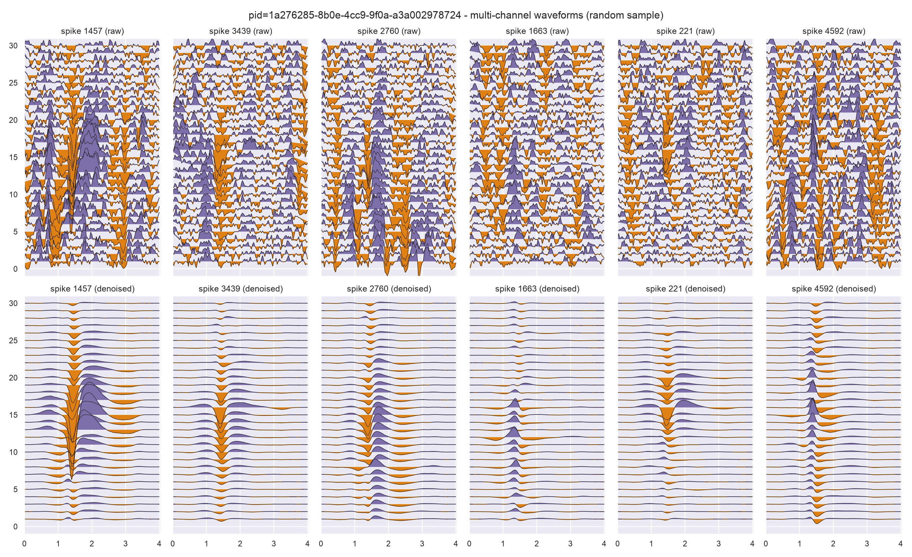
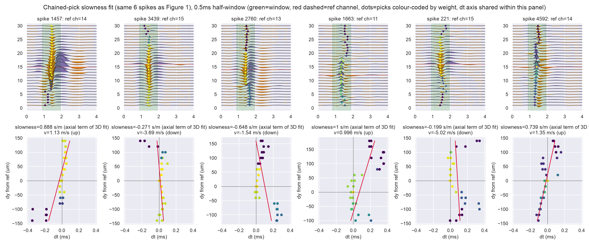
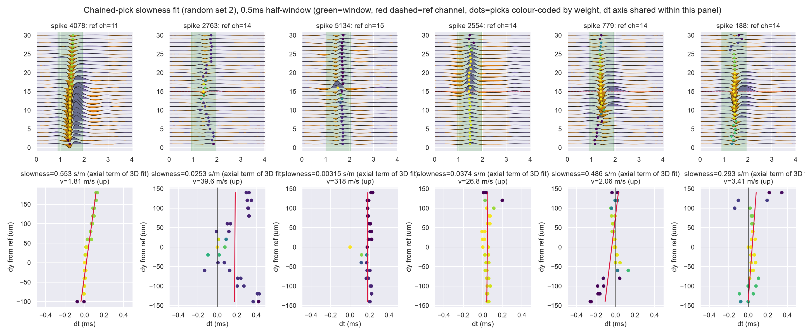
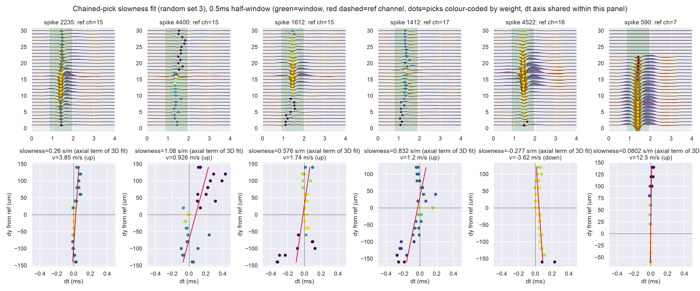
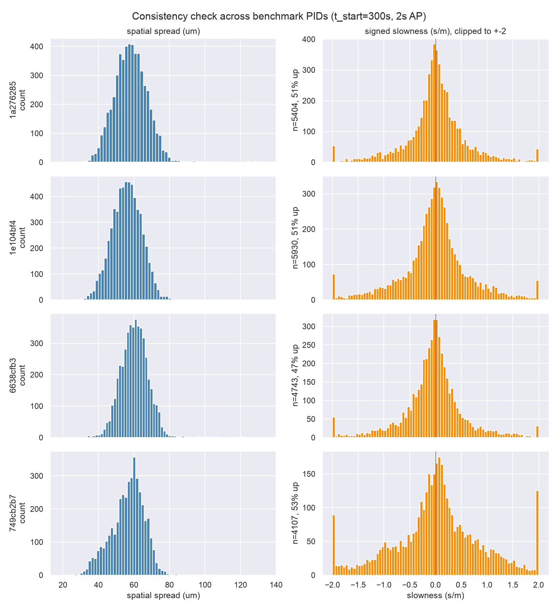

## Context

[ibleatools#123](https://github.com/int-brain-lab/ibleatools/issues/123) asks for two
new multi-channel waveform features: the spatial spread of a spike across its
neighbour channels, and its apparent velocity along the probe — reported as a
signed **slowness** (inverse velocity, proportional to the timing delta), plus a
Hanning window to narrow the per-channel peak search. This is a short report of
the prototyping path, before landing it as the three PRs linked at the bottom.

## Loading real waveforms

Snippets come from `IBLPIDFeatureCalculator.compute_snippet` (DARTsort backend),
2s of AP band at `t=300s`, on `ibleatools`'s
[`waveform-amplitude-volts`](https://github.com/int-brain-lab/ibleatools/pull/124)
branch so amplitudes are real Volts. `d_waveforms["channel_index"]` plus the
snippet's probe geometry gives each spike's neighbourhood in real micrometres.

(One environment fix needed first: the monorepo's `packages/spikeinterface`
checkout was on an unrelated branch incompatible with `dartsort==0.5.24`.
Worked around it with a throwaway venv rather than touching that branch.)

Raw (top row) vs. DARTsort-denoised (bottom row), a random sample of detected
spikes, both rows sharing one amplitude gain (set from the denoised row, so
the comparison is fair — raw's noise floor is honestly cluttered at this
gain):

## Method

For each spike, a Hanning window (0.5ms half-width) is centred on the
reference (max-deflection) channel's peak sample. Each neighbour channel's
sub-sample timing is picked by cross-correlation + parabolic interpolation on
`|corr|` (so a phase-inverted channel is still matched on shape). A weighted
linear fit of pick time vs. axial distance from the reference channel gives
the slope directly as **slowness** (s/m). Fitting slowness instead of velocity
is the point: velocity is its reciprocal and blows up whenever the fit's slope
is near zero, which happens often. Sign convention: probe `y` increases away
from the tip, so positive slowness means the wave moving "up".

The first version correlated every channel directly against the single
reference channel. Spike 4592 below (first panel, rightmost) showed why
that's not quite right: below channel 10 the picks jumped to a different
phase of the wavelet — a cycle skip, where the waveform's shape had drifted
enough from the reference that an unrelated lag became the taller peak in the
correlogram. Fixed by walking outward from the reference channel by axial
distance and correlating only **adjacent** channels, accumulating the lag
along the way — two channels next to each other are always similar enough
that this can't happen. Confirmed with a clean synthetic case (two wavelet
lobes, dominance switching smoothly across channels, no real delay): direct
correlation against a fixed reference shows a hard jump, the chained pick
stays flat and correct throughout
(`test_chained_xcorr_avoids_cycle_skip` in
[ibl-neuropixel#94](https://github.com/int-brain-lab/ibl-neuropixel/pull/94)).

Second refinement: the fit is now a full 3D plane (`dt = sx·dx + sy·dy + t0`),
keeping only the axial term `sy` as the reported slowness. A lateral-only fit
was tried earlier and dropped as too noise-dominated to report on a probe
whose neighbourhoods are short laterally — but *fitting* `dx` as a covariate
here still helps even though its own coefficient isn't reported: the probe's
staggered-column layout mildly correlates `dx` with `dy`, so including it
gives a less biased axial estimate than fitting `dy` alone.

Three example panels (top: window + picks overlaid on the wiggle plot;
bottom: the weighted fit behind the reported slowness, `dt` axis shared
within each panel):

## Consistency across benchmark PIDs

Repeated on 4 PIDs from `BENCHMARKS.py`, same window:

| PID | n spikes | spread p50 (µm) | spread p5-p95 (µm) | slowness IQR (s/m) | % upgoing |
|---|---|---|---|---|---|
| `1a276285` | 5404 | 58.0 | 43.6-73.3 | 0.471 | 51% |
| `1e104bf4` | 5930 | 56.0 | 42.0-69.2 | 0.567 | 51% |
| `6638cfb3` | 4743 | 60.3 | 48.0-72.6 | 0.486 | 47% |
| `749cb2b7` | 4107 | 57.8 | 39.4-70.0 | 0.887 | 53% |

Spread medians agree within a 4.3µm band and the upgoing/downgoing split
stays close to 50/50 everywhere — no PID stands out as an outlier.

A fifth PID (`dc7e9403`, BENCHMARKS.py's "static noise: positive spikes"
stress test) was dropped: `dartsort.subtract()` was still running after 2+
hours on it (vs. ~110s normal) when killed — a real robustness gap worth its
own issue, not something to fix here.

Timing, for reference: DARTsort feature extraction itself is ~105-120s
CPU-only for 2s of AP data (384 channels); spatial spread + slowness on top
cost well under a second for several thousand spikes — negligible by
comparison.

## A bug found along the way

`ibldsp.waveforms.compute_spatial_spread` (already in the codebase, unused
until this work started calling it) called `dist_chanel_from_peak` with the
whole dataframe where an index array was expected, and fed a *signed*
per-channel weight into a mean that needs non-negative weights — whenever a
spike's signed weights nearly cancelled out, the reported spread could come
out negative, which is meaningless for a distance. Fixed with a regression
test reproducing exactly that cancellation case
([ibl-neuropixel#93](https://github.com/int-brain-lab/ibl-neuropixel/pull/93)).

## Outcome

Three stacked PRs, following the existing split between `ibldsp.waveforms`
(generic, ephys-atlas-independent multi-channel waveform math) and
`ephysatlas.features` (orchestration):

- [ibl-neuropixel#93](https://github.com/int-brain-lab/ibl-neuropixel/pull/93) — the `compute_spatial_spread` bug fix.
- [ibl-neuropixel#94](https://github.com/int-brain-lab/ibl-neuropixel/pull/94) — new `compute_slowness` (chained picks, 3D fit), stacked on #93.
- [ibleatools#125](https://github.com/int-brain-lab/ibleatools/pull/125) — wires both into `spikes()` as `spatial_spread_um`/`slowness_s_per_m`, stacked on [#124](https://github.com/int-brain-lab/ibleatools/pull/124).

The prototype scripts behind every figure above are alongside this report in
`scripts/`.
