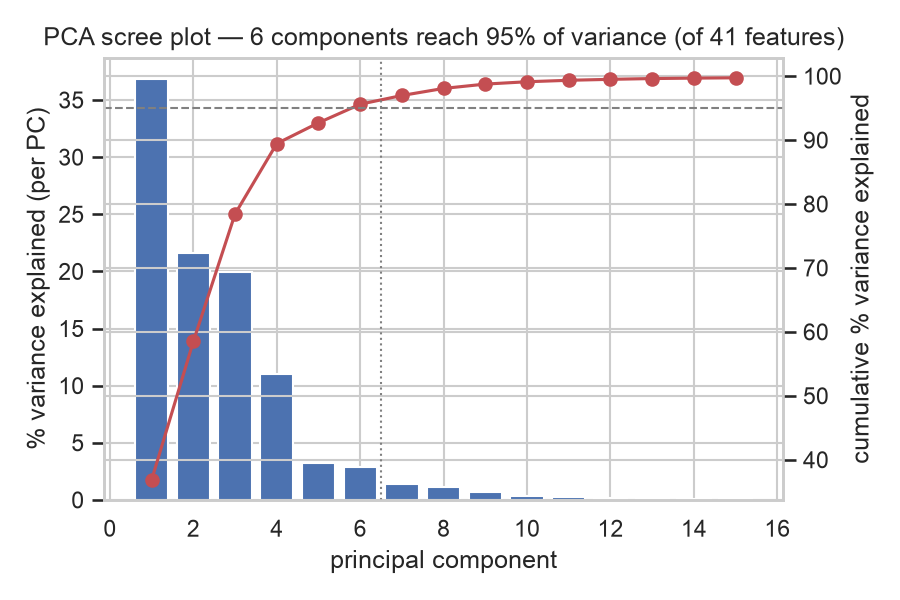
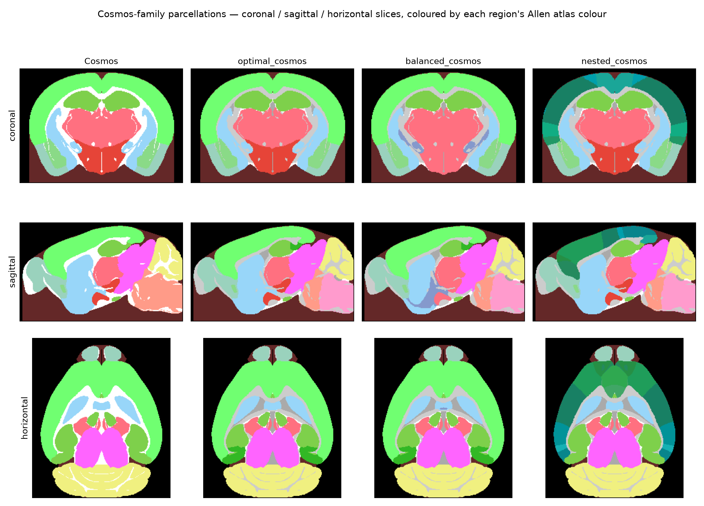
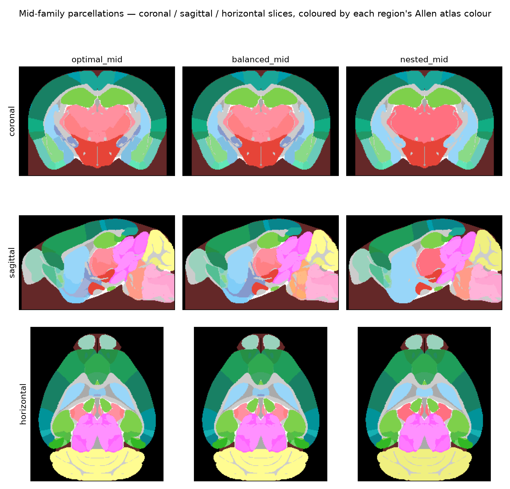
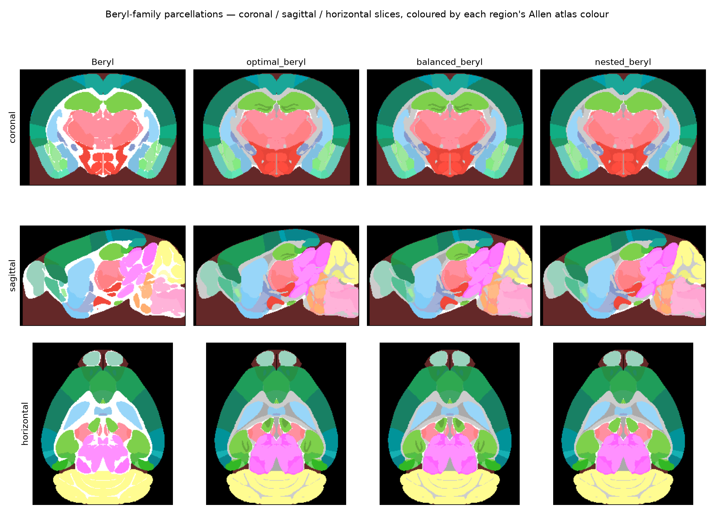

## Overview

The ephys-atlas encoding volume gives, at every 50 µm voxel of the Allen CCF, 41
electrophysiology features (LFP power/CSD/residual bands, spectral/aperiodic shape, spike
waveform shape, spike amplitude and rate). This analysis asks: **how electrophysiologically
distinctive is each brain region from every other brain region**, across the full set of regions
the atlas samples well enough to trust?

This is a narrower re-scoping of an earlier version of this analysis, which compared each region
only to its immediate spatial neighbours via a distance-weighted buffer. That framing, and all the
hierarchy-aggregation and neighbour-buffer machinery it required, has been dropped — see
`PLAN.md` for why. What carries forward unchanged is the global PCA basis fitted on the earlier
work: 41 correlated raw features are whitened into ~6 orthogonal components explaining 95% of
brainwide variance, and every distance below is a Mahalanobis distance in that basis.

This is a descriptive, exploratory analysis over one already-aggregated atlas volume, not a
hypothesis test over experimental replicates — there's no natural per-subject/per-session split
inside this file to hold out for confirmatory testing, so no p-values are reported. Effect sizes
(Cohen's d / Mahalanobis distance) are the validation currency here.

## Method

**Data.** `brainwide_ephys_atlas_50um.npz`, `ephys_atlas_vol` (228, 264, 160, 41), axis order
(ML, AP, DV, feature). The volume has no `NaN`s anywhere, including outside the brain (those
voxels are extrapolated, not real), so every step below restricts to in-brain, in-mask voxels via
`ephysatlas.anatomy.ClassifierAtlas(res_um=50).mask()` — a version of the Allen atlas that relabels
void voxels trapped inside the skull to a `void_fluid` region rather than counting them as
unlabelled background. Atlas volumes are (AP, ML, DV); the encoding volume is transposed
`(1, 0, 2, 3)` to align. ~47k in-mask voxels (1.2%) are an unfilled "no probe coverage" sentinel
(all 41 features exactly 0.0) rather than real data, and are excluded from every statistic below
(`distinctiveness.no_coverage_mask`). `root`/`void`/`void_fluid` are excluded throughout too, since
they aren't real tissue.

**Regions.** Every named region in the atlas's own raw painted partition (`ba.label`) — not any
Beryl/Cosmos/Swanson remapping — with more than 500 directly-painted voxels (~0.06 mm³). Each named
region is painted across one or two raw atlas ids: a `+id` and, for most regions, a genuinely
independently-painted `-id` "twin" (confirmed by inspection — e.g. piriform cortex's two ids hold
46,286 and 46,289 voxels respectively, each spanning both hemispheres; cerebellum's hold 3,304 and
3,317, one per ML side — not a near-empty duplicate either way). Since both hemispheres/twins of a
region are anatomically symmetric for this analysis, they're pooled into one row per region before
thresholding (`region_stats_table.pool_by_acronym`). 534 regions clear the bar.

**PCA basis.** Fit once, brainwide, on all in-mask non-excluded voxels: z-score each of the 41
features (using the encoding volume's own documented per-feature mean/std, not an empirical
in-mask mean/std), then keep the top orthogonal components explaining 95% of variance. 6 components
suffice, with variance spread fairly evenly across the first four (37/22/20/11%) — see the scree
plot below.

{#fig-scree}

**Pairwise Mahalanobis distance.** For every pair of qualifying regions, project both regions'
per-PC (mean, variance, n) onto the PCA basis, compute a per-PC Cohen's d between the pair, and
combine in quadrature (`sqrt(sum_k d_k^2)`) — a proper Mahalanobis distance, since the PCs are
orthogonal so squaring-and-summing doesn't double-count the ~20 mutually-correlated LFP
power/CSD/residual bands the way a naive sum over the raw 41 features would
(`region_stats_table.mahalanobis_matrix`). This needs no neighbour definition, distance transform,
or hierarchy walk at all — just a plain 534×534 matrix over already-pooled per-region statistics —
so it's considerably cheaper than the superseded neighbour-buffer pipeline.

**Parcellation search.** The same machinery also drives a hierarchy-consistent grouping search
(`parcellation.py`): since total voxel-wise sum-of-squares is fixed regardless of grouping (the
ANOVA identity again), minimizing within-group variance is exactly equivalent to maximizing
between-group Mahalanobis separation — which makes finding the best K-group cut of the CCF ontology
tree tractable as an exact tree dynamic program (`optimal_cut`) instead of an intractable
combinatorial search. Two ways to pick a K-group cut:

- **Bottom-up (`optimal_cut`).** Solves every subtree's best *j*-way split from the leaves up, then
  combines child solutions via a knapsack-style merge; the true minimum-cost frontier of exactly K
  groups. Independent per K, so the 13/100/250-group cuts aren't guaranteed to nest inside one
  another.
- **Top-down (`greedy_nested_cuts`).** Starts from one group (all of grey matter) and repeatedly
  opens whichever current group's split would reduce variance the most, one split at a time.
  Suboptimal for any fixed K (a locally greedy choice, not a joint optimum), but the resulting
  13/100/250-group cuts are guaranteed strict refinements of each other, since a group is only ever
  subdivided, never re-merged.

Both are restricted to grey matter (`fiber tracts`/`VS` excluded before any statistics are computed,
not just cropped from the output — they're trivially separable from grey matter and were otherwise
dominating the group budget without being the interesting comparison), and both admit an optional
size-balance penalty (`optimal_cut`'s `size_penalty`, used in the `balanced_*` variants below) that
trades some between-group separation for more equal group voxel counts — a quadratic penalty on each
group's deviation from an equal K-way voxel split, auto-scaled from the unregularized solution's own
cost (`auto_scaled_size_penalty`) so one dimensionless strength transfers across K without
per-K hand-tuning.

## Result

{#fig-heatmap}

The block structure along the diagonal is visible even without labels: closely related regions
(e.g. adjacent cortical layers, or lobules within the cerebellum) sit in near-black low-distance
blocks, while structurally very different tissue — grey matter vs. white-matter fiber tracts and
ventricular structures (the grey strip at the bottom right) — shows up as bright, high-distance
bands against most of the matrix. The single brightest cells in the matrix are pairs involving
small (500-1500 voxel), unusually homogeneous regions — mostly slender fiber tracts and small
brainstem nuclei — where a genuinely small within-region variance inflates Cohen's d even for a
modest raw feature difference; this is an expected property of the effect-size metric for small,
tightly-clustered regions, not an artefact specific to this dataset.

## Parcellations

Each parcellation search runs at three target sizes — a Cosmos-like scale (~13 groups), a
mid-scale (~100), and a Beryl-like scale (~250) — and each size gets a "family" of variants: the
real anatomical mapping where one exists at that scale, plus the bottom-up (`optimal_*`),
size-balanced (`balanced_*`) and top-down (`nested_*`) searches, all grey-matter-only. Shown as
coronal, sagittal and horizontal slices, coloured by each region's own Allen atlas colour — the
same rendering the built-in Cosmos/Beryl mappings use, since a parcellation is just another
`ba.regions.mappings` entry.

{#fig-slices-cosmos}

{#fig-slices-mid}

{#fig-slices-beryl}

The `nested_*` variants visibly over-split relative to `optimal_*`/`balanced_*` at the same nominal
target (e.g. 27 groups instead of 13 for the Cosmos family — the greedy search's one big
all-or-nothing first split opens every one of grey matter's direct children at once), which shows
up directly as extra colour subdivisions within what stays a single region in the other variants.

## Classifier evaluation

As a check on whether any of this actually buys more separable regions (not just a lower Mahalanobis
cost by construction), gradient-boosted classifiers (XGBoost; same 50 voltage features, same
pid-level train/test split throughout — 260,332 train / 64,402 test channels from real experimental
recordings, restricted to grey matter to match the parcellation searches) were trained to predict
region identity under all 9 parcellations plus the real Cosmos/Beryl/Allen mappings. Class imbalance
is reported alongside accuracy, both over the experimental channels actually used for training
(`gini` (channel)) and over the atlas's own voxel counts for the same class definitions (`gini`
(voxel)) — a Gini coefficient of 0 is perfectly balanced classes, towards 1 is maximally unbalanced:

```{python}
#| echo: false
import pandas as pd
table = pd.read_csv("cache/classifier_accuracy_summary_full.csv").set_index("target")
table = table[["n_classes", "accuracy", "balanced_accuracy", "gini", "gini_voxel"]].sort_values("n_classes")
table.columns = ["# classes", "accuracy", "balanced accuracy", "gini (channel)", "gini (voxel)"]
table["accuracy"] = (table["accuracy"] * 100).round(1).astype(str) + "%"
table["balanced accuracy"] = (table["balanced accuracy"] * 100).round(1).astype(str) + "%"
table["gini (channel)"] = table["gini (channel)"].round(3)
table["gini (voxel)"] = table["gini (voxel)"].round(3)
table
```

A few things stand out:

- **At Beryl-comparable granularity, both search-based parcellations edge out the real Beryl
  mapping** on balanced accuracy (`optimal_beryl`/`balanced_beryl`: 6.9%/7.3% vs. Beryl's 5.2%)
  despite having no anatomical information built in — `balanced_beryl` is also the best-balanced
  parcellation of the whole group by gini. At Cosmos-comparable granularity the reverse holds: real
  Cosmos still has the best balanced accuracy of the three search variants.
- **The size-balance penalty works, but only where the tree has room.** Gini improves meaningfully
  from `optimal_*` to `balanced_*` at the 100- and 250-group scales (0.643→0.624, 0.663→0.628 by
  channel), but barely moves at 13 (0.421→0.427) — the standard Cosmos-like divisions leave little
  room to redistribute without changing K; the single biggest group in the grey-matter tree
  (`STRd`, dorsal striatum) has exactly one ontology child, so no amount of penalty weight can split
  it further.
- **`nested_*`'s higher raw accuracy is a class-imbalance artefact, not better separation** — it
  consistently has the worst gini of the three search variants at every scale, and its balanced
  accuracy is correspondingly the weakest (e.g. 23.1% vs. 45.0-45.7% for the other two at Cosmos
  scale) — a symptom of its one-big-split-at-a-time construction (see the visible over-splitting
  in the slice figures above) producing a few dominant groups a classifier can lean on.

## Caveats

- **Descriptive, not inferential.** One already-aggregated atlas volume, not experimental
  replicates — no significance testing, only effect sizes and anatomical plausibility checks.
- **Small-region sensitivity.** The 500-voxel floor (same threshold used throughout this project's
  earlier work) still admits some very small, very homogeneous regions whose Mahalanobis distance
  against almost anything is large simply because their own variance is tiny — read the brightest
  single cells in the matrix with that in mind rather than as the most biologically interesting
  contrasts.
- **No spatial context.** Unlike the superseded neighbour-buffer version, this matrix says nothing
  about which regions are physically adjacent — two regions can be far apart in the brain and still
  show a small Mahalanobis distance if their feature distributions happen to be similar.
