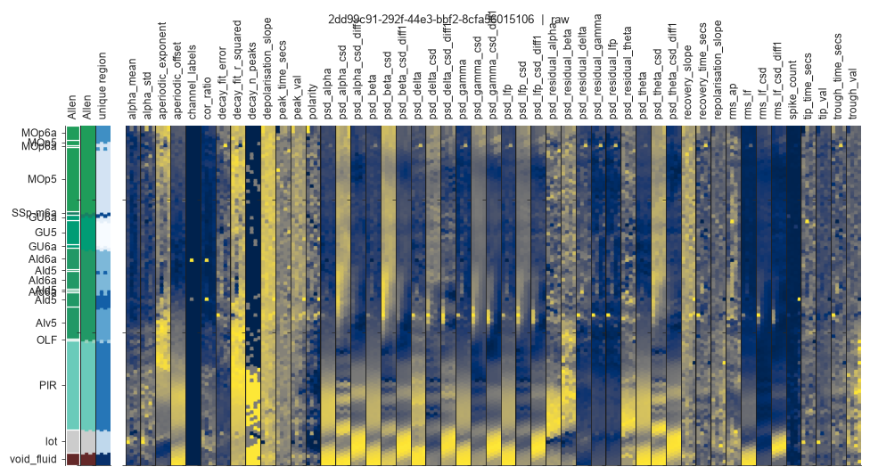
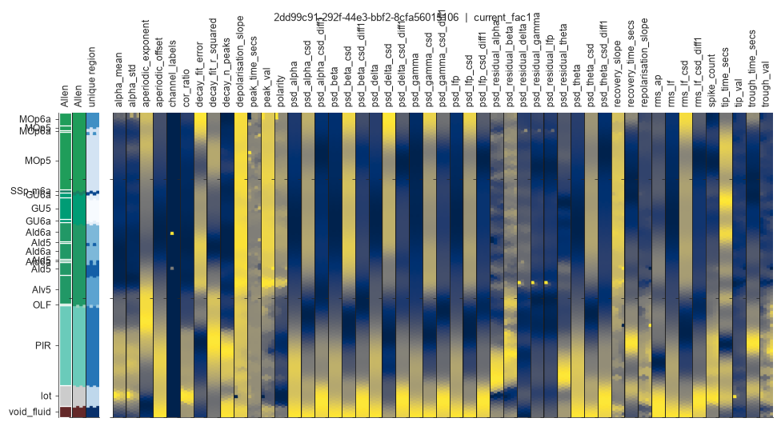
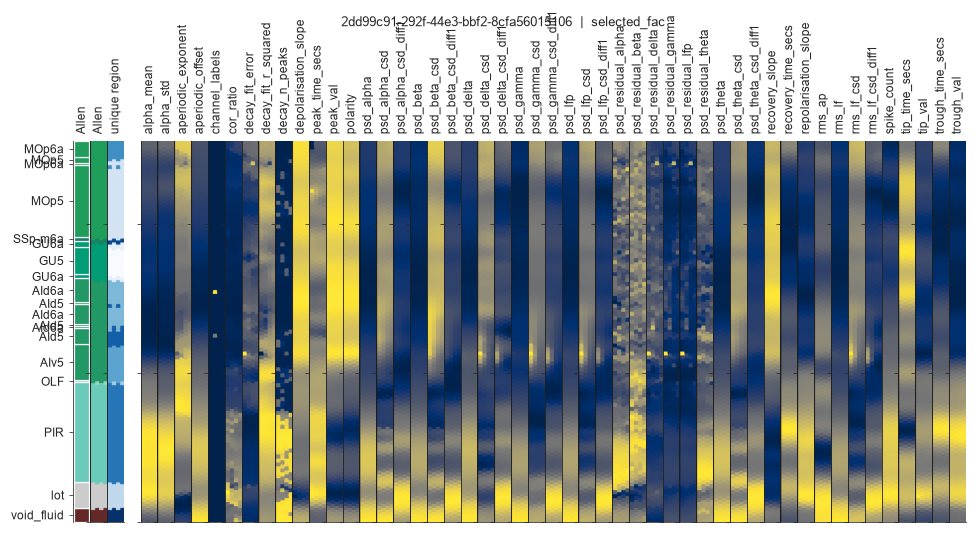
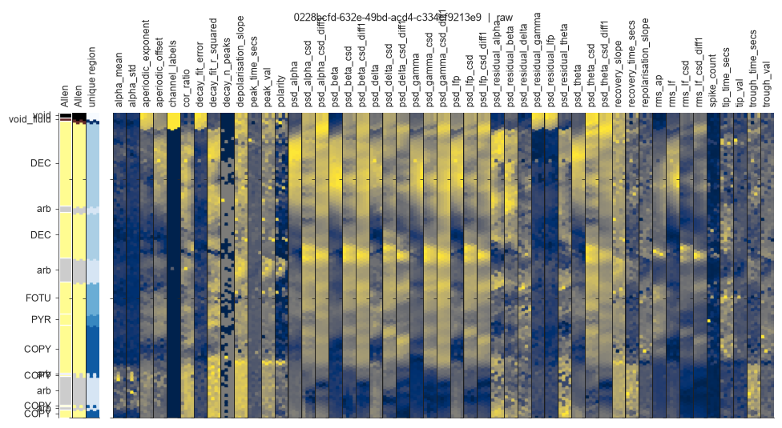
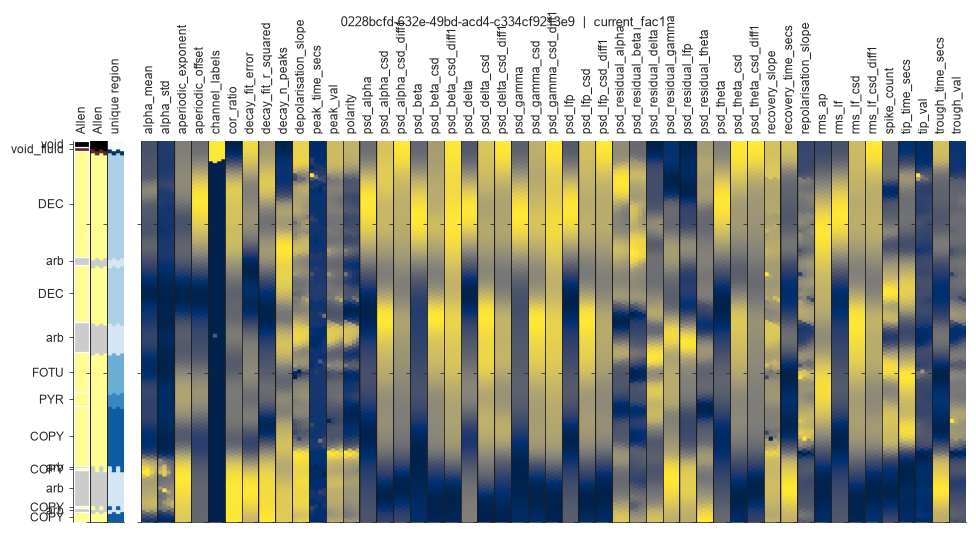
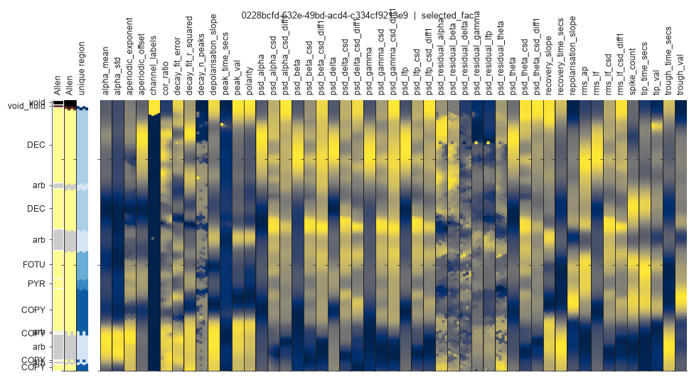

## Context

`ephysatlas.features.denoise_shank` TV-denoises each channel feature with
`skimage.restoration.denoise_tv_chambolle(weight = median(|feature|) * fac)`.
Until now `fac` was a single scalar (hardcoded to 1) applied to every feature,
regardless of provenance. `EphysDenoiser`/`denoise_dataframe`/
`denoise_raw_features_data` now accept `fac` as a dict keyed by
`raw_ap`/`raw_lf`/`raw_lf_csd`/`waveforms`, so each group can be tuned
independently ([ibleatools#112](https://github.com/int-brain-lab/ibleatools/pull/112)).

All experiments below use vintage `2026_W32`, an XGBoost `Cosmos_id` classifier,
misaligned PIDs excluded, and the same fixed PID-based train/test split (or
fold assignment for CV) across every configuration compared.

## One-factor-at-a-time bracket

Each group swept individually, others held at the current default `fac=1`.

| fac | raw_ap | raw_lf | raw_lf_csd | waveforms |
|---|---|---|---|---|
| 0 (no denoise) | 0.5975 | 0.5680 | 0.6057 | 0.5597 |
| 0.1 | 0.6121 | 0.6077 | 0.6116 | 0.5977 |
| 0.3 | 0.6106 | 0.6114 | 0.6091 | 0.6032 |
| **1 (baseline)** | **0.6125** | **0.6125** | **0.6125** | **0.6125** |
| 3 | 0.6090 | 0.6080 | 0.6097 | 0.6189 |
| 10 | 0.6059 | 0.6093 | 0.6070 | 0.6184 |

`raw_ap`, `raw_lf` and `raw_lf_csd` peak at the current default: accuracy
degrades in both directions. `waveforms` is the outlier — it keeps improving
past `fac=1` and hadn't plateaued by `fac=10`.

## Finer waveforms bracket

`raw_ap`/`raw_lf`/`raw_lf_csd` fixed at `0.1`, `waveforms` swept finer:

| waveforms fac | 0.1 | 0.3 | 1 | 2 | 3 | 4 | 5 | 7 | 10 | 15 | 20 | 30 |
|---|---|---|---|---|---|---|---|---|---|---|---|---|
| accuracy | 0.601 | 0.609 | 0.609 | 0.618 | 0.615 | 0.620 | **0.622** | 0.612 | 0.618 | 0.622 | 0.620 | 0.617 |

Broad plateau from `fac≈2` to `30` (0.612-0.622); the tie between `fac=5` and
`fac=15` plus the dip at `fac=7` point to single-split noise rather than a
sharp optimum. Candidate config: `raw_ap = raw_lf = raw_lf_csd = 0.1`,
`waveforms = 5` (accuracy 0.622 vs. 0.6125 for the all-`fac=1` default, on
this one split).

## 5-fold CV confirmation

Candidate vs. baseline (`fac=1` everywhere), same 5 PID folds for both:

| config | fold 0 | fold 1 | fold 2 | fold 3 | fold 4 | mean | std |
|---|---|---|---|---|---|---|---|
| baseline (fac=1) | 0.6125 | 0.5899 | 0.5809 | 0.5906 | 0.6077 | 0.5963 | 0.0133 |
| candidate | 0.6222 | 0.5890 | 0.5886 | 0.5979 | 0.6196 | **0.6035** | 0.0164 |

The candidate is at or above baseline in every fold but one (fold 1, a
negligible -0.1pp), for a consistent **+0.7pp** mean gain — a modest but real
effect, not an artifact of the single split used for bracketing.

## Feature displays: raw vs. current filter vs. selected filter

Two example PIDs, using `ephysatlas.reveal.AtlasReveal.figure_01_features_with_histology_columns`
(extended to show all four TV-denoised groups). Columns are individual
features in channel space; rows are channels ordered by depth, with the Allen
region annotation on the left.

Click any figure to zoom, then use the arrows to cycle through raw / current /
selected for that PID — the swap is instantaneous (no slide animation), which
makes the small preprocessing differences easy to spot.

### PID `2dd99c91-292f-44e3-bbf2-8cfa56015106`

::: {layout-ncol=1}
{group="pid-2dd99c91"}

{group="pid-2dd99c91"}

{group="pid-2dd99c91"}
:::

### PID `0228bcfd-632e-49bd-acd4-c334cf9213e9`

::: {layout-ncol=1}
{group="pid-0228bcfd"}

{group="pid-0228bcfd"}

{group="pid-0228bcfd"}
:::

The selected filter visibly under-smooths the LF/CSD columns relative to
today's filter (weaker `fac=0.1` there) while more aggressively smoothing the
waveform columns (`fac=5`) — the trade-off behind the small CV accuracy gain.

## Code

`packages/ibleatools/examples/drafts/`: `sweep_tv_denoise_fac.py`,
`sweep_waveforms_fine.py`, `cv_confirm_tv_denoise_candidate.py`.
